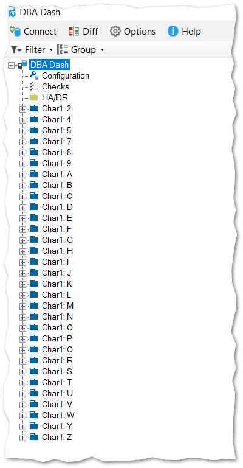
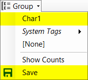

If you have a large number of instances it might be useful to group instances by [tag](/docs/help/tagging/), making the tree easier to navigate.  DBA Dash automatically provides a number of system tags and you can [add your own tags](/docs/help/tagging/#user-tags) in the GUI.  In this blog post we will see how to group by the first character of the instance name - without having to manually tag each instance.



The script below will take the 1st character of the instance name and generate the tags.  It will then associate the tags with the instances with the insert into dbo.InstanceIDsTags (Regular Instances) and dbo.InstanceTags (Azure DB).

```sql
DECLARE @TagName NVARCHAR(50)='Char1'

INSERT INTO dbo.Tags(TagName,TagValue)
SELECT @TagName,UPPER(LEFT(Instance,1))
FROM dbo.Instances
EXCEPT
SELECT TagName,TagValue
FROM dbo.Tags

INSERT INTO dbo.InstanceIDsTags(InstanceID,TagID)
SELECT  I.InstanceID,
        T.TagID
FROM dbo.Instances I
JOIN dbo.Tags T ON UPPER(LEFT(I.Instance,1)) = T.TagValue AND T.TagName = @TagName
WHERE EngineEdition <> 5 /* Exclude Azure DB */
EXCEPT
SELECT  InstanceID,
        TagID
FROM dbo.InstanceIDsTags


INSERT INTO dbo.InstanceTags(Instance,TagID)
SELECT  I.Instance,
        T.TagID
FROM dbo.Instances I
JOIN dbo.Tags T ON UPPER(LEFT(I.Instance,1)) = T.TagValue AND T.TagName = @TagName
WHERE EngineEdition = 5 /* Azure DB */
GROUP BY I.Instance, T.TagID
EXCEPT
SELECT  Instance,
        TagID
FROM dbo.InstanceTags
```

You can schedule this script to run as a SQL Agent job to automatically apply this tag to your instances.

To apply the grouping, just select the Tag from the Group menu.  If you want the group to persist next time you load DBA Dash, select the "Save" option.



If you want to completely remove the "Char1" tag, you can run the script below:

```sql
DECLARE @TagName NVARCHAR(50)='Char1'
DELETE IT
FROM dbo.InstanceIDsTags IT
WHERE EXISTS(
		SELECT 1
		FROM dbo.Tags T
		WHERE TagName = @TagName
		AND T.TagID = IT.TagID
)
DELETE IT
FROM dbo.InstanceTags IT
WHERE EXISTS(
		SELECT 1
		FROM dbo.Tags T
		WHERE TagName = @TagName
		AND T.TagID = IT.TagID
)
DELETE dbo.Tags
WHERE TagName = @TagName
```

You might have some different tagging requirements based on your naming conventions used for your SQL instances.  This script could be used as a starting point if you have different requirements.

Note:  Editing tags in this way is not *guaranteed* to work between versions of DBA Dash.  There is a small chance it could be broken by some future update.
