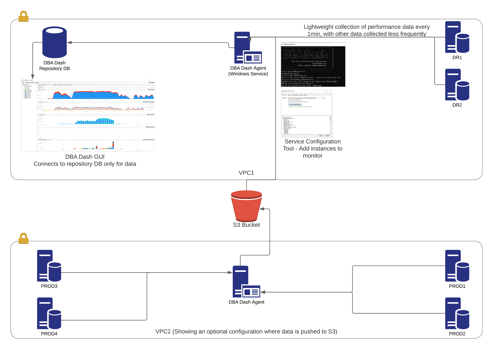
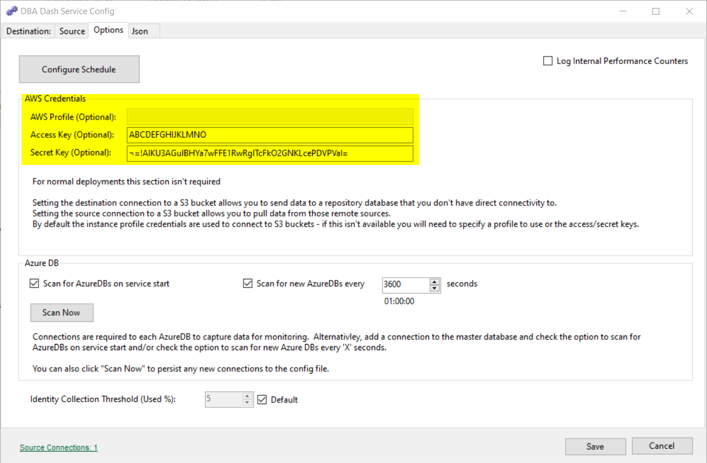
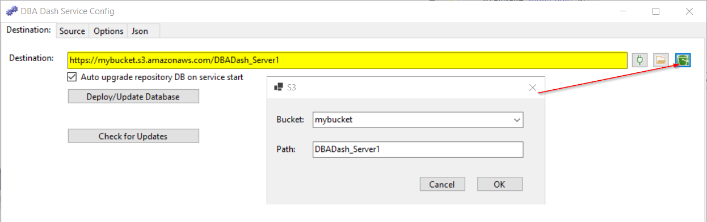
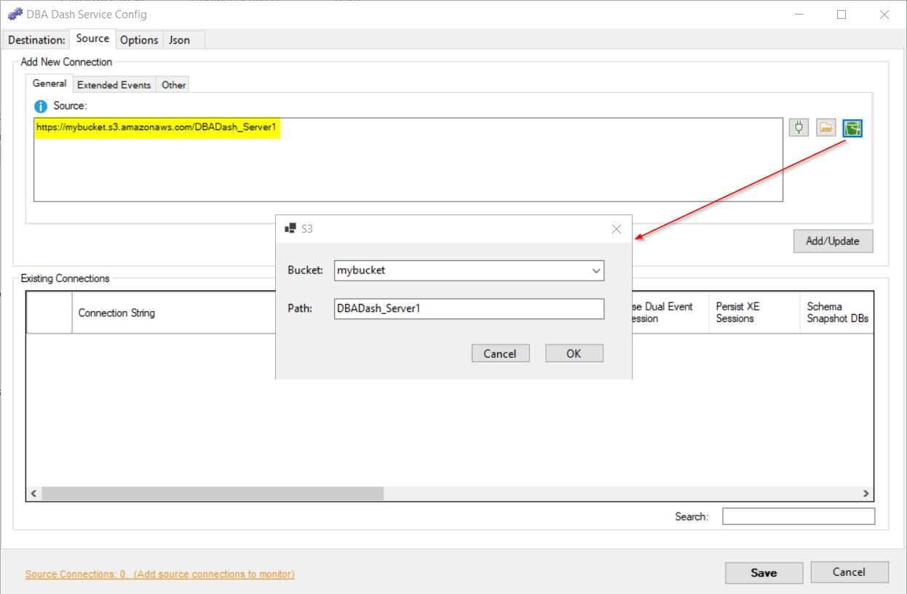

## Introduction

The DBA Dash service collects data from your monitored SQL instances and stores the collected data in a central repository database.  In this typical setup, the DBA Dash service needs connectivity to both the monitored instances and the repository database.

You might have some isolated environments where there is no direct connectivity between the instances you want to monitor and the repository database.  How do we collect data in this scenario?

DBA Dash allows you to collect data from these remote environments via a [S3 bucket](https://aws.amazon.com/s3/) accessible to both locations.  This requires two DBA Dash services.  One will run in the remote environment.  It's destination connection is a S3 bucket instead of a SQL connection to the repository database. The second DBA Dash service will run somewhere with connectivity to the repository database.  It's destination connection is the repository database and the source connection is the S3 bucket path you configured as the destination connection for the other service.

The source and destination connection can also be a folder instead of a S3 bucket.  You would need to provide your own method to sync the files between your environments.

[](dba-dash-diagram.png)
*The diagram above shows a local DBA Dash service collecting data from the DR1 and DR2 instances and pushing this data to a central repository database.  We also have another DBA Dash service collecting data from PROD1,PROD2,PROD3 & PROD4 - pushing this data to a S3 bucket.  The bucket is a source connection for the local DBA Dash service which pushes the collected data from the bucket to the repository database (along with the data collected from DR1 and DR2).*

## Prerequisites

* Configure a S3 bucket

It's recommended to create a new bucket for DBA Dash.  The DBA Dash service will need read/write/delete permissions to the bucket.  A policy that grants access will look something like this:

```json
{
    "Version": "2012-10-17",
    "Statement": [
        {
            "Effect": "Allow",
            "Action": [
                "s3:ListBucket"
            ],
            "Resource": [
                "arn:aws:s3:::mybucket"
            ]
        },
        {
            "Effect": "Allow",
            "Action": [
                "s3:GetObject",
                "s3:PutObject",
                "s3:DeleteObject"
            ],
            "Resource": [
                "arn:aws:s3:::mybucket/*"
            ]
        }
    ]
}
```

The policy can then by attached to a IAM role or user to grant access to the bucket.  Using an IAM role avoids the need to store and manage the rotation of access keys.  This can be used if the DBA Dash service is running on an EC2 instance.

A user can also be created with a policy attached to grant access to the bucket.  You can then generate an access key and secret key combination which can be added to the DBA Dash service config.

Detailed bucket setup is outside the scope of this blog post.

## Remote service setup

Here we will configure the DBA Dash service to collect data from monitored instances and push to a S3 bucket.

* Configure credentials for bucket access (Optional)

Ideally it's best to use an IAM role for bucket access.  This avoids the need to store the credentials in the config and manage the rotation of the credentials.  This is possible if the DBA Dash service is running on an EC2 instance.  You can also specify a profile to use instead of using an access/secret key combination.

Credentials are configured on the Options tab if required:


Although the secret key is encrypted in the configuration file, this should be considered obfuscation rather than encryption. 
Use a limited account that only grants access to the S3 bucket

* Set the destination connection:

The format of the destination connection should look like this:

`https://mybucket.s3.amazonaws.com/DBADash_Server1`

You can also click the bucket icon to build the connection:

[](s3-destination.png)

* Add source connections to monitor as usual and install as a service.  See [quick-start](/docs/setup/quick-start)

Xml files containing the collected data are written to the bucket.

## Local service setup

Here we will configure the DBA Dash service to pull the data from the S3 bucket and push it into our repository database.

* Configure the agent as usual using the [quick-start guide](/docs/setup/quick-start)
* Configure credentials for bucket access if required - same as for the [remote service](#remote-service-setup)
* Add the S3 bucket as a source connection

Copy/paste the path used as the destination connection for the remote DBA Dash service as a source connection.  You can also click the bucket icon to help build the path:

[](s3-source.png)

Click the "Add/Update" button.

* Save the config and restart the service

The Xml files are downloaded and imported into the repository database.  The files are automatically deleted from the bucket.

## Latency

The service will poll the bucket for new data every 1min. The polling frequency can't be configured but it should provide a reasonable balance between polling too frequently and reducing the delay between collection and import.

An SQS queue would provide more immediate processing - but adds complexity to the setup/configuration.  Polling isn't ideal but it's simple and works well.  The option to use a SQS queue might be considered for future versions of DBA Dash.

## File format

The collected data is serialized using DataSet.WriteXml and written to the S3 bucket.  The files can be viewed using [this tool](https://github.com/trimble-oss/serialized-dataset-viewer).

## Azure?

There is no support for Azure blob storage, but you can still access a S3 bucket from any server with internet connectivity.  If you don't want to use a S3 bucket for some reason, there is an option to use a file system folder instead. If you write to a folder you can setup your own method of synchronization between your two environments.
