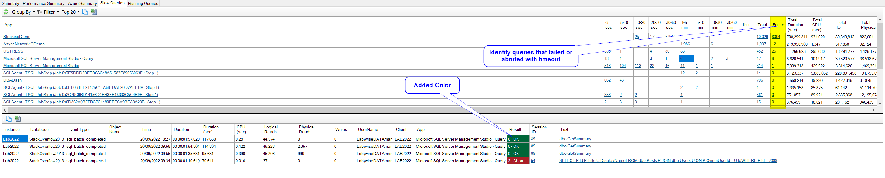

## Slow Queries tab improvements

The result column in Slow Queries tab is now color coded - It's easier to identify failed queries.

Added "Failed" column in the summary grid to give a count of failed queries and allow you to drill down.  Previously you could change the grouping to Result to identify failed queries and drill down.  The "Failed" column removes the need for this extra step.

## Other changes

[See release notes](https://github.com/trimble-oss/dba-dash/releases/tag/2.23.1)
