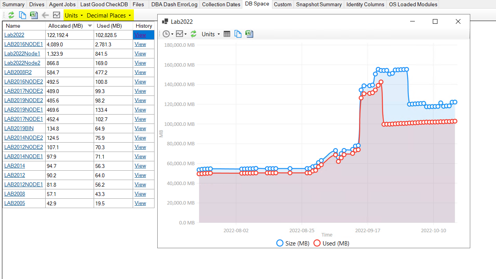
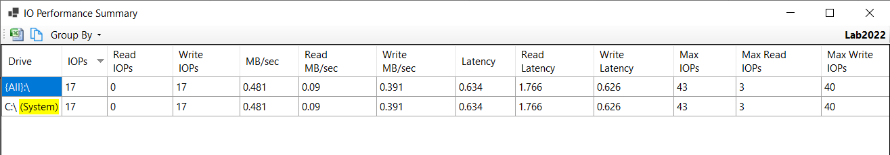
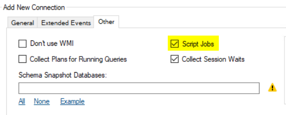

## Hide Instances from Summary

It's now possible to hide instances from display in the daily checks Summary tab.  For example, you might want to hide a new instance from view until it's properly configured.  Or you might want to retire an old instance but still keep it available in the tree.

* Click Options, Manage Instances
* Uncheck the "Show In Summary" for the instance.
* Close the dialog.

The instance is now removed from the summary tab, but it's still accessible in the tree.  The icon color changed from blue to grey to make it easy to identify if an instance is not included in the summary tab.  If you want to make all instances visible in the Summary tab again, click the gear icon and select "Show Hidden".  An additional "Visible" column is added to the grid to identify which instances are normally visible.

## Units and Decimal place options

In the DB Space tab you now have the option to choose Units and decimal places.  For example, you might prefer to count in MB for smaller DBs and GB or TB for larger DBs.

## Drive Label

In the IO Summary dialog, the drive label is now shown when you group by drive.

## Agent Job/Job Step collection performance improvement

The performance of the Jobs collection is not an issue under normal circumstances.

If you are monitoring instances with large numbers of jobs over high latency network connections using SMO can be very slow. Performance has been improved by replacing SMO with queries to the system tables:

* [Jobs](https://github.com/trimble-oss/dba-dash/blob/main/DBADash/SQL/SQLJobs.sql)
* [JobSteps](https://github.com/trimble-oss/dba-dash/blob/main/DBADash/SQL/SQLJobSteps.sql)

SMO is still used to script the agent job, but this can be disabled if required.

DBA Dash processes collections in batches based on their schedule.  The collections in a batch are processed serially to reduce the load on the monitored instance, but this can mean a slow collection like Jobs/JobSteps can slow down the whole batch.  The processing has been changed for Jobs/JobSteps so that it runs after the other collections.

The Jobs collection is scheduled to run every 1hr but only executes if changes have been detected or it's been 24hrs since the last collection.

## Other changes

[See changelog](https://github.com/trimble-oss/dba-dash/releases/tag/2.24.0)
