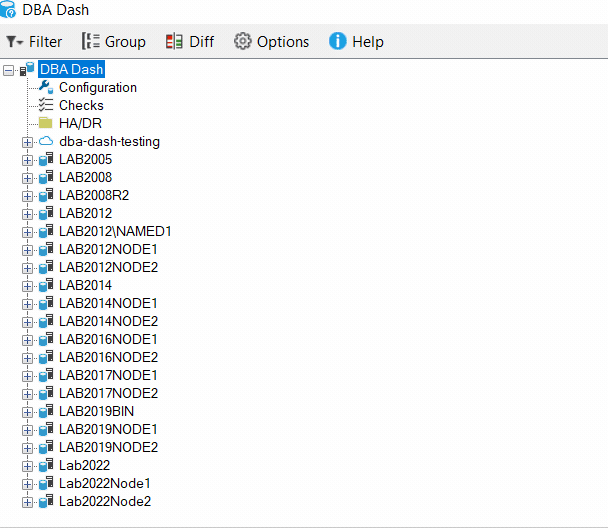
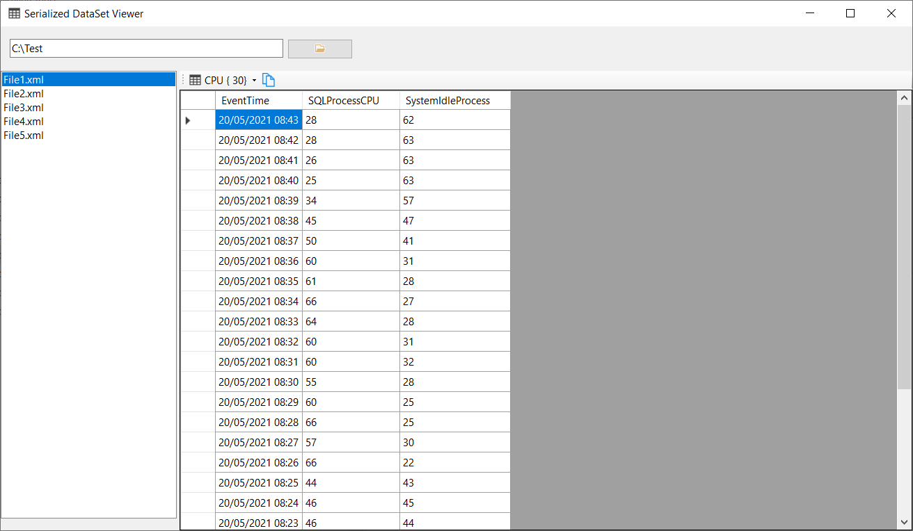

## Group instances by tag

You can now group instances in the tree by tag.  System tags are available to group on or you can create your own custom tags. The tagging feature could be used previously to filter instances - now it can also be used to group instances.

## Serialized DataSet viewer

The [Serialized DataSet viewer](https://github.com/trimble-oss/serialized-dataset-viewer) is a small utility that can be used to view the files generated from DBA Dash when writing to a folder or S3 destination.  Also, if you have issues with importing data into the DBA Dash repository, the collected data is written to the "Failed" folder.  This utility is located in the "SerializedDataSetViewer" folder.

This tool is only needed if you are troubleshooting issues importing data into the repository database or if you are curious about what data is contained in the files written to folder or S3 destinations.

