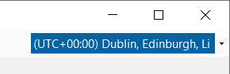
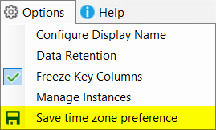

## Time zone switching

You can now select a time zone in the GUI if you prefer to use a time zone different from Windows.

You can also save the selected time zone so that it will be used the next time you load DBA Dash.

