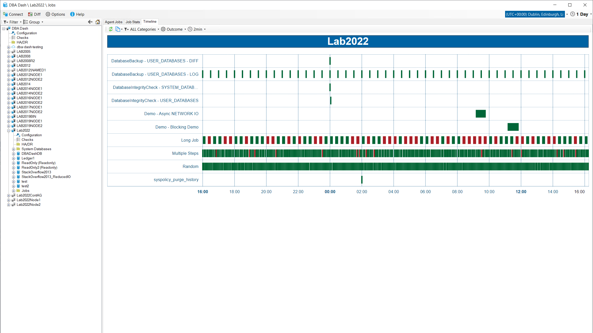
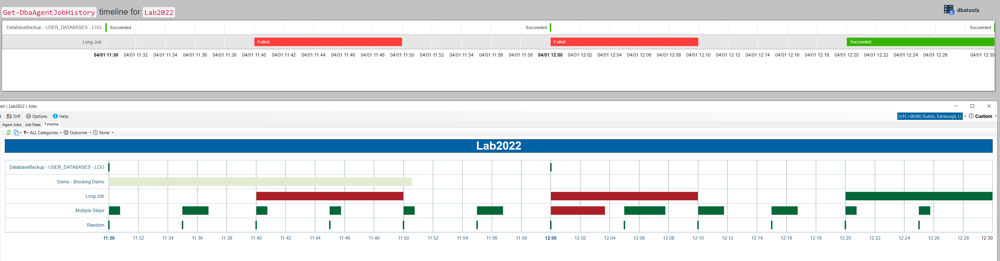

## Agent Job Timeline view

A timeline (gantt chart) view of your SQL Server agent jobs is now included.  This is a good way to visualize your job executions that allows you to see when jobs execute in relation to each other.  You can see when jobs have failed and how frequently failures occur. You can also see how long each job execution takes.  The timeline view helps give you a better understanding of your SQL Agent jobs and could help you improve job scheduling.

[](agent-job-timeline.png)

### Background

This feature was initially discussed in the #dbadash channel on the [SQL Server Community Slack](https://www.brentozar.com/archive/2017/04/chatting-slack-watch-groupby/).  Thanks to *Tuan* for the feature suggestion and *WSUHoey* for the suggestion to use Google charts similar to what [dbatools](https://dbatools.io/) uses for [ConvertTo-DbaTimeline](https://dbatools.io/timeline/).  DBA Dash uses it's own approach but takes inspiration from dbatools.

dbatools is an amazing powershell module for SQL Server that has had a huge impact on the way people do database administration.

### DBA Dash vs dbatools job timeline

DBA Dash provides an interactive experience where dbatools gives you the automation and flexibility of the command line.  Both are great.  It was useful for me to validate my output against *ConvertTo-DbaTimeline* and there are some minor differences that are worth mentioning.

Example:
[](dbadash_convertto_dbatimeline.png)

```powershell
# dbatools example:
 Get-DbaAgentJobHistory -SqlInstance Lab2022 -StartDate "2023-01-04 11:30" -EndDate "2023-01-04 12:30" -ExcludeJobSteps  | ConvertTo-DbaTimeline | Out-File C:\temp\DbaAgentJobHistory.html -Encoding ASCII
 ```

#### Retention

The DBA Dash timeline is based on the data from the DBA Dash repository database rather than msdb.  This might have *more* or *less* history available than msdb.  By default msdb will only keep a max of 100 rows per job and 1000 rows total. DBA Dash keeps 8 days of history by default.  DBA Dash uses partition switching to efficiently remove old data and doesn't have any per job retention settings.

In the example above, the data from the *Random* and *Multiple Steps* jobs is missing from dbatools due to the msdb retention settings.  This isn't an issue with dbatools and is easily fixed by adjusting the retention.  The lack of per job retention in DBA Dash can be beneficial for producing consistent timeline views though - it won't vary per job.


Note: DBA Dash also keeps job execution history for 2 years (by default) in aggregated format, but this is not currently used for timelines.

#### Filtering

The "Demo Blocking Demo" job execution started at 11:10 so it isn't included in the dbatools timeline.  DBA Dash chooses to include this as it was executing within the selected time period.  In DBA Dash it appears truncated with a lighter color to indicate you are not viewing the complete execution.  If a job execution finished after the selected date range it will also appear truncated in DBA Dash, where dbatools will extend the timeline.  Extending the timeline can be misleading as you won't have the jobs that executed between the end of your selected date range and the end of the extended timeline.

There is an extra LOG backup job at 12:30 in dbatools as this started at exactly 12:30 (DBA Dash filters for < end date).

A very long running job that started more than 24hrs before the start of the selected time period won't be included.  Jobs still executing are not included. DBA Dash will also have some additional latency as job history is collected every 1min by default.

#### Grouping

For longer date ranges, DBA Dash will start to apply some grouping to job executions.  This improves performance by reducing the size of the HTML file and the number of points that need to be plotted on the timeline.  It's particularly important if you have frequently executed jobs.  This is less of an issue for dbatools as the history for frequently executed jobs is likely to be truncated when looking at longer date ranges.

The grouping is done on the start date of the job and job execution status.  The data is plotted based on the start date of the first job and the end date of the last job started within the same period.  If there is only 1 job execution within a period, the chart will appear the same as it would without any grouping.  You can adjust the grouping or remove it if you prefer - but you might run into performance issues.

## Other changes

See [here](https://github.com/trimble-oss/dba-dash/releases/tag/2.31.0) for a full list of changes.
