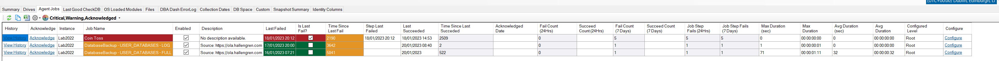
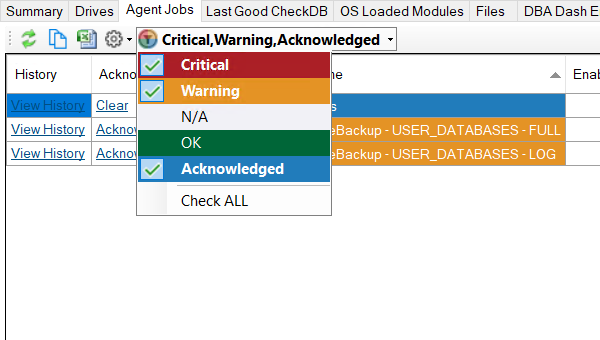
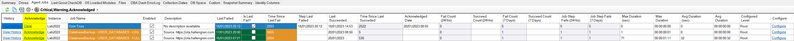

## New Status Filter

The new status filter makes it easy to see that a filter has been applied.

## Acknowledge Agent job failures

DBA Dash 2.32.0 introduces the ability to acknowledge agent job failures.  This allows you to keep your dashboard clear after you have investigated the root cause of a job failure.  The job will have a new "Acknowledged" status until there is a subsequent failure or the thresholds are no longer met for warning/error status.

Simply click the "Acknowledge" link to clear an issue.  Clicking the "Gears" icon and selecting "Acknowledge Errors" allows you to Acknowledge all the jobs displayed in the grid.
