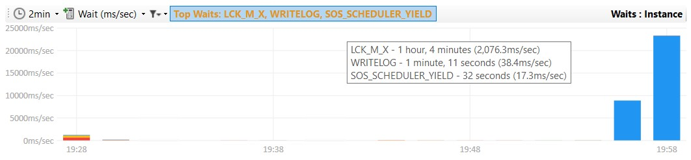
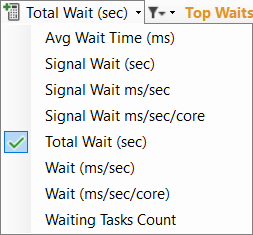

## Top 3 waits highlighting

The top 3 waits for the whole period are now shown in the title bar.  Previously you would have to review the tooltip for each bar or navigate to the Waits tab.

In this case the top wait type is LCK_M_X which indicates that we have queries waiting to acquire locks (blocked queries).  DBA Dash highlights this wait type yellow.  It will highlight some other critical waits like RESOURCE_SEMAPHORE or THREADPOOL as red.

The wait metric can also be changed from ms/sec:

## Other

See [here](https://github.com/trimble-oss/dba-dash/releases/tag/2.33.0) for a full list of fixes.
