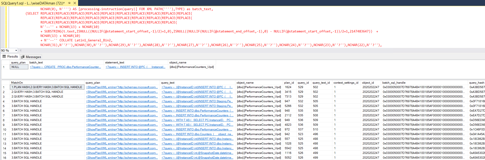
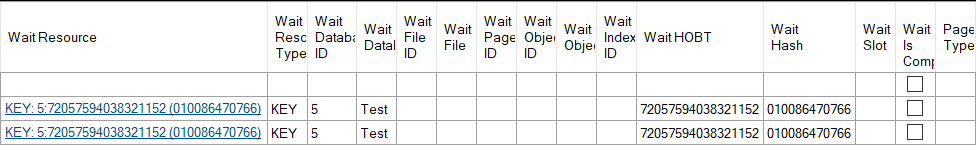
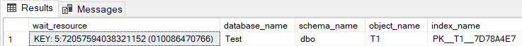

## Running Queries - Find Plan

Plan collection can be configured for DBA Dash in the service configuration tool.  A query plan might not be available for a given query depending on the plan collection thresholds and the availability of the plan at the time of collection.  In addition to the "View Plan" link, a find plan link is now shown for any query where the plan isn't available in the DBA Dash repository database.

The "Find Plan" link will provide a script you can run on your source SQL instance.  This will retrieve the plan from the plan cache if available and it will also search the query store based on the plan hash, query hash and sql handle.  The script is also a quick way to identify the query_id and plan_id in the Query Store.  If you want this script for a query where the plan is available in the DBA Dash repository database (rather than downloading the plan), click the link on the query hash, plan hash, SQL Handle or Plan Handle columns instead.

## Running Queries - Decipher Wait Resource

DBA Dash already does some deciphering of the wait resource for you in the Running Queries tab.  The wait resource is now a clickable link which returns a script you can run to get some more information.

The output of the script will vary depending on the type of wait resource.

Note: The script uses the undocumented DBCC PAGE command.

## Slow Queries - Pivot by CPU

The slow queries tab now has the option to pivot by CPU instead of duration.  In some cases the CPU time will be higher than the duration due to parallelism.  In other cases the CPU time will be less than the duration if the query had to wait for locks, IO etc.  Pivoting by CPU makes it easier to identify queries with high CPU cost.

Note: Added in 2.33.1

## Other

See [here](https://github.com/trimble-oss/dba-dash/releases/tag/2.34.0) for a full list of fixes.
