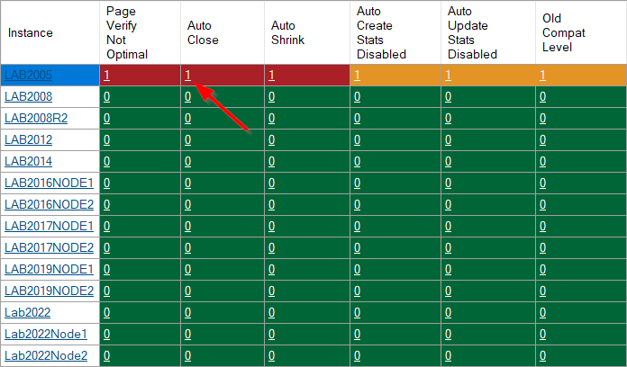
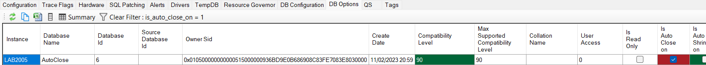

## Database Options Improvements

### Add new columns:

* None-Default target recovery time
* Not Using Indirect Checkpoints
* Online
* Recovery Pending
* Recovering
* Standby

### Improve highlighting

### Add tooltips

### Add drilldowns

## Other

* Query timeouts extended for per database collections.
* Snapshot age fix for ResourceGovernorConfiguration collection

See [here](https://github.com/trimble-oss/dba-dash/releases/tag/2.35.0) for a full list of fixes.
