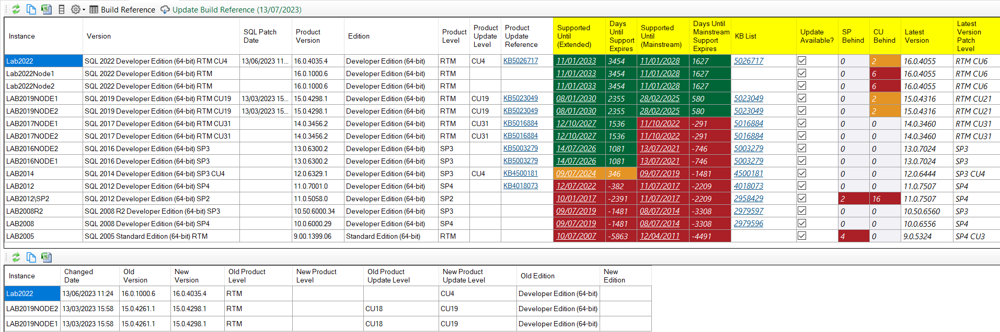
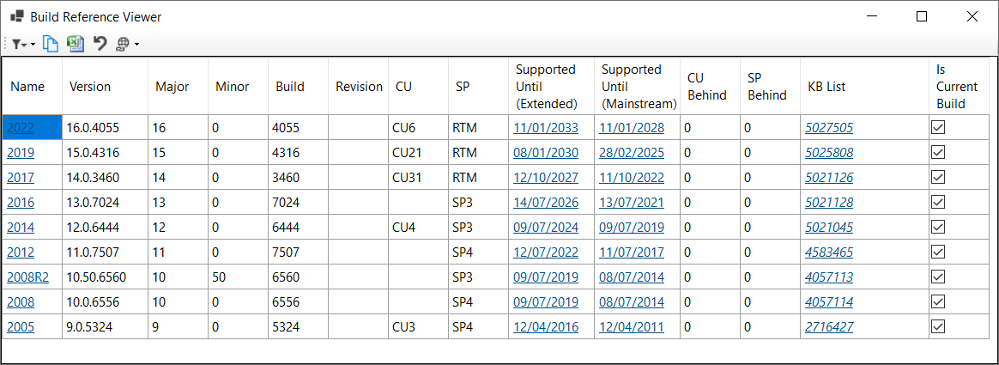
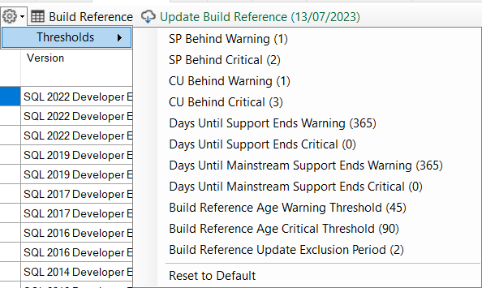
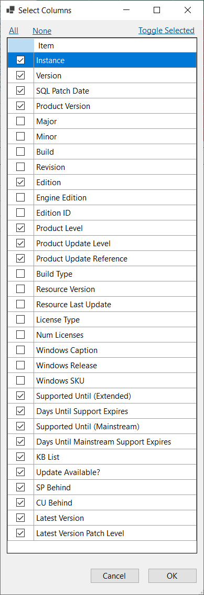

## SQL Patching - Added latest build info

**Build reference provided by [dbatools](https://dbatools.io) ♥️**

The SQL Patching tab previously tracked your current patch level and a history of patches applied to your SQL instances.  DBA Dash can now highlight **when a new build is available** and **how far behind your SQL instances are on patching**.  It will also highlight when your instances are out of mainstream and extended support.

*The build reference data is provided by [dbatools](https://dbatools.io) in an easy to consume [json](https://dataplat.github.io/assets/dbatools-buildref-index.json) format.  The build reference is maintained by contributors of the dbatools project and supports their [Get-DbaBuild](https://docs.dbatools.io/Get-DbaBuild) & [Test-DbaBuild](https://docs.dbatools.io/Test-DbaBuild) powershell functions as well as their [online build reference viewer](https://dataplat.github.io/builds).*

## Build Reference Viewer

The build reference viewer shows you the latest builds available for each version of SQL Server.  You can drill down to see all the builds available for a specific version of SQL Server and includes links to the relevant KB.  It's similar to the [online build reference viewer](https://dataplat.github.io/builds) provided by dbatools.

## Configure Thresholds

DBA Dash highlights when you are behind on patching and when your SQL instances are out of support.  The thresholds are all configurable to your preference.

### Removed columns

Some columns have been removed from the SQL Patching report but are still available if you click the Columns button in the toolbar.

### Updating the build reference

Click the **Update Build Reference** button on the **SQL Patching** tab to update the build reference at any time.  The build reference will also be updated whenever you upgrade to a new version of DBA Dash which is useful if you can't reach out to the internet.  You can also download the build reference directly from [here](https://dataplat.github.io/assets/dbatools-buildref-index.json) and save it as a file called **BuildReference.json** in the DBA Dash service installation folder.  The build reference will then be updated on service restart.

## Other

See [2.44.0](https://github.com/trimble-oss/dba-dash/releases/tag/2.44.0) release notes for a full list of fixes.

