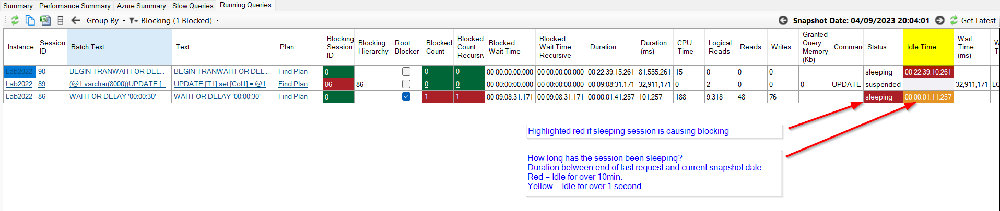
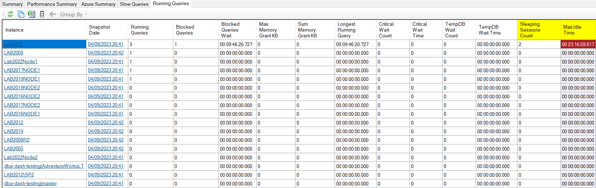

## Running Queries - Sleeping Sessions

### Intro
A sleeping session refers to one that is currently inactive and awaiting input from the client application. As these sessions are inactive, they are normally not of much interest from a monitoring perspective and are excluded from collection.  The exception is when the sleeping session has an open transaction.  These sleeping sessions with open transactions can cause blocking.  If the session is sleeping for a long time it can also prevent log truncation and cause the transaction log to fill up. DBA Dash only collects sleeping sessions in the running queries snapshots where there is an **open transaction**.

### What's new?

* **DBA Dash now captures the last_request_end_time column from the sys.dm_exec_sessions DMV.**  This can be used to calculate how long the session has been idle (in the sleeping state).  Sessions that have been sleeping for a long time with open transactions warrant attention, particularly when they are blocking other queries.

* **New Idle Time column has been added to Running Queries tab**.  This shows how long a sleeping session has been inactive.  By default this will highlight yellow when the session has been inactive for over 1 second and red if it is inactive for over 10min.

*Note: Column is hidden if there are no sleeping sessions with open transactions*

* **Max Idle Time** and **Sleeping Sessions Count** available at summary level.

### Fixing the problem

Application changes are required to fix problems caused by sleeping sessions with open transactions.  The sleeping session can't be tuned from the DB side as there is no query to tune.  DBA Dash reports that last query ran by the session, but tuning this query might not be beneficial if the real problem is the amount of time the session is idle with an open transaction. To fix the issue:

* Applications should keep transactions as short as possible.
* Don't block the transaction with web service calls, email sends or any other slow operations
* Implement robust error handling to ensure transactions are always either committed or rolled back.
* DBAs and users should take care when using **BEGIN TRAN** in SSMS and ensure a **COMMIT** or **ROLLBACK** is also issued.
* A DBA can [KILL](https://learn.microsoft.com/en-us/sql/t-sql/language-elements/kill-transact-sql?view=sql-server-ver16) a sleeping session as a **last resort** to resolve blocking.  This will roll back the transaction, undoing any work that was performed.  It doesn't address the root cause but it might provide some short-term relief from blocking.

## Other

See [2.46.0](https://github.com/trimble-oss/dba-dash/releases/tag/2.46.0) release notes for a full list of fixes.
