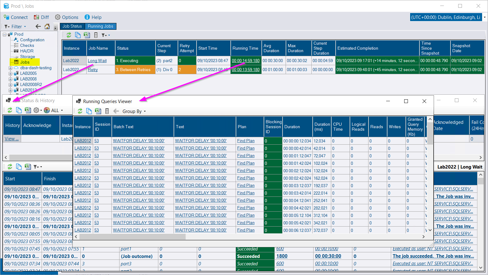

## ⚠️ Notice

Upgrading to version 2.48 will result of a rebuild of the JobHistory table in the repository database.  The deployment might take longer than usual as a result.  This will depend on the size of your JobHistory table and the performance of your SQL instance.  You can use the **Options\Data Retention** to review the size of your JobHistory table and the configured retention.

If you want to speed up the process, run the script below prior to upgrading.  It will truncate data from all partitions except the latest one. This doesn't impact the job status summary or job stats (long term job performance metrics).  It will only impact the job timeline and the amount of data available in *View History*.

```sql
DECLARE @From INT
DECLARE @To INT
DECLARE @SQL NVARCHAR(MAX)
SELECT @From = MIN(p.partition_number),@To = MAX(p.partition_number)-1
FROM sys.partitions p
WHERE p.object_id = OBJECT_ID('dbo.JobHistory')
AND p.index_id=1
AND p.rows > 0

IF @To>=@From
BEGIN
	SET @SQL = CONCAT('TRUNCATE TABLE dbo.JobHistory WITH (PARTITIONS (',@From,' TO ',@To,'));')
	PRINT @SQL
	EXEC sp_executesql @SQL
END
ELSE
BEGIN
	PRINT 'Nothing to truncate'
END

```

## Running Jobs

Running jobs are now captured in DBA Dash 2.28.0.  You can easily see what long running jobs are currently executing across all your SQL instances.

[](sql-agent-running-jobs.png)

You can see how long the job has been running for and the average time the job takes to run.  It will show the estimated completion time for the job and highlight if the job is running for longer than usual.  Clicking on the **Running Time** link will show you the running query snapshots for this job *(assuming it's executing a T-SQL job step)*.  Clicking on the **Job Name** link will show you the job history for the job.

Agent jobs have been moved from the **Checks** node in the tree at root level to it's own tree item.  The icon has been updated for agent jobs and the HA/DR node in the tree.

## Agent Jobs

The performance the **View History** button has been improved. Performance has also been improved importing job history into the DBA Dash repository. The history now shows a start and finish date for agent job history.  The **Run Duration** column now has a link that will show you the associated running query snapshots (similar to **Running Jobs**).

## Other

See [2.48.0](https://github.com/trimble-oss/dba-dash/releases/tag/2.48.0) release notes for a full list of fixes.
