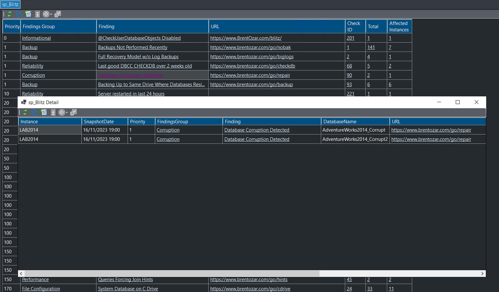

## Custom Collections

<iframe width="560" height="315" src="https://www.youtube.com/embed/0gebFSyS6_k?si=dPriURKKBtHAt7C_" title="YouTube video player" frameborder="0" allow="accelerometer; autoplay; clipboard-write; encrypted-media; gyroscope; picture-in-picture; web-share" allowfullscreen></iframe>

DBA Dash provides a lot of features, functionality and customization out of the box which can now be extended further through [custom collections](/docs/help/custom-collections/).  With custom collections you can run any community or custom script on your monitored SQL instances and have that data stored in your DBA Dash repository database.  Combined with the [custom reports](/docs/how-to/create-custom-reports) feature, that data can be readily available within the application to provide whatever additional information you need.

Sounds like hard work?  It's not.  It's actually surprisingly simple. DBA Dash will generate a lot of the code for you that you can either use as is or tweak as required.  You can have DBA Dash setup to capture information from a community script like [sp_Blitz](https://github.com/BrentOzarULTD/SQL-Server-First-Responder-Kit/blob/dev/sp_Blitz.sql) and have a report setup within a matter of minutes.  Retention taken care of and option to customize as required!

The real power of this feature is to support whatever need you have for your environment that DBA Dash doesn't support out of the box.  If you build something cool, consider [sharing it](https://github.com/trimble-oss/dba-dash/discussions) with the community. ♥️

* [See here for more information about custom collections](/docs/help/custom-collections/).
* [See here for customized sp_Blitz report](https://github.com/trimble-oss/dba-dash/discussions/768)

## Custom Report improvements

Custom reports were introduced in [2.49.0](../whats-new-in-2.49.0/) and have been improved significantly in 2.50.0.  This feature ties in with the custom collections, enabling the data you've collected to be displayed within the application.

* Option added to Script report

This makes it easy to share your custom report creations with the community.  Post on your blog site and/or post on the [GitHub discussions](https://github.com/trimble-oss/dba-dash/discussions) page.  The "Custom Report" label can be used to tag your discussion post and to find reports generated by other users.

* Added Links
    * Link to a URL
    * Text link (SQL, PowerShell or plain text formatting options)
    * Query Plan - load query plan in your default app.
    * Drill Down - custom report link providing parameter values with data from the current row

Custom reports are already a very powerful feature and will be improved further over time.

## Other

See [2.50.0](https://github.com/trimble-oss/dba-dash/releases/tag/2.50.0) release notes for a full list of fixes.
