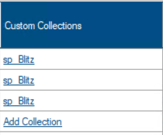
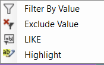

## 🔔 NOTICE

DBA Dash will be moving from .NET 6 to .NET 8 *soon*.  2.52 will likely be the **last** version built with .NET 6. There will be a big version bump from 2.x.x to 3.x.x when DBA Dash moved to .NET 8 as this version will require a new .NET runtime.  It doesn't indicate that there will be major changes to features/functionality.  DBA Dash ships changes frequently as they are ready.

### What does this mean for me?

You will need to download and install the .NET 8 Desktop runtime.  This isn't required for 2.52 but it will be needed in **future releases**.  Installation is quick and painless and does't require a reboot.  The upgrade process will prevent the update until .NET 8 is installed.

[Download .NET 8 Desktop Runtime](https://dotnet.microsoft.com/en-us/download/dotnet/8.0)

### Why?

Now is a good time to upgrade as DBA Dash is 2 versions behind and can benefit from performance enhancements in the latest version of .NET.  .NET 8 is the latest LTS version of .NET, released just a month ago with support until the end of 2026. .NET 6 support ends November 2024.

*Now back to what's new with 2.52.0....*

## Advice based Configuration

The configuration tab previously highlighted when configuration was changed from the default values.  This is still an option but it now offers an advice based approach by default for common configuration options (e.g. MAXDOP, cost threshold for parallelism etc.).  It also [fixes](https://github.com/trimble-oss/dba-dash/discussions/786) issues with highlighting of certain configuration options.

## Custom Collections Configuration improvement

Custom collections can be configured at instance level or at service level.  Previously there wasn't an easy way to tell what collections have been defined for each instance when configuring at the instance level.  The configuration tool now shows a CSV list of collections or **Add Collection** if no custom collections are defined.  At service level the button will also show a count of custom collections and display a tooltip with the custom collections.

## Custom Report Filtering

Custom Reports now include some basic filtering capabilities via a context menu.  Right-click a cell an select **Filter By Value** to filter the grid based on the value selected, or click **Exclude Value** to exclude that value.  There is also a LIKE option that supports wildcard searches.  The **Clear Filter** button in the toolbar can be used to remove the filters.

## Other

See [2.52.0](https://github.com/trimble-oss/dba-dash/releases/tag/2.52.0) release notes for a full list of fixes.
