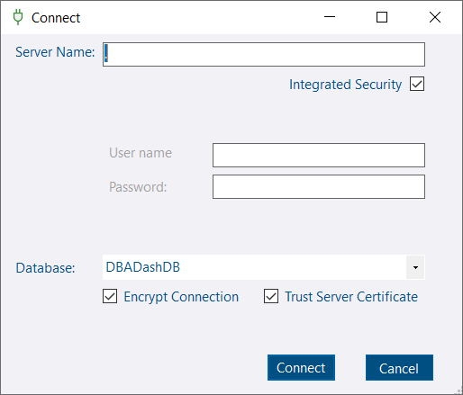
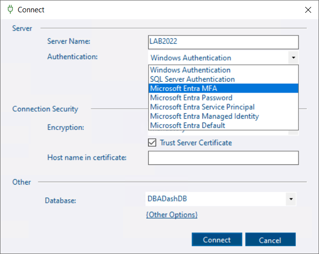

## Improved Connection Dialog

The connection dialog includes a number of improvements including support for Entra authentication!

### Old dialog:

### New dialog:

* Added support for Entra authentication.
    * Microsoft Entra MFA
    * Microsoft Entra Password
    * Microsoft Entra Service Principal
    * Microsoft Entra Managed Identity
    * Microsoft Entra Default

* Added Additional "Strict" encryption option.
* Trust server certificate unchecked by default.  This is inline with similar changes Microsoft have made to SSMS to improve security.
* Added Host name in certificate option.
* Added option to supply additional connection string options

## Support added for monitoring read replicas in Azure

This is now possible by adding `ApplicationIntent=ReadOnly` to the connection string in the config tool to target the read replica.  This would previously be blocked by the config tool as it would detect the read replica as a duplicate connection.

## Other

See [3.10.0](https://github.com/trimble-oss/dba-dash/releases/tag/3.10.0) release notes for a full list of fixes.
