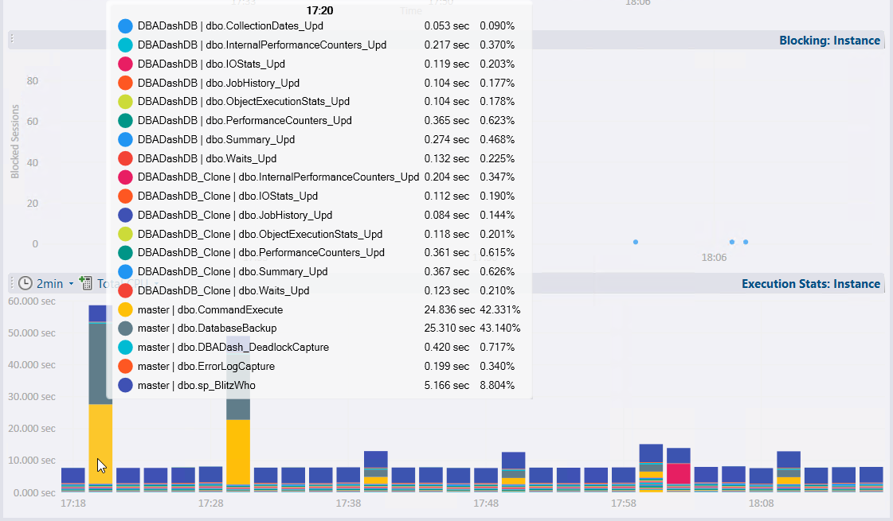
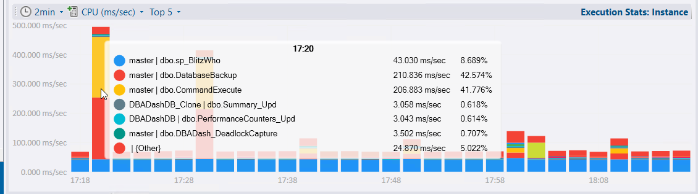
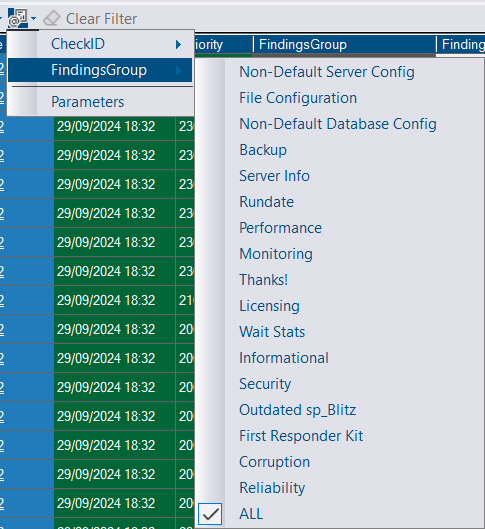
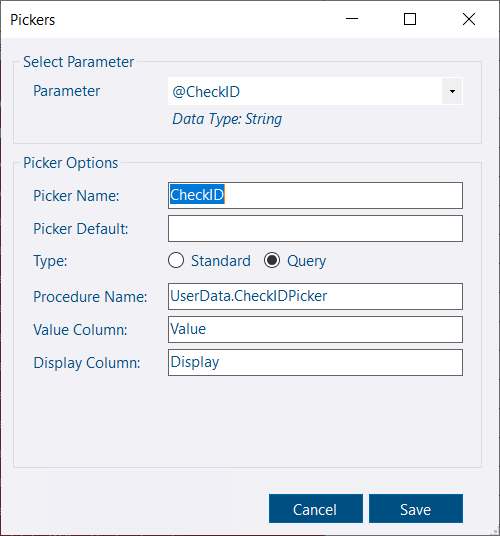
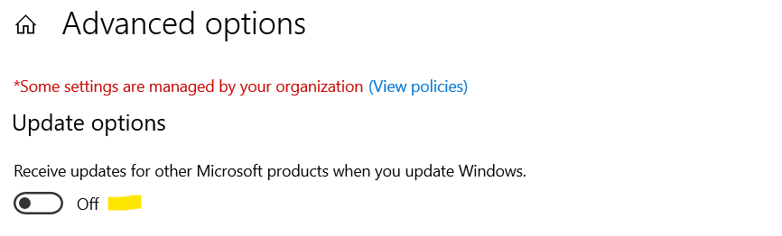
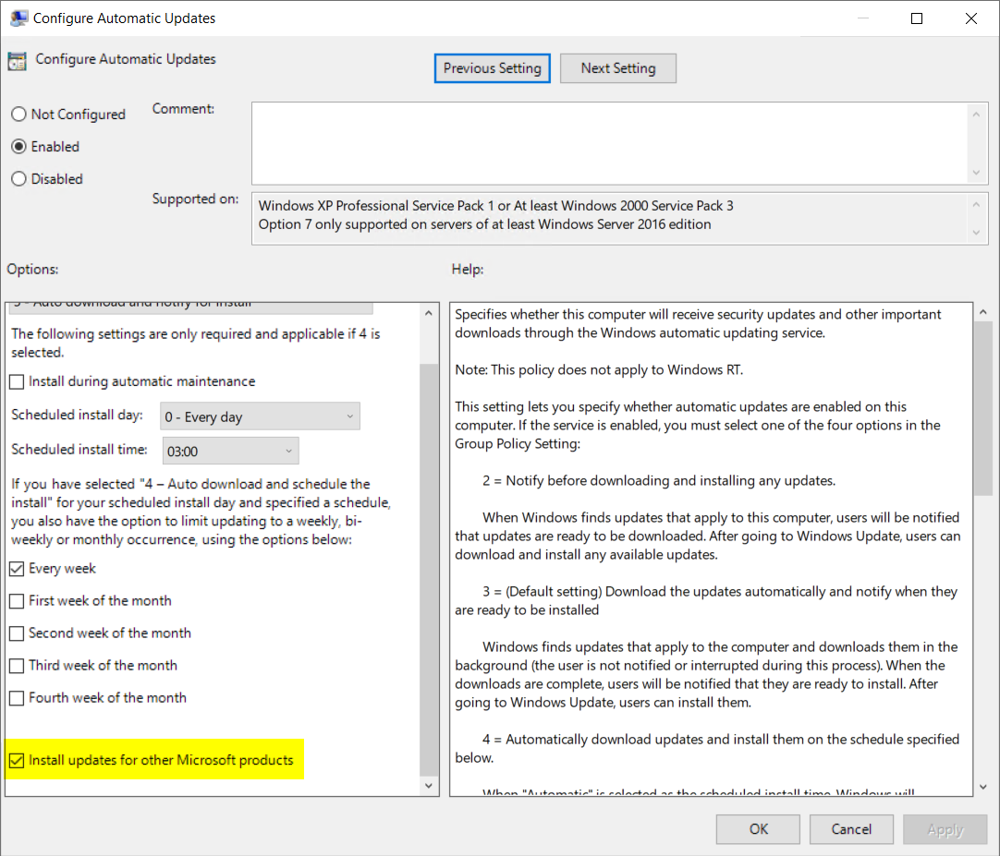
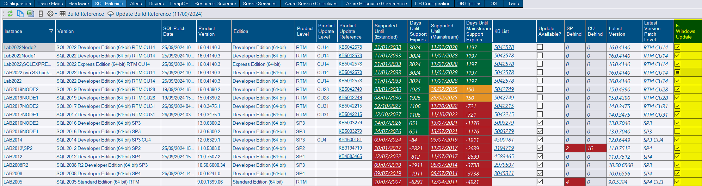

## Object Execution Stats (Performance Tab) improvement

The object execution stats chart on the performance tab previously showed the top 20 stored procedures for each interval.  The list of stored procedures in the chart and on the tooltip was sorted *alphabetically*.

The new version now shows the top 5 stored procedures overall and for each time period.  These are now sorted to show the procedures in order of the selected metric across the *whole* time period.  This change makes it easier to focus on what's most important.  If you want to see more items, just change the option in the *Top* menu of the chart.  The chart also includes an *Other* category which groups the activity of the procedures that fall out of the top 5 - helping to put the activity in context.  The *Other* category can be turned off in the *Top* menu.

The default metric is now *Duration (ms/sec)* instead of Total Duration.  CPU (ms/sec) is also available.  This makes bars that don't span the same amount of time easier to compare.

* Old - takes longer to identify what you need to focus on:

* New - quickly identify the most important procedures to focus on.


*Note: sp_BlitzWho is listed ahead of dbo.DatabaseBackup and dbo.CommandExecute (Executed as part of dbo.DatabaseBackup and double counted) as it's the procedure with the most CPU usage for the whole time period*


## Custom Report - Pickers

Enhance your custom reports with selection lists for your custom parameters.

Click the gear icon on your report an select "Edit Pickers".

Enter a list of items or have the list populated dynamically from a stored procedure!

## SQL Patching tab - Is Windows Update column

DBA Dash now captures if SQL is configured to receive patching through Windows updates.  SQL patching via Windows updates can be configured via Windows update settings or via group policy:

* Windows update advanced options:

* Group policy:

The setting is shown on the SQL Patching tab.  Checked = enabled. Unchecked = not enabled.  Square (indeterminate) = Unknown.

Note: This setting is collected as part of the *ServerExtraProperties* collection.  The service account requires either WMI access OR *sysadmin*.


 I like this option for pre-production environments.  For production environments I prefer to use [dbatools](https://docs.dbatools.io/Update-DbaInstance) to explicitly install a specific version that I know has received some testing.


## Other

See [3.11.0](https://github.com/trimble-oss/dba-dash/releases/tag/3.11.0) release notes for a full list of fixes.
