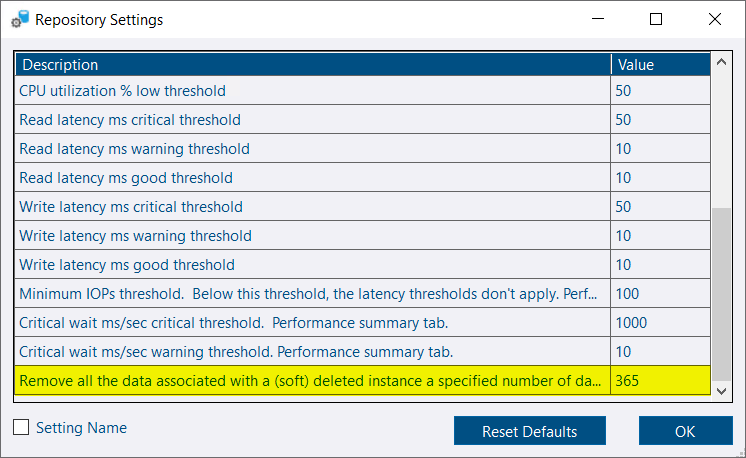
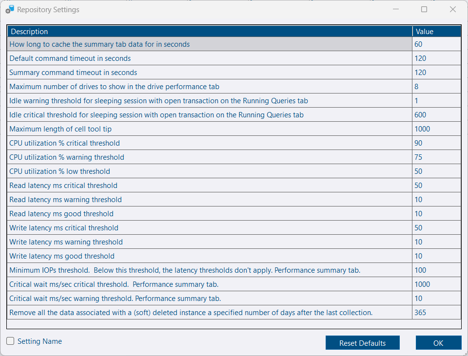
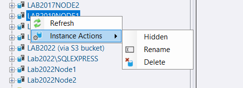
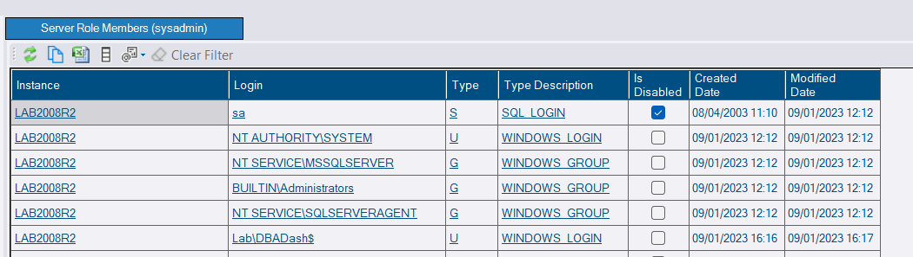
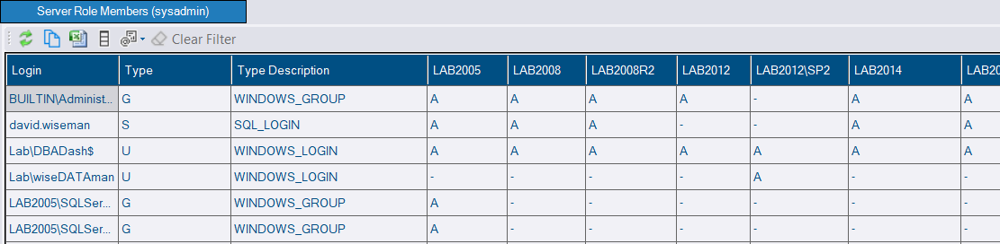
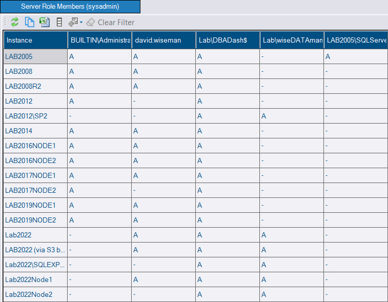

## Recycle Bin

A *Recycle Bin* folder has been added to provide easy access to instances that have been deleted.  Quickly restore a deleted instance if you need to access data colleted from a retired instance.  Or click the *Delete Now* link to fully remove the instance from the repository database.


Deleting an instance can take some time depending on how long the data collections have been running, the data retention settings and the collection schedule.  If you leave the instance soft deleted for some time, the data retention settings will clear out the data more efficiently by truncating old partitions.


You can have the system automatically hard delete the instance after a specified period of time.  By default, they are kept indefinitely.  Click *Options*, *Repository Settings*.


The recycle bin has a safety feature that prevents instances from being deleted until at least 24hrs after the last collection.


## Repository Settings

The repository settings dialog exposes some configuration options that you can alter if needed, including the hard delete threshold mentioned above.

## Service Config Tool improvements

Deleting a connection in the service config tool will now give you the option to mark the instance deleted in the repository database, reducing the effort required to delete an instance.

## GUI Improvements

Context menu actions have been added to make it easier to mark an instance deleted, rename an instance or hide it from the summary page.


The **Configure Display Name** and **Manage Instances** dialogs are now redundant. These will be removed from a from DBA Dash soon.


## CLI Improvements

* ConnectionID is now populated when adding instances via the CLI, unless the skip validation option is used.
* You can pass in --ConnectionID to remove a connection.
* Additional actions supported:
    * RemoveAndDelete - remove a connection and mark deleted in the repository database.
    * Delete - mark a connection deleted in the repository database.
    * Restore - mark a deleted connection active again in the repository database.
    * List2 - Provides a list of connections with the ConnectionID included.
    * PopulateConnectionID - Add ConnectionID for any connections that are missing a ConnectionID.

## Server Role Members system report

I've had a couple of requests to show *sysadmin* users across instances.  It's been possible to include this for some time via a [custom report](https://github.com/trimble-oss/dba-dash/discussions/1018), but as it's a common requirement it makes sense to include it as a built in report.

The report shows *sysadmin* users by default but it can also show membership of other server level fixed and user roles.

*Normal:*

*Pivot By Instance:*

*Pivot By User:*

Users that are **db_owner** or are a member of **SecurityReports** role will be able to see this report.

## Other

Thanks [Chad Baldwin](https://chadbaldwin.net/) for a [bug fix](https://github.com/trimble-oss/dba-dash/pull/1071) contribution. ♥️

See [3.12.0](https://github.com/trimble-oss/dba-dash/releases/tag/3.12.0) release notes for a full list of fixes.
