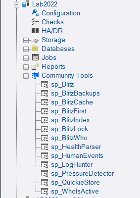
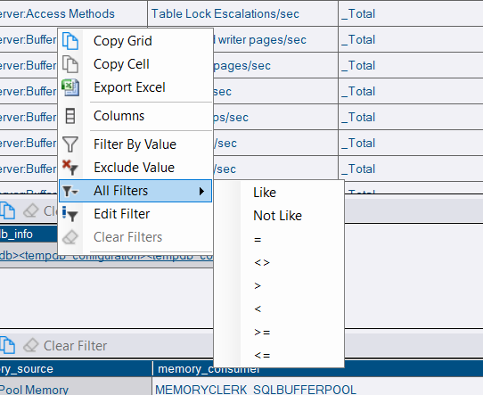
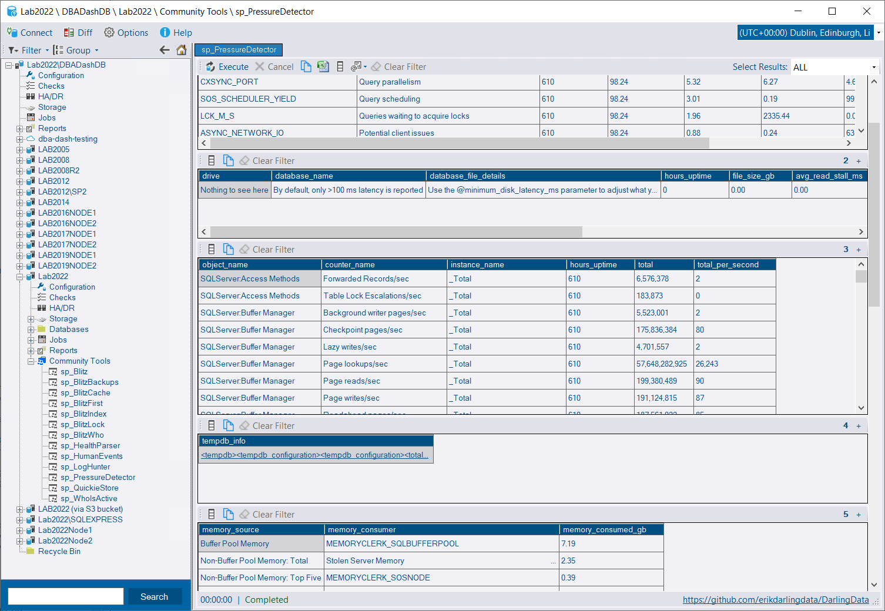

## Community Tools

From version 3.13, DBA Dash supports various community scripts, including [Adam Machanic's](https://dataeducation.com/about/) [sp_WhoIsActive](https://whoisactive.com/), [Brent Ozar's](https://www.brentozar.com/) [First Responder Kit](https://github.com/BrentOzarULTD/SQL-Server-First-Responder-Kit) and [scripts from](https://github.com/erikdarlingdata/DarlingData) [Erik Darling](https://erikdarling.com/).  This extends the functionality of DBA Dash which is itself a community tool.🤝

Community Tools are executed on your monitored instances using the [Messaging](/docs/help/messaging) feature.  The GUI communicates with the service via the repository database using service broker.  The service runs the scripts and sends the data back to the GUI.  The complexity is hidden behind the scenes - once the scripts are deployed and security configured, it just works.


[See here for more information](/docs/help/community-tools)


# Grid Improvements

A number of new filtering options are available in the grid.  Some of the filtering options were available previously for custom reports, but these are now available globally and have been extended to include:

* Less Than <
* Less Than or Equal <=
* Greater Than >
* Greater Than or Equal >=
* Not LIKE
* IN. (Select multiple cells within a single column to see this context option)
* NOT IN. (Select multiple cells within a single column to see this context option)


Grid filtering is now available in most places in the application.


The context menu also allows you to Export to Excel, copy a cell value or the whole grid to the clipboard and control column visibility.

## Custom Reports - Multiple Grids

Custom reports can now display more than one grid at once.  Community tools are using custom reports under the hood and this is particularly useful for certain scripts like sp_PressureDetector that produce a large number of result sets.  You can also take advantage of this improvement for your own custom reports.  You can still expand a single grid to full screen when you want to focus your attention on a particular grid.

## Custom Reports - Open in new Window

There is a open in new Window option for custom reports which can be useful for multitasking.

## Other

See [3.13.0](https://github.com/trimble-oss/dba-dash/releases/tag/3.13.0) release notes for a full list of fixes.

