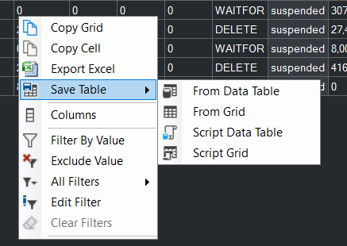
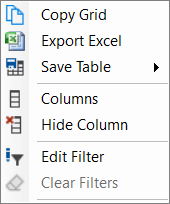

## Grid Improvements

Building on the work from [3.13](/content/blog/whats_new_in_3_13.0/), the grid can now be saved to a table in a SQL Server database or scripted as INSERT statements.  In both cases you have the option to use the grid or the underlying DataTable - the results will be similar, but the underlying DataTable might have different column names and extra columns.  Scripting the table provides a great way to persist a copy of the grid that is easy to share with others, attach to cases or manipulate with T-SQL.

Custom reports & Community Tools also have a toolbar option to script all grids.

There is now a context menu item to hide a column from the grid.  Clicking a blank area now shows the context menu, meaning you won't get stuck if you accidentally remove all columns.

The new grid is now available on the Object Execution Stats tab.

## Community Tools Improvements

The sp_Blitz tab is now available at table level, passing the relevant context information automatically to the stored procedure.

Data is now persisted when switching tabs until you load the same tab in a different context, improving your ability to multi-task.

[sp_HumanEventsBlockViewer](https://erikdarling.com/sp_humaneventsblockviewer/) has been added to the list of community tools.

## Hidden Instances

A hidden instance appears in the tree, but is not visible by default when reporting on instances higher in the tree.  This behavior wasn't applied consistently and relied on each report passing in a `@ShowHidden` parameter, to determine if instances should be visible.

The GUI now only passes in a filtered list of instance IDs - making the @ShowHidden parameter redundant.  This is much simpler and ensures consistency.  This also means it just works for custom reports without users having to filter out hidden instances.

## Other

* The *Open in new Window feature* now passes the current grid rather than starting with a blank copy of the current report in the same context.

* The Slow Queries tab and Running Queries tabs only refresh automatically on load if there is a change in context.  This makes it easier to multi-task, switching between tabs and having the data preserved unless you navigate to a different instance.

* The Code Viewer now has a save button.

See [3.14.0](https://github.com/trimble-oss/dba-dash/releases/tag/3.14.0) release notes for a full list of fixes.

