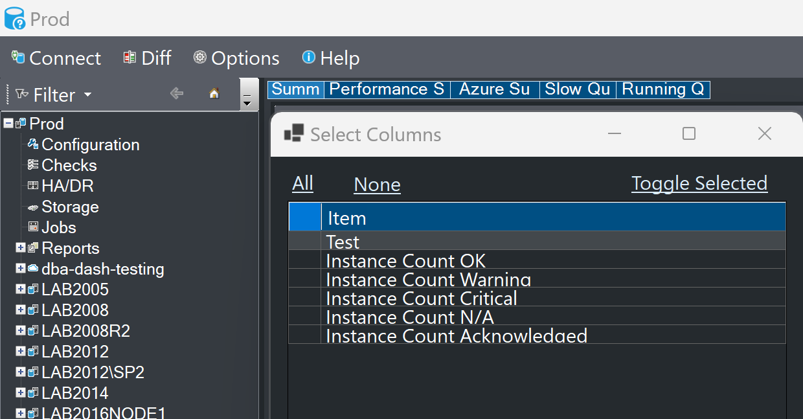
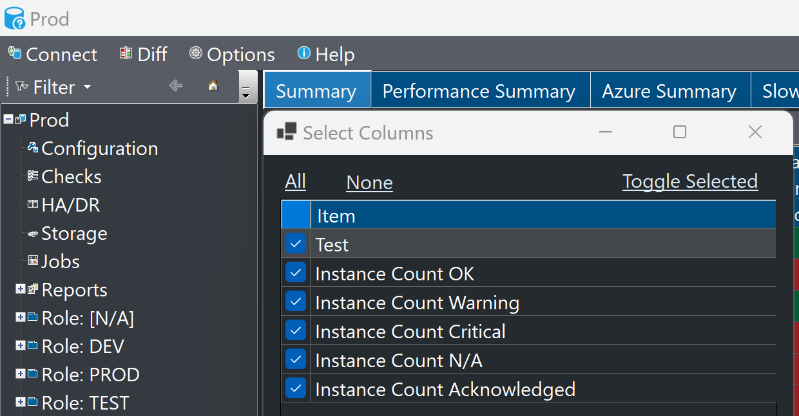
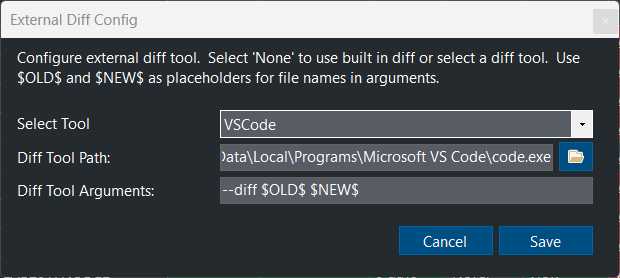
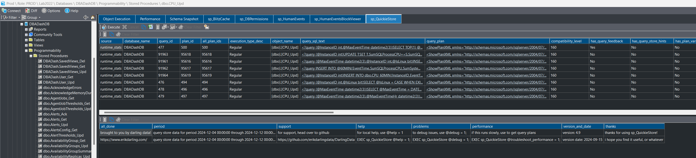

## Improved High DPI scaling support

On high DPI displays, scaling is increased to make text readable and other objects comfortably visible.  Scaling is also an important accessibility feature.

DBA Dash didn't previously handle scaling well beyond a certain point.  The screenshots below are a before/after screenshot at 250% scaling.  On the old version, the tab text is truncated and the row height is too small making the checkboxes invisible.

Scaling issues have been fixed in numerous parts of the application.


Scaling is optimized for the *primary* display.  If you have multiple displays with different scaling, the application might not look as sharp on your secondary display. Per monitor scaling options don't seem to work that well with some controls in WinForms so this seems to be the best compromise.



You can override the default scaling options of an application by right-clicking the application executable and selecting *Properties*.  On the *Compatibility* tab there is a *Change high DPI settings* button that allows you to configure the scaling behavior.


## Custom external diff tool

An external diff tool can now be configured (*Option\Configure External Diff Tool*).  This works with the schema snapshots feature and it allows you to load the diff in an external tool like WinMerge or VS Code.

Thanks [Chad Baldwin](https://github.com/chadbaldwin) for his collaboration on this issue.

## Community Tools at object level

Some community tools are now available at object level.  This provides a quick way to supply a procedure name to sp_Quickie store or sp_BlitzCache for example.

## CPU utilization fix

This was an interesting [issue](https://github.com/trimble-oss/dba-dash/issues/1149). On some servers, there would be no CPU utilization shown in DBA Dash.  DBA Dash collects it's CPU utilization via the ring buffer which provides:

* ProcessUtilization - how much CPU SQL server is consuming
* SystemIdle - how much CPU is idle

You can calculate total CPU usage as 100-SystemIdle or "Other" process utilization as 100-(SystemIdle+ProcessUtilization).

On *some* systems SystemIdle+ProcessUtilization can exceed 100% and these would be filtered out on import.  In these cases the ProcessUtilization needs to be divided by the number of physical NUMA nodes.  This mostly seems to impact bare metal servers but it can also impact VMs.

There doesn't seem to be any official documentation or consensus on how to handle this.  I'm choosing to only apply the fix where the utilization exceeds 100% as there doesn't seem to be a reliable way to know *when* the fix is required.

The [fix](https://raw.githubusercontent.com/trimble-oss/dba-dash/refs/heads/main/DBADash/SQL/SQLCPU.sql) ensures that CPU utilization is reported on affected systems and never exceeds 100%. There is a slight risk that the split of SQL Process and Other CPU is mis-reported in some situations on affected systems.

If you have any additional insight into this, please add to this [issue](https://github.com/trimble-oss/dba-dash/issues/1149) or contribute a PR.

## Other

See [3.16.0](https://github.com/trimble-oss/dba-dash/releases/tag/3.16.0) release notes for a full list of fixes.

