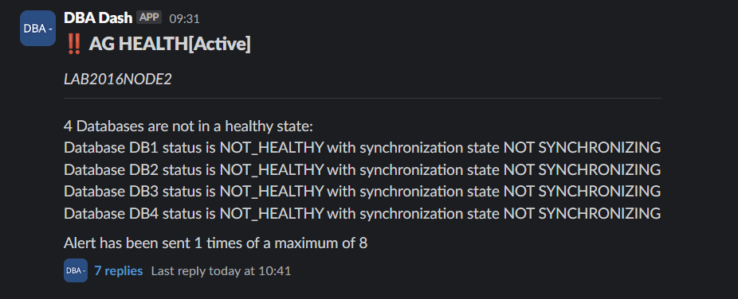
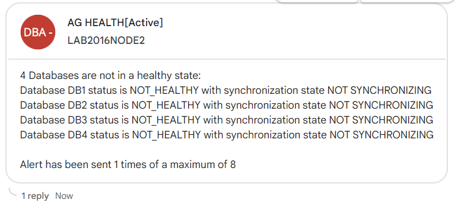


3.17.0 is currently available for beta testing and will need to be deployed [manually](http://localhost:1313/docs/setup/upgrades/#manual-upgrade).  If you have any issues or feedback, please create an [issue](https://github.com/trimble-oss/dba-dash/issues).


## Alerts

One of the most requested features, [alerts](/docs/help/alerts) is now available in 3.17! This enables you to respond quickly to issues that require your attention.

The new alert system allows you to send notifications to Google Chat, Slack, generic webhook & email.

*Slack:*

*Google Chat (Webhook):*

It supports the following rule types.

* AG Health
* Collection Dates
* Counter
* CPU
* Drive Space
* Wait

Alerts can be setup to send notifications to different teams depending on the time of day, day of week or priority of the alert.

The alert system will be expanded and improved over time.  To get started with alerts, [see here](/docs/help/alerts).

## Contributors

Thanks [Paulo Pozeti](https://github.com/ppozeti) for pull request [#1173](https://github.com/trimble-oss/dba-dash/pull/1173) to exclude an ignorable wait type (SNI_CONN_DUP).

## Other

See [3.17.0](https://github.com/trimble-oss/dba-dash/releases/tag/3.17.0) release notes for a full list of fixes.

