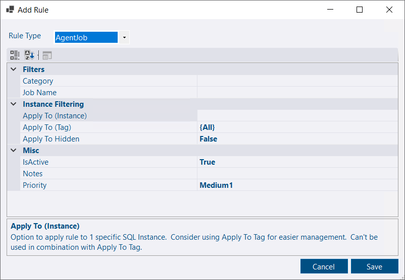

## PagerDuty notification channel

PagerDuty is now supported as a notification channel for your alerts.  PagerDuty can handle notifications based on your on call schedules, severity of the alert etc.  It's particularly useful for the highest priority alerts where you might want to receive a call rather than rely on other types of messaging.

## Agent Job Alert Rule

Alert rules can now be created for agent jobs.  The alerts can be filtered by job category or job name.  For example, if you wanted an alert to trigger when there is a failed backup you could set the job name to `%backup%`.  A failed job execution triggers the notification and a successful execution of the job will resolve the alert.  As with all rules, you can filter what instances the rule applies to using a tag or name of the instance.


The agent job rule is particularly useful as it allows you to create an alert for any custom condition you can think of - you just need to create an agent job that will fail based on your condition.

The Counter rule also has a lot of flexibility as DBA Dash supports custom [performance counters](docs/help/os-performance-counters/).


## Alert message consolidation

A single incident or alert mis-configuration could result in a large number of alert notifications as various rules trigger in response to their conditions.  Instead of receiving a notification for each alert you can receive a single consolidated alert notification to cut down on the noise.  In other cases it can be better to receive individual alert notifications and have updates reply back to the threaded notification (supported by Google Groups and Slack).  The *Alert Consolidation Threshold* can be configured on the notification channel to your preference.  This will default to 5 if not specified.

## Trigger collections

An option is now available that lets you trigger all collections or selected collections.

## Contributors

Thanks [Chad Hodgson](https://github.com/j005e) for a Drives collection [bug fix](https://github.com/trimble-oss/dba-dash/pull/1228).

Upgrades to newer versions of DBA Dash are now faster thanks to [this suggestion](https://github.com/trimble-oss/dba-dash/issues/1233) from [dev-ops-geek](https://github.com/dev-ops-geek).

## Other

See [3.18.0](https://github.com/trimble-oss/dba-dash/releases/tag/3.18.0) release notes for a full list of fixes.

