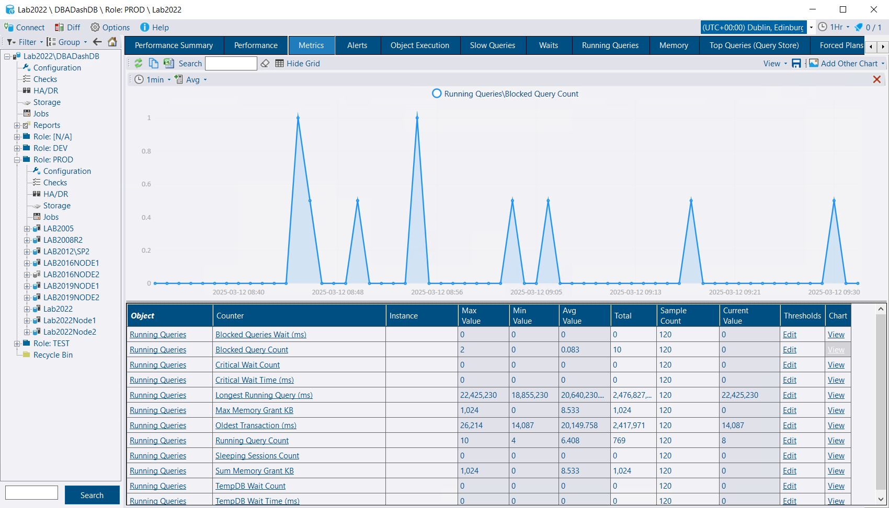

## Offline Instances

Handling of offline instances has been improved. Previously, if you had connections that were inaccessible, they would use up threads as the scheduled collections ran, failed, and retried. The only way to know an instance was offline was to check the snapshot age and look at the log file to determine the cause of the failure.

If a connection fails when a scheduled collection runs, that collection is now put into a list of offline instances. This list is checked every 10 seconds, and instances are removed from the list once they are back online. Scheduled collections are skipped while instances are offline. The list of offline instances is sent back to the repository database, where it can be reported on in the *Offline Instances* tab. This provides a list of instances that are currently offline and a timeline of when instances were offline.

An *Offline* alert rule can be used to create a notification when an instance goes offline. A *Restart* alert rule can be used to notify you *after* an instance comes back online following a restart.


An instance won't be detected as offline until a scheduled collection runs and fails to connect to the SQL instance. It takes time for connections to fail based on the connection timeout and retry policy (currently retrying after 2 seconds, then after 10 seconds).


Offline instances will also be displayed on the Summary tab using the existing *Instance Uptime* column. If an instance is offline, it will display "Offline" with a duration of how long the instance has been offline.  The tooltip provides additional info. The formatting of durations on the summary tab has been improved.


The time an instance is offline is reset if the DBA Dash service is restarted. If the service has been restarted, the snapshot age or offline instance timeline might provide a more accurate offline duration.


## OSInfo Schedule Changed

This collection now runs every 1 minute instead of every 1 hour, unless you have overridden the default schedule. This collection provides the start time of SQL Server and is useful to detect that an instance has rebooted. The increased frequency of this collection isn't likely to cause any problems, but the option is available to customize the schedule if required.

## Running Queries

It can be useful to know how long a transaction has been open, and this is now captured in Running Queries. For example, the running queries tab might show a query with a duration of 1 second that is currently executing but it might be part of a transaction that was started hours ago.  Long running transactions have the potential to cause blocking and prevent log truncation. How long the oldest transaction has been open is also displayed at the summary level.

The various summary level metrics are now available on the Metrics tab. As a metric, they are also available to alert on as a Counter rule.

## ConnectionID

The ConnectionID is now populated automatically for new connections, even if the validation is skipped (when using the command line). If the skip validation option is used, the ConnectionID is based on the Data Source parameter in the connection string.

## Other

See [3.19.0](https://github.com/trimble-oss/dba-dash/releases/tag/3.19.0) release notes for a full list of fixes.

