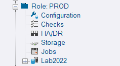

## Instance Grouping

Instance grouping has been improved by including the **Configuration**, **HA/DR**, **Checks**, **Storage** and **Jobs** nodes at the group level.  This allows you to access all the root level reports, filtered for the specific tag you are grouping by.  Also, the drill-downs from group level are more intuitive as they no longer have to move you back up the tree.

## context_info

**context_info** is a 128 byte binary value that you can associate with a session using [`SET CONTEXT_INFO`](https://learn.microsoft.com/en-us/sql/t-sql/statements/set-context-info-transact-sql?view=sql-server-ver16).  This is now captured by DBA Dash in Running Queries and Slow Queries collections.  Some common uses of context_info might be to store a user ID or tenant ID which is useful to capture for troubleshooting purposes. [#723](https://github.com/trimble-oss/dba-dash/discussions/723)

## Excel with ClosedXML

[ClosedXML](https://github.com/ClosedXML/ClosedXML) is now been used to generate Excel spreadsheets instead of SpreadsheetLight. SpreadsheetLight is a cool package for creating Excel spreadsheets in .NET.  Unfortunately it hasn't been updated in a while and it's not compatible with the latest OpenXML NuGet.  ClosedXML has the advantage of been a popular library with over 80 contributors and is actively been developed where SpreadsheetLite is supported by a single developer.  Both are open source projects with MIT License, but with ClosedXML, the source code is readily available on GitHub.

## Other

See [3.1.0](https://github.com/trimble-oss/dba-dash/releases/tag/3.1.0) release notes for a full list of fixes.
