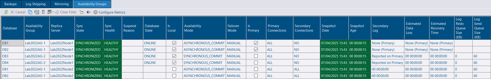
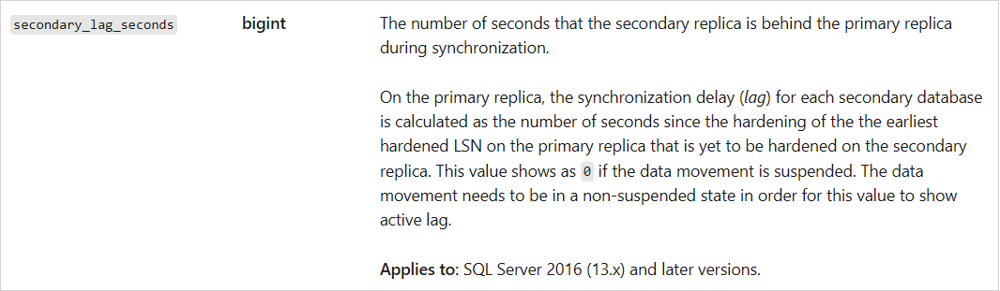
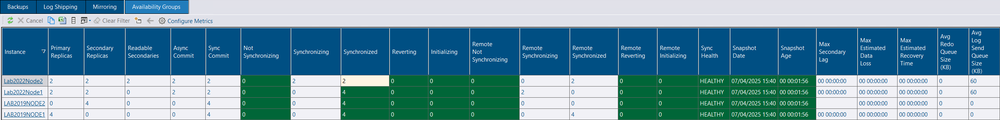
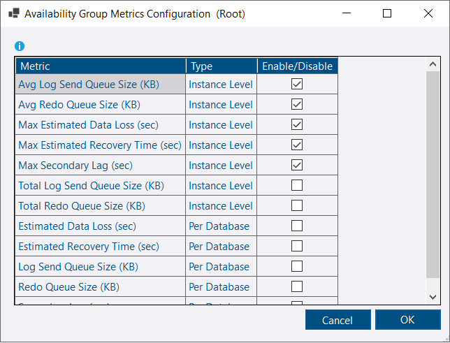
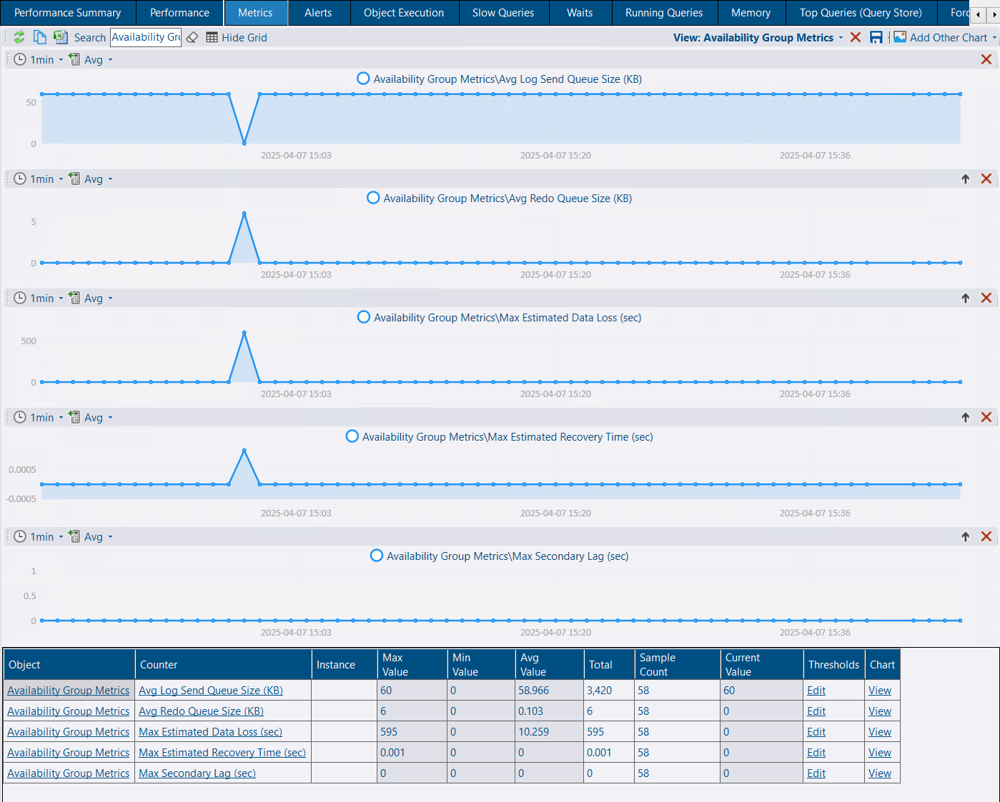
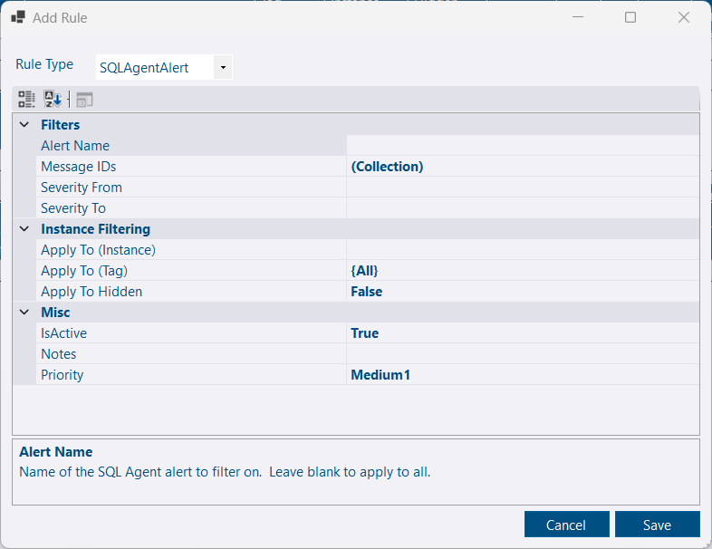
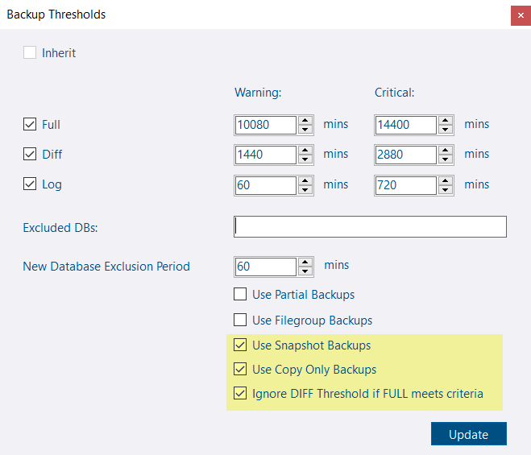

## Availability Group Monitoring improvements

Additional metrics are now available to track availability group performance.

* Secondary Lag.  This value comes from [sys.dm_hadr_database_replica_states](https://learn.microsoft.com/en-us/sql/relational-databases/system-dynamic-management-views/sys-dm-hadr-database-replica-states-transact-sql).

* Estimated Recovery Time.  *Calculated by dividing the redo queue size by the redo queue rate*.
* Estimated Data Loss.  *Calculated as the difference between the last commit time on the replica and the last commit time on the primary*
* Send Queue Size.  *Log data waiting to be sent to the secondary replica (KB).*
* Redo Queue Size. 	*Log data waiting to be redone on the secondary replica (KB).*

Additional columns from [sys.dm_hadr_database_replica_states](https://learn.microsoft.com/en-us/sql/relational-databases/system-dynamic-management-views/sys-dm-hadr-database-replica-states-transact-sql) are available for selection (click the columns toolbar button)

*At the summary level, the aggregate values (current) are shown across all databases.*

You can configure which Availability Group metrics are tracked over time by clicking **Configure Metrics**. *Metrics will be Available on the Metrics tab.*


If you enable per-database metrics this will result in a large number of additional performance counters being tracked.


The following metrics are tracked by default which are available as performance counters on the Metrics tab:

* Avg Log Send Queue Size (KB)
* Avg Redo Queue Size (KB)
* Max Estimated Data Loss (sec)
* Max Estimated Recovery Time (sec)
* Max Secondary Lag (sec)


Alerts are available for performance counters, including the new Availability Group Metrics performance counters.


## Alert Rule for SQL Agent Alerts

SQL Agent alerts can be created for a variety of error and performance conditions.  A rule is now available in DBA Dash for SQL Agent alerts.  SQL Agent alerts can notify you directly via email.  You can now also be notified via the DBA Dash alert system which has Desktop notifications, Slack, PagerDuty & Webhook options (e.g. Google Chat).

## New Backup Threshold Config options

Some new options are available:

* Use Snapshot Backups. *Uncheck this option if you don't want to consider snapshot backups*
* Use Copy Only Backups.*Uncheck this option if you don't want to consider copy only backups*
* Ignore DIFF threshold if FULL meets criteria. *In most cases it doesn't make sense to alert on a missing DIFF backup if you have a FULL backup that meets the criteria.*

## Other

See [3.20.0](https://github.com/trimble-oss/dba-dash/releases/tag/3.20.0) release notes for a full list of fixes.

