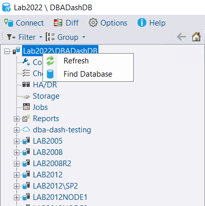

## Log Shipping Report improvement

Durations are now formatted in a human readable format.  Avg and Min are available in addition to max at summary level.  Log shipping metrics can be configured on the Log Shipping tab, allowing you to track log shipping performance over time (on the Metrics tab).  Metrics can be alerted on.

## Running Queries

### Open in new Window option

You can use Ctrl+Click on the Snapshot Date column to open a Running Queries snapshot in a new Window.  There is also a context menu option available which allows you to open multiple snapshots in a tabbed interface.

### Implicit Transactions

Implicit transactions are a [bad idea](https://www.brentozar.com/archive/2018/02/set-implicit_transactions-one-hell-bad-idea/).  If you have sessions using implicit transactions, these will now be highlighted in DBA Dash.  If you don't have any implicit transactions the column won't be visible by default, saving some horizontal space.

## Slow Queries row count

The Slow Queries tab will now include the row_count from the associated batch/rpc completed event.  This will be visible when you drill down.

## Grid Improvements

### Transpose context menu option

The transpose grid context menu is now available which you can use to convert rows to columns and columns to rows.

You can transpose selected row(s) or the whole grid.  This makes it easier to view all the details of a row or rows in a wide grid for example.  The column headers are numbered by default, but you can change this by clicking the link in the "Column" column.

### Auto Resize Columns

The context menu now has options to resize columns.

### Grid Select

The context menu provides options to select a row or the whole grid.  This is useful to highlight a row or rows, helping you to keep track of them as you scroll left to right.  You could also use the Shift+End shortcut to highlight the cells to the right of the selected cell.

### Row & Column counts

The context menu provides access to a count of rows and columns in the grid.

## Find Database context menu option in TreeView

The find database context menu option can be used to find a specific database across your SQL instances.  It will highlight the first 10 matches in the tree.

## Chart Date/Time format

Chart date/time format is now more consistent.  It's also configurable in the options menu if you prefer a different format than your current culture.

## Other

See [3.21.0](https://github.com/trimble-oss/dba-dash/releases/tag/3.21.0) release notes for a full list of fixes.

