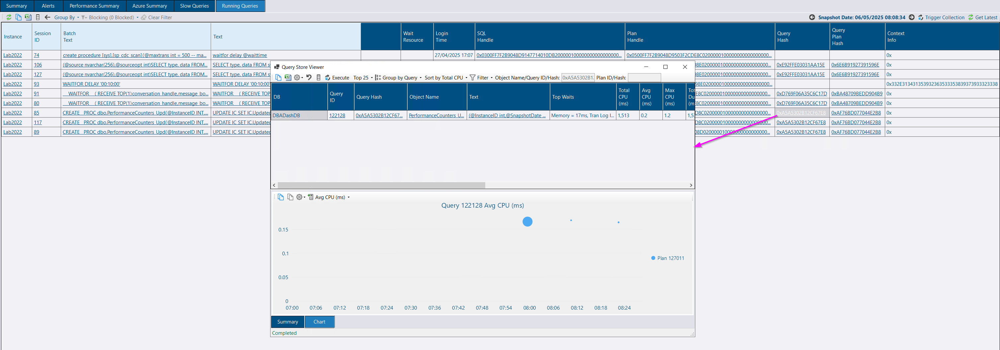
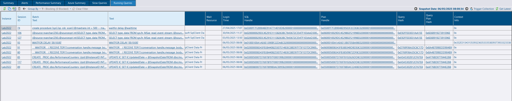

## Running Queries - Query store link

When viewing running query snapshots, you might suspect a performance issue is the result of a regressed query plan.  You can check query store to confirm this and even resolve the issue by fixing a good query plan.  To find the query in query store, you could copy the query hash, and search for the plan on the *Top Queries (Query Store)* tab, but this is a little manual and cumbersome.  You can now click the link on the *Query Hash* or *Plan Hash* columns to load the query store information in a separate Window.


The time period is currently linked to the global selected time period.  You will be able to adjust this separately in a future version.


## Column Freeze and re-ordering.

The column context menu provides an option to freeze a column.  The selected column and the columns to the left are frozen in place as you scroll to the right, making it easier to keep track of rows on wide grids like the Running Queries grid.

Thanks to [Chad Baldwin](https://github.com/chadbaldwin) for [this contribution](https://github.com/trimble-oss/dba-dash/pull/1344).

## Query plan lazy loading

This change will speed up load times for the Running Queries tab, particularly if you are connecting to the repository database over a slow VPN.

Thanks to [Chad Baldwin](https://github.com/chadbaldwin) for [this contribution](https://github.com/trimble-oss/dba-dash/pull/1340)

## Running Queries Plan collection on demand

The running queries tab allows you to view execution plans if [plan collection is enabled](/docs/help/running-queries/#enable-plan-capture) and the threshold was met for plan collection.  We can now view plans that **haven't** been collected using the messaging feature to fetch plans on demand from the monitored instance.

The *Find Plan* link will now load the plan on demand instead of providing a script for you to collect the plan manually. The plan collection script is still available by clicking on the SQL Handle or Plan Handle columns.

## Config tool service status

The service status is now automatically refreshed.

## Messaging default

Messaging is now enabled by default for new deployments of DBA Dash.  Users need to be a member of the Messaging role or database owner to use messaging related features.  Community tools still need to be explicitly enabled and users need to be a member of the Community Scripts or database owner to access them.  The messaging feature provides access to query store, running collections on demand and community tools.

## Other

Thanks to [Vincenzo Marchese](https://github.com/VincenzoMarchese) for a [bug fix](https://github.com/trimble-oss/dba-dash/pull/1302) contribution that was included from 3.20.1 but wasn't initially called out in the last blog.

See [3.22.0](https://github.com/trimble-oss/dba-dash/releases/tag/3.22.0) release notes for a full list of fixes.

