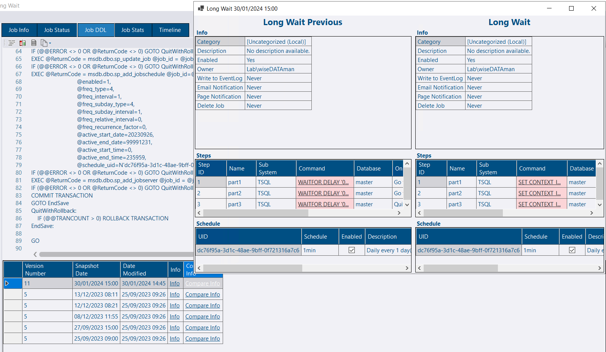
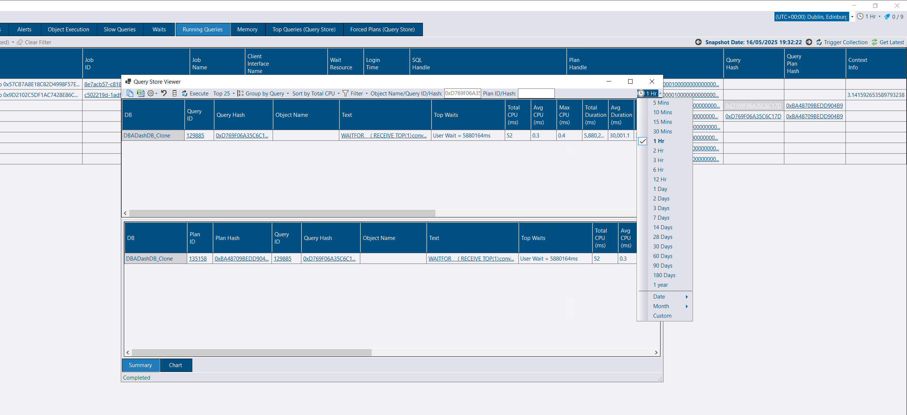

## Agent Jobs Info tab

This new tab shows metadata about the job, steps and schedule when you click on a job in the tree.

Previously you could use the Job DDL tab to view the details of the job, but this can be hard for a human to parse.  Having the schedule job steps and other metadata displayed in a friendly format is a big improvement.

I initially wanted to display schedule information, but the schedule information isn't collected.  Although I could create a new collection for this, I wondered if I could just parse this information with ScriptDom (which should be a reliable method to extract the data).  I didn't want to spend a lot of time on this so I got claude.ai to generate the code for me.  It got me 95% of the way there which was great.  I also tried Gemini which can be good, but failed on this occasion.

As the information is parsed from the script, it also allows me to display job info in a friendly format for previous versions.  This also allows for a more friendly info page diff.

## Running Queries - SQL Agent Job link

From the *Running Queries* tab, click the *Job Name* or *Job ID* columns to load information about the currently executing job.  This provides access to the job metadata in addition to the execution history and past performance at the click of a button.  You also get access to the change history.

## Running Queries - Object Execution Stats link

Similar to the job link, you can now click the *Object Name* column to get execution stats associated with the stored procedure.  You can see the past performance of a stored proc at the click of a button.

## Running Queries - Query store link improvement

The query store Window can now have the time period set independently from the application global time.

## Context Info - Display As context menu

You can use `SET CONTEXT_INFO` to associate binary data with the current session in your app.  This is captured in DBA Dash on the Running Queries and Slow Queries tabs, shown as a hexadecimal string.  There is now a context menu option to convert this into more meaningful data - a Guid, int or a string.

## Soft-deleted instances

If an instance has been soft deleted, this can cause confusion if the instance is added back to the config.  The collections will succeed, but the instance isn't visible in the tree.  Errors will now be logged if collections are running for an instance that has been soft deleted.  Also, a warning message is now displayed when adding the connection back into the config.

## Service Config - service auto refresh fix

The automatic service refresh can cause issues when the config tool has been running for a period of time.  The refresh is now a bit smarter, reducing in frequency and turning off when the config tool is no longer in active use or the destination tab is not selected.

## Other

Thanks to [Chad Baldwin](https://github.com/chadbaldwin) for [this contribution](https://github.com/trimble-oss/dba-dash/pull/1371) to improve wait resource parsing on SQL Server 2022.

See [3.23.0](https://github.com/trimble-oss/dba-dash/releases/tag/3.23.0) release notes for a full list of fixes.

