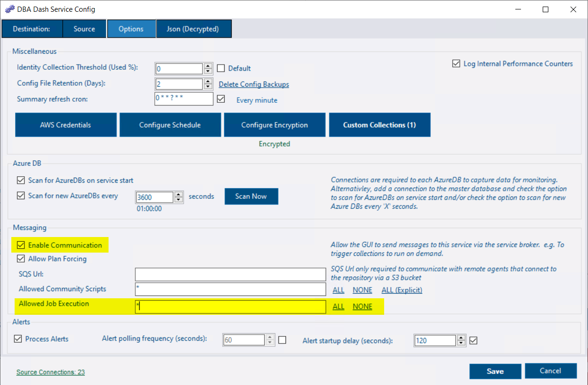
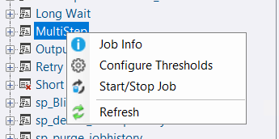
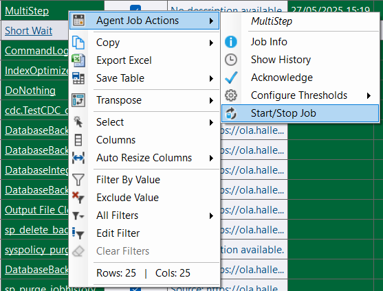
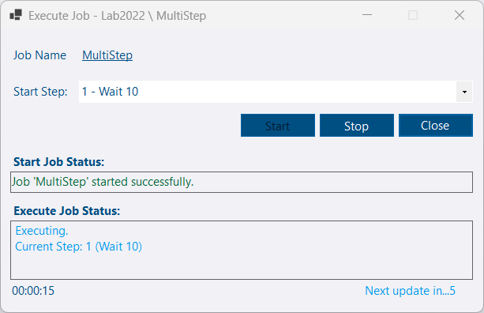

## Agent Job Execution

It's now possible to start & stop SQL agent jobs from the DBA Dash GUI.  This feature is **disabled by default** and needs to be enabled in the config tool.

Once enabled, job execution is only available to users that are members of the *AllowJobExecution* or *db_owner* roles.


If job execution is enabled and the users have the appropriate access in the repository database, they will be able to start and stop SQL agent jobs - irrespective of their access to the monitored instances.  Job execution is ran by the DBA Dash service account on behalf of the user using the Messaging feature.


As the job is executed by the DBA Dash service account, that account will need permissions to execute SQL agent jobs.  This can be granted through the **SQLAgentOperatorRole** role in the **msdb** database.

## Other

Thank you [Evan Stewart](https://github.com/evanstewart207) for [a bug fix](https://github.com/trimble-oss/dba-dash/pull/1398) relating to identity columns and [Mark Cilia Vincenti](https://github.com/MarkCiliaVincenti) for a [code refactoring/performance improvement](https://github.com/trimble-oss/dba-dash/pull/1397).

See [3.24.0](https://github.com/trimble-oss/dba-dash/releases/tag/3.23.0) release notes for a full list of fixes.

