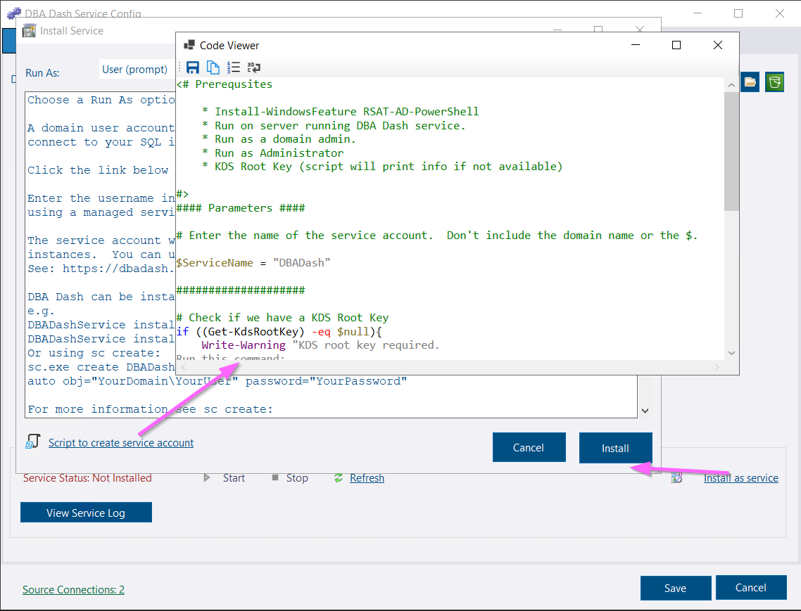
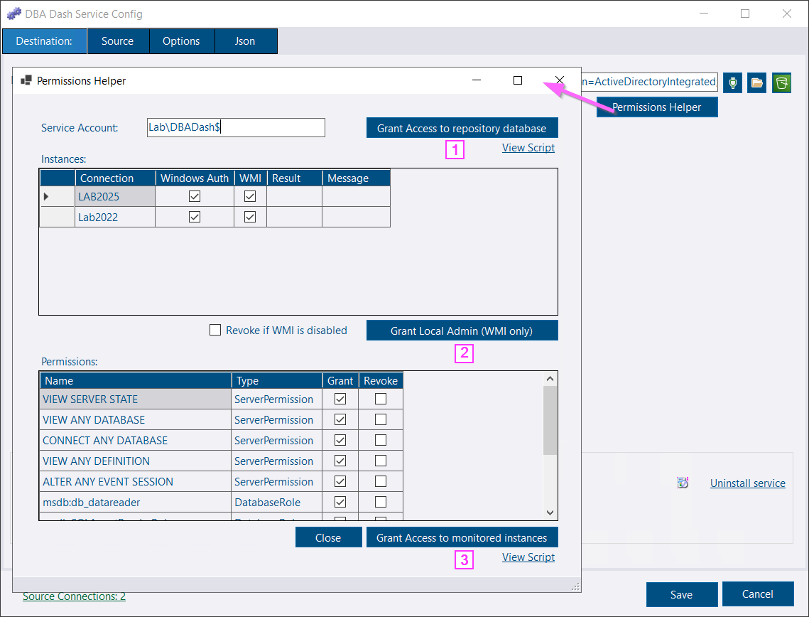
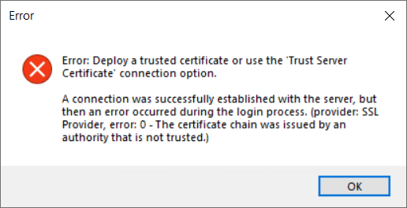
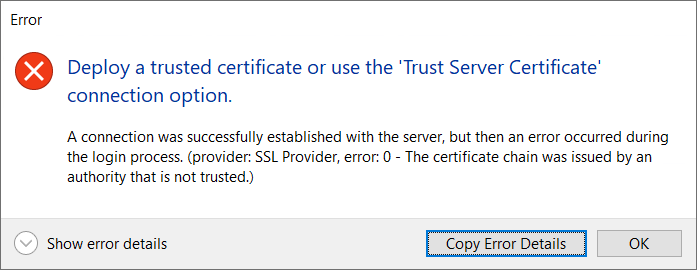

## Creating a service account

When you click the **Install as service** link, there is a new **Script to create service account** link.  This provides some powershell that you can run to create a managed service account to use for the DBA Dash service.

Review the instructions, then copy and run the script to create a managed service account.

[](create-service-account.png)


A managed service account is a domain user account, allowing you to use Windows authentication to connect to your SQL instances. A managed service account removes the burden of assigning and rotating service account passwords.


## Permissions Helper

Configuring permissions for the service account is likely to be the hardest part of the DBA Dash setup.  The Permission Helper has been added to make that process easier.

The permissions helper button can be found on both the *Destination* and the *Source* tabs of the config tool.

[](permissions-helper.png)

Button [1] grants access to the repository database, [2] grants local admin permissions to allow WMI collections (optional) to work and [3] grants permissions to collect data from monitored instances.  See the [permissions helper doc](/docs/help/permissions-helper) for more info.

## Other config tool improvements

* When you install the service, the account is automatically granted permissions to the application folder (required for writing to the Logs folder)
* Improved support for High DPI displays.
* Improved handling when there is a failure starting the service.  If there is an issue decrypting the config, you will be prompted to create a temporary key to fix the issue. For other failures, an error message will be displayed.

## New Error Dialog

The MessageBox has been replaced by a TaskDialog.

#### Old


#### New



The new error dialog looks better and the *Show Error Details* provides additional information if required.  The *Copy Error Details* button allows you to copy/paste the full exception details, great if you need to log an [issue](https://github.com/trimble-oss/dba-dash/issues).  e.g.

```
Deploy a trusted certificate or use the 'Trust Server Certificate' connection option.
A connection was successfully established with the server, but then an error occurred during the login process. (provider: SSL Provider, error: 0 - The certificate chain was issued by an authority that is not trusted.)

Details:
--------
Microsoft.Data.SqlClient.SqlException (0x80131904): A connection was successfully established with the server, but then an error occurred during the login process. (provider: SSL Provider, error: 0 - The certificate chain was issued by an authority that is not trusted.)
 ---> System.ComponentModel.Win32Exception (0x80090325): The certificate chain was issued by an authority that is not trusted.
   at Microsoft.Data.SqlClient.SqlInternalConnection.OnError(SqlException exception, Boolean breakConnection, Action`1 wrapCloseInAction)
   at Microsoft.Data.SqlClient.TdsParser.ThrowExceptionAndWarning(TdsParserStateObject stateObj, SqlCommand command, Boolean callerHasConnectionLock, Boolean asyncClose)
   at Microsoft.Data.SqlClient.TdsParserStateObject.ThrowExceptionAndWarning(Boolean callerHasConnectionLock, Boolean asyncClose)
   at Microsoft.Data.SqlClient.TdsParserStateObject.SNIWritePacket(PacketHandle packet, UInt32& sniError, Boolean canAccumulate, Boolean callerHasConnectionLock, Boolean asyncClose)
   at Microsoft.Data.SqlClient.TdsParserStateObject.WriteSni(Boolean canAccumulate)
   at Microsoft.Data.SqlClient.TdsParserStateObject.WritePacket(Byte flushMode, Boolean canAccumulate)
   at Microsoft.Data.SqlClient.TdsParser.TdsLogin(SqlLogin rec, FeatureExtension requestedFeatures, SessionData recoverySessionData, FederatedAuthenticationFeatureExtensionData fedAuthFeatureExtensionData, SqlConnectionEncryptOption encrypt)
   at Microsoft.Data.SqlClient.SqlInternalConnectionTds.Login(ServerInfo server, TimeoutTimer timeout, String newPassword, SecureString newSecurePassword, SqlConnectionEncryptOption encrypt)
   at Microsoft.Data.SqlClient.SqlInternalConnectionTds.AttemptOneLogin(ServerInfo serverInfo, String newPassword, SecureString newSecurePassword, TimeoutTimer timeout, Boolean withFailover)
   at Microsoft.Data.SqlClient.SqlInternalConnectionTds.LoginNoFailover(ServerInfo serverInfo, String newPassword, SecureString newSecurePassword, Boolean redirectedUserInstance, SqlConnectionString connectionOptions, SqlCredential credential, TimeoutTimer timeout)
   at Microsoft.Data.SqlClient.SqlInternalConnectionTds.OpenLoginEnlist(TimeoutTimer timeout, SqlConnectionString connectionOptions, SqlCredential credential, String newPassword, SecureString newSecurePassword, Boolean redirectedUserInstance)
   at Microsoft.Data.SqlClient.SqlInternalConnectionTds..ctor(DbConnectionPoolIdentity identity, SqlConnectionString connectionOptions, SqlCredential credential, Object providerInfo, String newPassword, SecureString newSecurePassword, Boolean redirectedUserInstance, SqlConnectionString userConnectionOptions, SessionData reconnectSessionData, Boolean applyTransientFaultHandling, String accessToken, DbConnectionPool pool, Func`3 accessTokenCallback)
   at Microsoft.Data.SqlClient.SqlConnectionFactory.CreateConnection(DbConnectionOptions options, DbConnectionPoolKey poolKey, Object poolGroupProviderInfo, DbConnectionPool pool, DbConnection owningConnection, DbConnectionOptions userOptions)
   at Microsoft.Data.ProviderBase.DbConnectionFactory.CreatePooledConnection(DbConnectionPool pool, DbConnection owningObject, DbConnectionOptions options, DbConnectionPoolKey poolKey, DbConnectionOptions userOptions)
   at Microsoft.Data.ProviderBase.DbConnectionPool.CreateObject(DbConnection owningObject, DbConnectionOptions userOptions, DbConnectionInternal oldConnection)
   at Microsoft.Data.ProviderBase.DbConnectionPool.UserCreateRequest(DbConnection owningObject, DbConnectionOptions userOptions, DbConnectionInternal oldConnection)
   at Microsoft.Data.ProviderBase.DbConnectionPool.TryGetConnection(DbConnection owningObject, UInt32 waitForMultipleObjectsTimeout, Boolean allowCreate, Boolean onlyOneCheckConnection, DbConnectionOptions userOptions, DbConnectionInternal& connection)
   at Microsoft.Data.ProviderBase.DbConnectionPool.TryGetConnection(DbConnection owningObject, TaskCompletionSource`1 retry, DbConnectionOptions userOptions, DbConnectionInternal& connection)
   at Microsoft.Data.ProviderBase.DbConnectionFactory.TryGetConnection(DbConnection owningConnection, TaskCompletionSource`1 retry, DbConnectionOptions userOptions, DbConnectionInternal oldConnection, DbConnectionInternal& connection)
   at Microsoft.Data.ProviderBase.DbConnectionInternal.TryOpenConnectionInternal(DbConnection outerConnection, DbConnectionFactory connectionFactory, TaskCompletionSource`1 retry, DbConnectionOptions userOptions)
   at Microsoft.Data.ProviderBase.DbConnectionClosed.TryOpenConnection(DbConnection outerConnection, DbConnectionFactory connectionFactory, TaskCompletionSource`1 retry, DbConnectionOptions userOptions)
   at Microsoft.Data.SqlClient.SqlConnection.TryOpen(TaskCompletionSource`1 retry, SqlConnectionOverrides overrides)
   at Microsoft.Data.SqlClient.SqlConnection.Open(SqlConnectionOverrides overrides)
   at Microsoft.Data.SqlClient.SqlConnection.Open()
   at DBADash.DBConnection.TestConnection(String connectionString) in D:\a\dba-dash\dba-dash\DBADashSharedGUI\DBConnection.cs:line 160
   at DBADash.DBConnection.BttnConnect_Click(Object sender, EventArgs e) in D:\a\dba-dash\dba-dash\DBADashSharedGUI\DBConnection.cs:line 173
ClientConnectionId:742e98a1-a430-491d-ae1d-e691ae43105b
Error Number:-2146893019,State:0,Class:20
$
--------
DBA Dash 3.25.0.0
Date: 16/06/2025 09:05:26 -07:00
```

## Other

See [3.25.0](https://github.com/trimble-oss/dba-dash/releases/tag/3.25.0) release notes for a full list of fixes.

