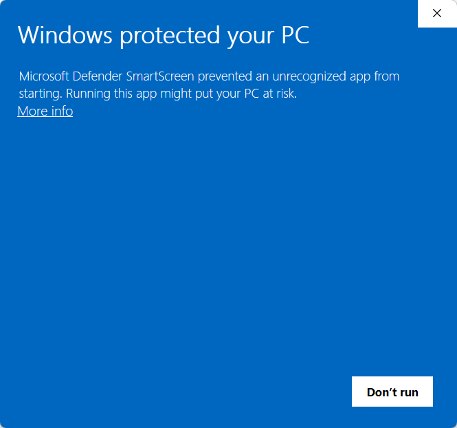
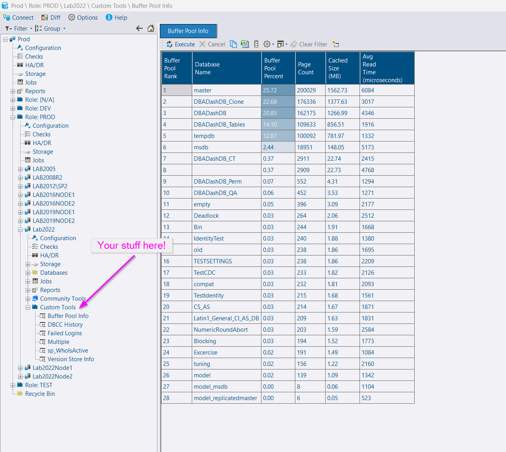
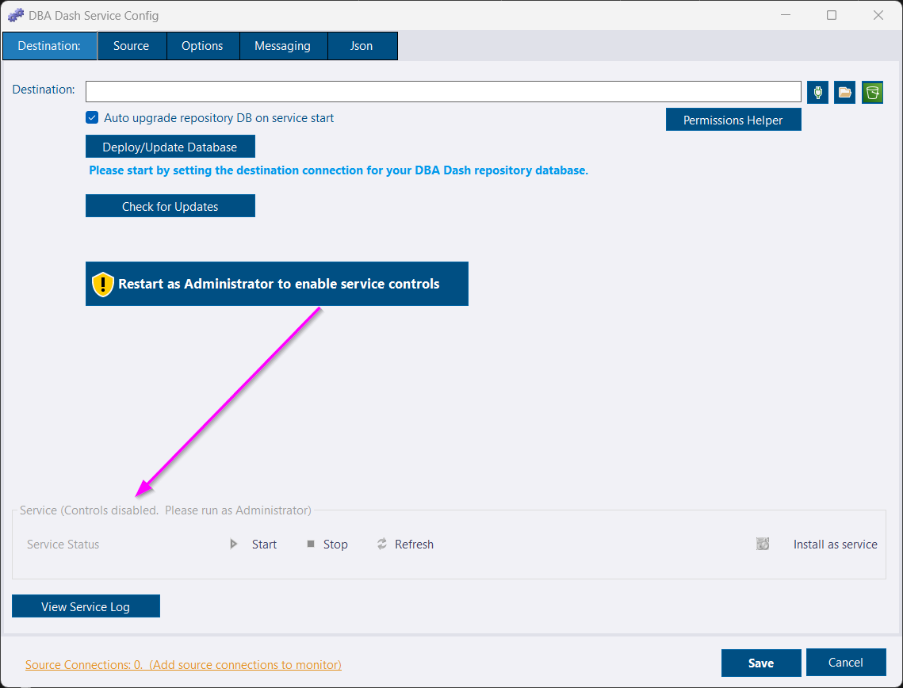
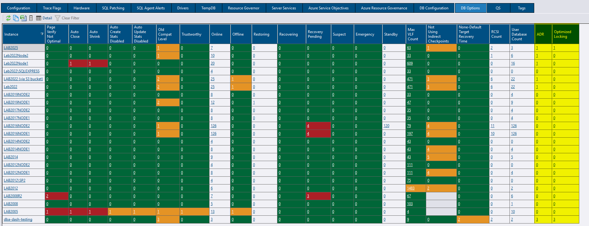
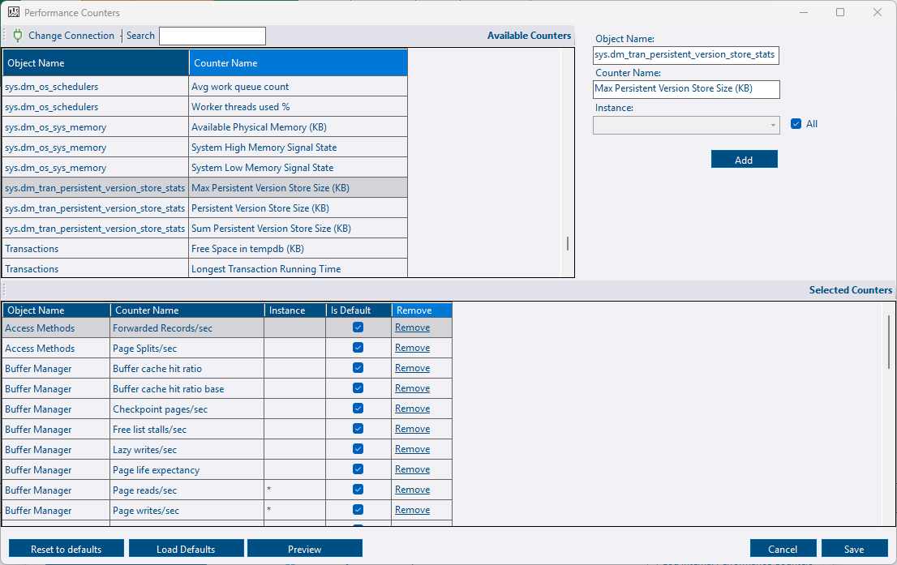
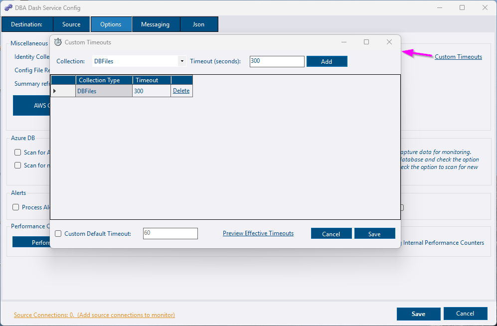

## Signed Releases

Starting with version 3.26, releases are now signed.  This should mean an end to Windows Defender SmartScreen notifications when you first launch a new version of the app.

Code signing is also generally a good idea and it will enable more users to be able to use DBA Dash.

## Custom Tools - custom procedure execution!

You can now run *your own* custom stored procedures on demand directly from the DBA Dash GUI.  The procedure is executed on your monitored instance via the messaging feature, similar to how community tools work.  Security is an important consideration with this feature, but you are in control of which procedures are allowed and who can execute them.

This opens up a lot of possibilities from running your own diagnostic scripts to returning the contents of a queue or log table used by your application.


**Quick Start**

* Create a stored procedure in the database that DBA Dash connects to (usually master unless you have specified an initial catalog when adding the connection in the config tool)
* Add the name of the proc to *Allowed Custom stored Procedures* on the Messaging tab in the service config tool.
* Ensure *Enable Communication* is also checked on the Messaging tab.
* Add users to the Messaging and CustomTools roles in the repository database to allow access.  db_owner has access by default.
* Customize using the DBA Dash GUI if required.



**Example**

The example in the screenshot above is using [sys.dm_os_buffer_descriptors](https://learn.microsoft.com/en-us/sql/relational-databases/system-dynamic-management-views/sys-dm-os-buffer-descriptors-transact-sql?view=sql-server-ver17) to show memory usage in the buffer pool by database.  I created a proc from [Glenn Berry's](https://glennsqlperformance.com) diagnostic information queries as a quick example.

Note: sys.dm_os_buffer_descriptors can be quite resource intensive on SQL instances with large amounts of memory.  It's usually OK to run as a one off, but I have seen performance issues caused by other monitoring tools querying this every 20 seconds.


[See here](docs/help/custom-tools) for more info.

## Erik Darling's sp_IndexCleanup added as a community tool

[sp_IndexCleanup](https://erikdarling.com/sp_indexcleanup/) can be used to identify duplicate, redundant and unused indexes.  It can now be run from the community tools folder in DBA Dash.

## Config Tool can be run without Administrator

The config tool needs to be run as Administrator to allow you to install as a service and to start/stop the service.  Instead of requiring administrator, the config tool will now run without Administrator privileges, providing you with a button to click to re-launch as Administrator if required.

## Extra columns captured from sys.databases

These additional columns are now captured:

* catalog_collation_type
* is_accelerated_database_recovery_on
* is_change_feed_enabled
* is_event_stream_enabled
* is_memory_optimized_enabled
* is_temporal_history_retention_enabled
* is_optimized_locking_on

These columns are available on the DB Options tab with Accelerated database recovery (ADR) and optimized locking being available on the server level summary.  Enabling/disabling these features will now be tracked by DBA Dash.

## Persistent Version Store metrics available to select as performance counters

If you have enabled accelerated database recovery (ADR), you might want to track the size of the persistent version store.  This is now available as a performance counter to track (but not enabled by default).  This comes from sys.dm_tran_persistent_version_store_stats rather than sys.dm_os_performance_counters.

## Config Tool - performance counter selection

DBA Dash allows you to capture performance counters from [sys.dm_os_performance_counters](https://learn.microsoft.com/en-us/sql/relational-databases/system-dynamic-management-views/sys-dm-os-performance-counters-transact-sql?view=sql-server-ver17) and also some 'virtual' counters made available from some other DMVs.  This previously involved editing an XML file by hand.  Counters can now be added/removed from the service configuration tool.  This is much easier and less error prone.

## Config Tool - timeout configuration

The default query timeouts should work well for most users, but they can be customized if needed.  This can now be configured using the service configuration tool instead of manually editing a json file.  Similar to the performance counter selection, this is also easier and less error prone.

## Other

See [3.26.0](https://github.com/trimble-oss/dba-dash/releases/tag/3.26.0) release notes for a full list of fixes.

