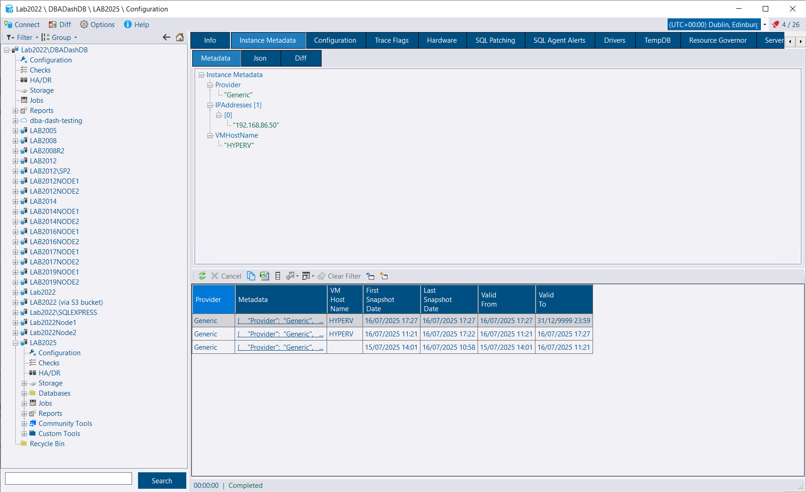
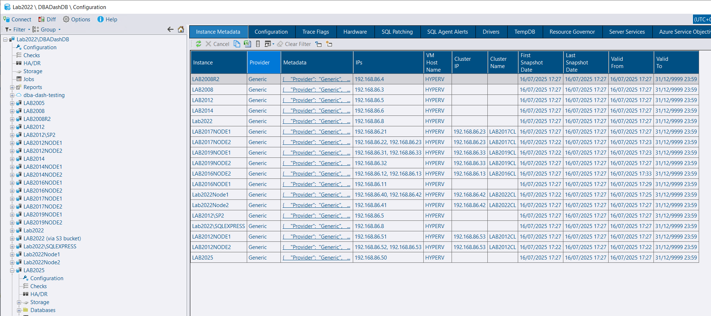
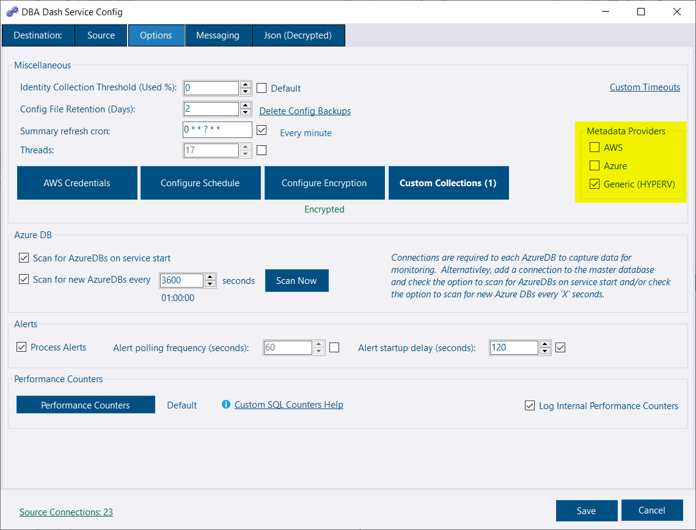
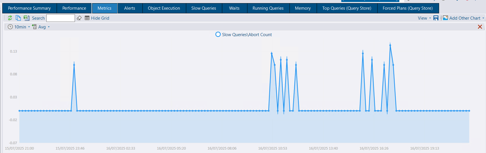
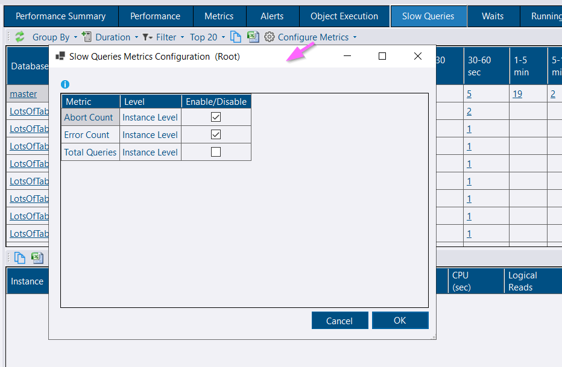
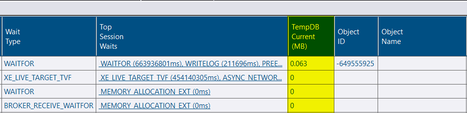
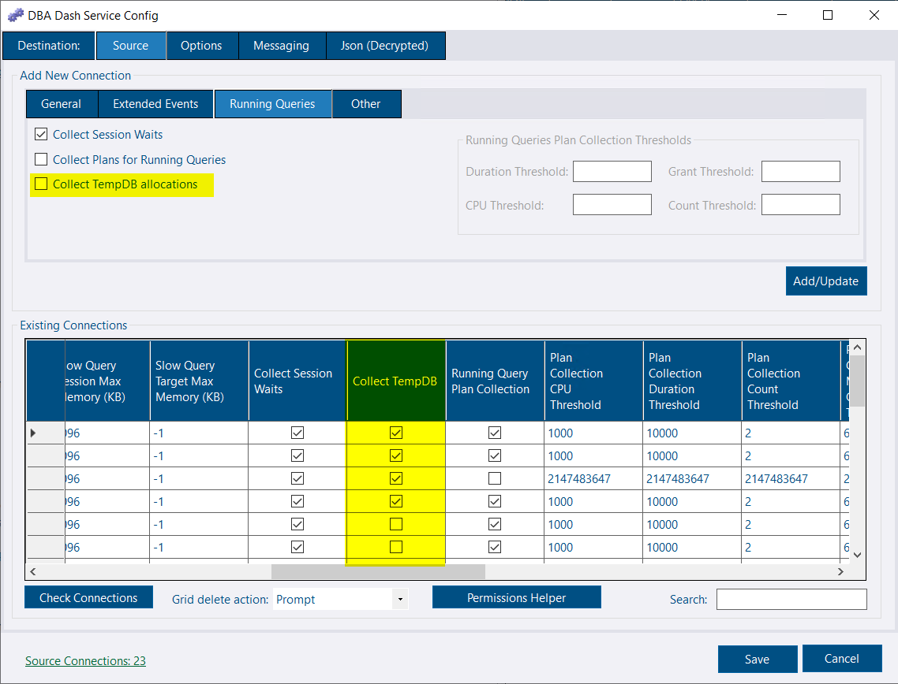
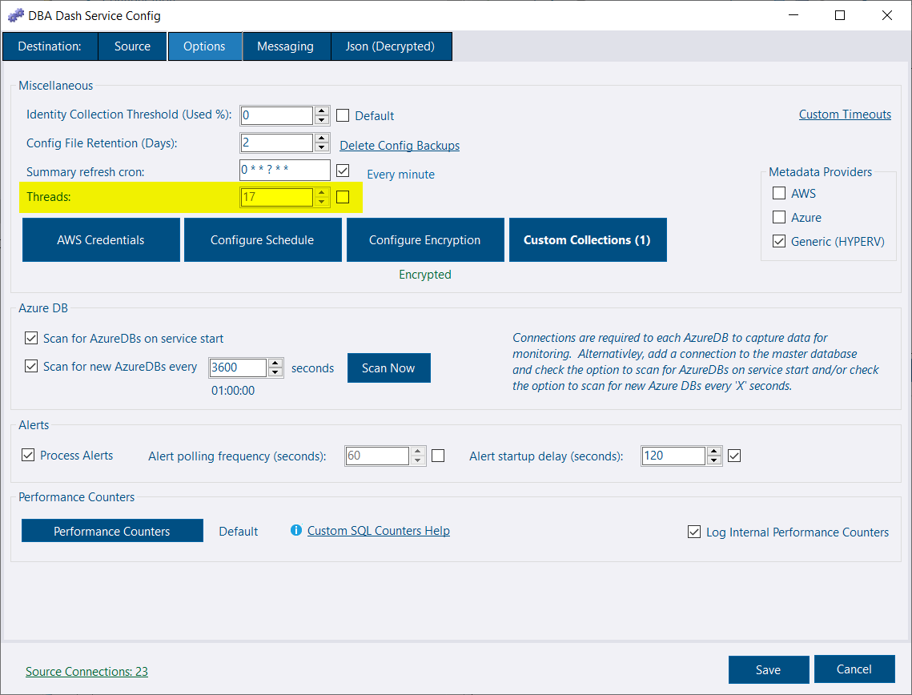

## Instance Metadata

DBA Dash can now optionally collect data from the IMDS for [AWS](https://docs.aws.amazon.com/AWSEC2/latest/UserGuide/configuring-instance-metadata-service.html) and [Azure](https://learn.microsoft.com/en-us/azure/virtual-machines/instance-metadata-service?tabs=windows).  It can also collect some basic information for instances hosted on HYPERV or other cloud providers.

To enable this collection, check the options you want to use in the Metadata providers section of the Options tab of the service config tool.  The collection is scheduled to run at 10pm by default but it won't run if there are no providers enabled or instances with WMI enabled.  To collect data from the IMDS, a PowerShell script is run via WSMan on the remote instance so we can collect data from the IMDS service running on http://169.254.169.254.

The *Hardware* tab also includes a VM Size column which has a link to the instance metadata.  In AWS the instance size was reported in the model column, but we didn't have this information for Azure.


Tags in DBA Dash can be created from the collected IMDS data.  In Options\Repository settings, set `Tags to create from Instance Metadata.  Use * for ALL.` to `*` to create all associated tags.  These will be created as system tags next time tags are updated (every 1hr by default).

Note: To capture AWS Tags from IMDS, ensure the 'Allow Tags in instance metadata` is enabled for the instance.


## Slow Queries metrics

Metrics related to the slow queries collection can now be added.  For example, you might want to monitor the number of query timeouts/cancellations (Abort Count).  Click the Configure Metrics on the *Slow Queries* tab.

## Running Queries improvements

TempDB allocations can be captured.  On the source tab, check the Collect TempDB in the grid.  Or check the option on the *Running Queries* tab when adding a new instance.  The overhead of collecting tempdb allocations is very small based on my testing.

The *total_elapsed_time* column is now captured which results in a more accurate query duration.

## Service threads calculation

The service threads calculation has been updated.  This now takes into account the number of connections and CPU cores instead of being hardcoded to 10 threads.  You can now configure this on the *Options* tab of the service config tool as well as see how many threads have automatically been assigned.

## Other

Thanks [Mark Cilia Vincenti](https://github.com/MarkCiliaVincenti) for a [code refactoring improvement](https://github.com/trimble-oss/dba-dash/pull/1474).

See [3.27.0](https://github.com/trimble-oss/dba-dash/releases/tag/3.27.0) release notes for a full list of fixes.

