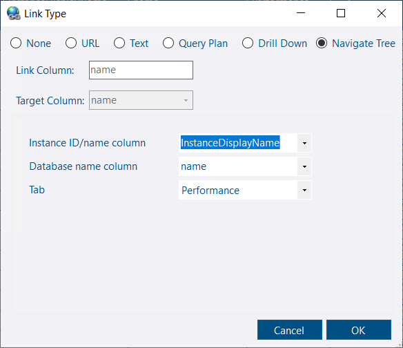

## Database Finder

Previously, the tree would highlight up to 10 matching databases, requiring you to scroll and manually locate the database you wanted. The new database finder opens a dialog that lists all matches in a searchable report, allowing you to quickly select the desired database and the specific tab to open. This streamlines navigation and makes finding databases much faster and more intuitive.

The dialog supports flexible searching using SQL LIKE syntax. By default, `%` wildcards are automatically added to the beginning and end of your search term, so partial matches are included. If you prefer, you can remove or adjust these wildcards directly in the search box to refine your results.

## Current context in the tree is highlighted

The tree now highlights the selected node, making it easier to keep track of your current context in the tree.

## Navigate Tree link type added for custom reports

You can now link to a specific tab associated with a SQL instance or database (similar to the database finder) in your own custom reports.

## Text picker for custom reports

A new text picker is available:

## Alert - Time range

*Added in 3.27.1*

Alert time ranges can now cross the midnight boundary, making configuration easier.

e.g.

*You can now specify a single recurring blackout period from 11PM to 4AM, instead of requiring two separate blackout periods to cover 11PM to midnight and midnight to 4AM.*

This also applies to notification channel schedules.

## Connection Dialog update

*Added in 3.27.3*

Selecting Windows authentication will now use `Integrated Security = true` instead of `Authentication=ActiveDirectoryIntegrated` in the connection string, similar to the behavior of SSMS.  There is a separate `Microsoft Entra Integrated` option that can be used for `Authentication=ActiveDirectoryIntegrated`.

An *Advanced* option is now available which makes it easier to configure less common connection options when required *(Similar to the advanced button in the SSMS 21 connection dialog)*

## Drives - Files link

*Added in 3.27.1*

The Drives tab now includes a link to show what database files are located on the drive.  This helps identify what is consuming space on the drive.

## DB Space History improvement

*Added in 3.27.1*

The database space history report was previously limited to daily granularity.  The data was collected hourly by default so this was a limitation of the report.  The report will now adjust its granularity automatically or it can be overridden.

## Other

See [3.28.0](https://github.com/trimble-oss/dba-dash/releases/tag/3.28.0) release notes for a full list of fixes.

