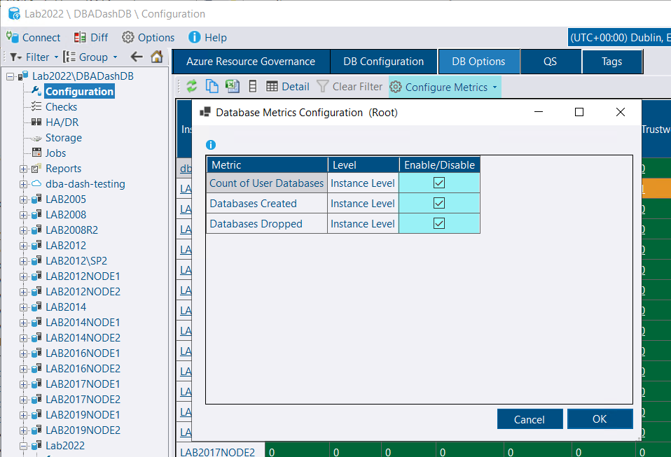
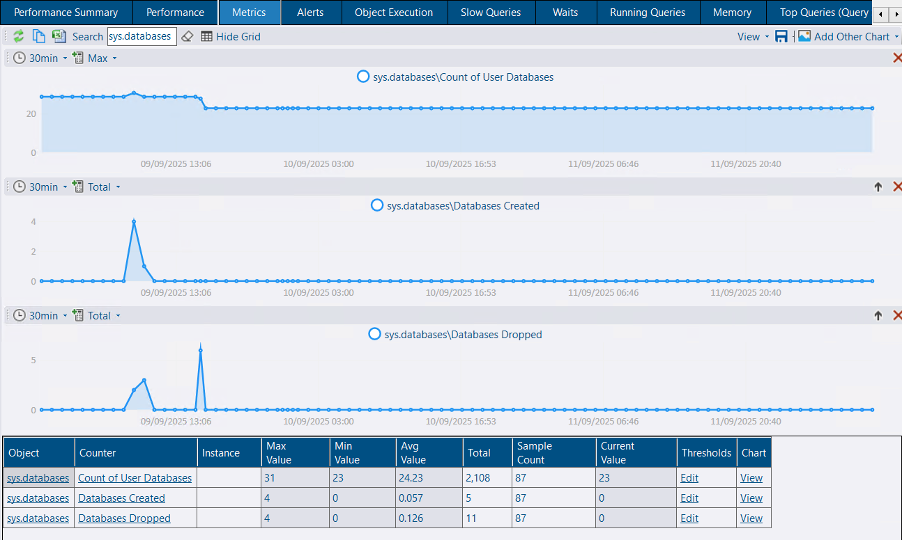
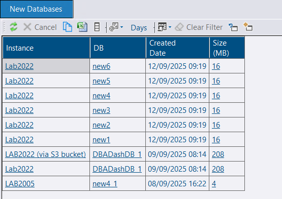
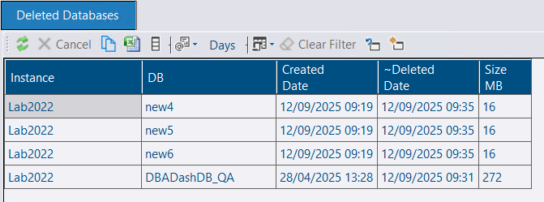
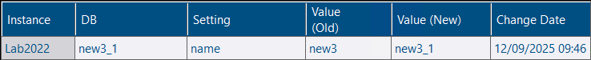
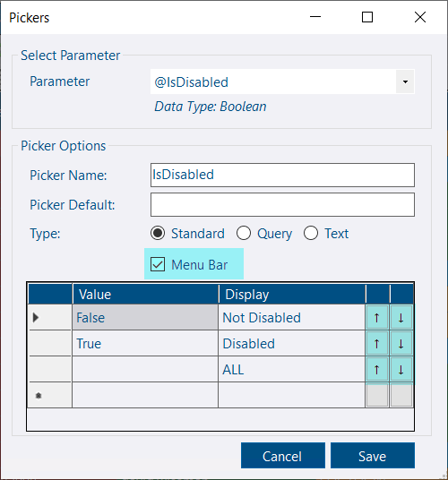
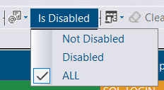

## Metrics associated with Databases collection

New metrics are now available for the Databases collection, which can be configured on the DB Options tab.

* Databases Created: Tracks the number of new databases created.

* Databases Dropped: Tracks the number of databases that have been deleted.

* Count of User Databases: Provides a total count of all user databases.

These metrics are available on the Metrics tab once configured:


You can even alert on these metrics.  e.g. Receive a notification when a database is added or removed.


## New databases / Deleted Databases system reports

As well as tracking the number of databases created and dropped over time, you might want to know which databases were created or dropped recently.

*The new databases report shows databases recently created (by create_date, 7 days by default) across all your SQL instances.*

*The deleted databases report shows databases recently removed.  Note: The deleted date is approximate and shows the time the collection ran where the database was no longer present.  If the database was re-created it would show in the New Databases report instead.*


You don't need to configure database metrics for these reports to work


## DB Options - tracking renames

Database renames are now tracked on the DB Options tab.

*The logic to handle renames previously used database_id and create_date.  This logic was flawed as create_date is updated on rename. It now uses service_broker_guid and database_id.  Otherwise databases are now matched on name rather than on database_id (which can change in some situations).  Renames are now logged.*

## Custom report picker improvements

Pickers can now be located directly on the menu.  Picker items can now be moved up/down without re-creating the picker list.

## Performance improvement

Performance of importing the databases collection via *Database_Upd* has been improved, even with metrics enabled.

## Other

See [3.29.0](https://github.com/trimble-oss/dba-dash/releases/tag/3.29.0) release notes for a full list of fixes.

