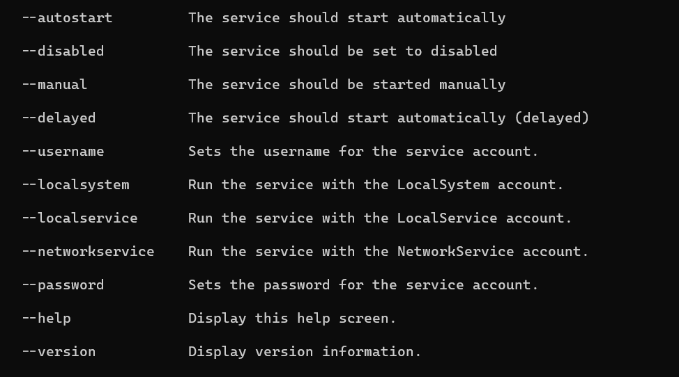

## Replace TopShelf

⚠️ Breaking change to *command line* installation process

[TopShelf](https://github.com/Topshelf/Topshelf) was a popular library for turning console applications into Windows services, but the project has been retired.  Although TopShelf still works OK, it's worth replacing it with a more modern alternative.  This can now be done natively using [BackgroundService](https://learn.microsoft.com/en-us/dotnet/core/extensions/windows-service).

If you install DBA Dash using the service configuration tool, the process remains the same.  If you are installing using the command line, the process has changed slightly. **Username** needs to be passed in as `--username` instead of `-username` and **password** needs to be passed in as `--password` instead of `-password`.

See
`dbadashservice install --help`

## Other

Export to excel fix, instance count fix.  Remove job stats and timeline tabs from group level in tree.

See [3.2.0](https://github.com/trimble-oss/dba-dash/releases/tag/3.2.0) release notes for a full list of fixes.
