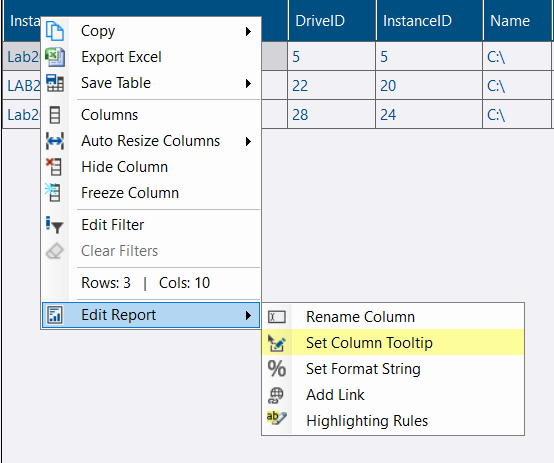
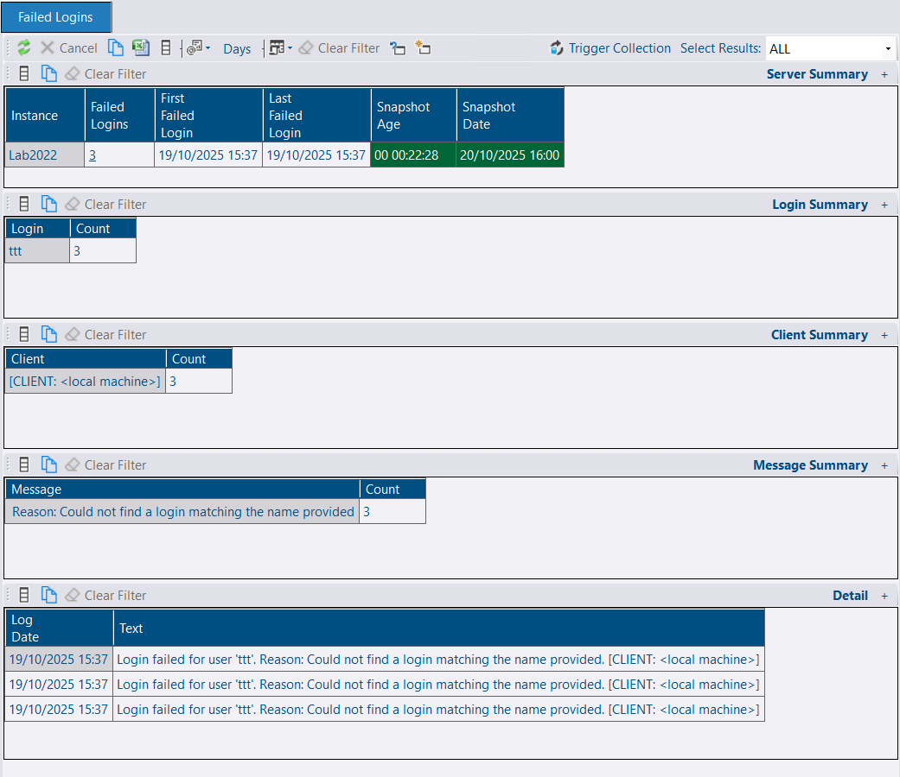
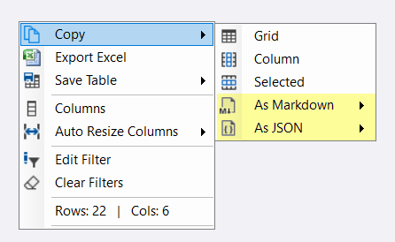
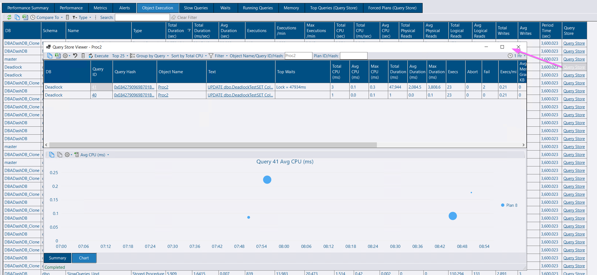

## Column Tooltips

Various system reports have been improved with column tooltips. You can also add column tooltips/descriptions for your own custom reports.

[](column-tooltip.png)

### Custom Report Refactor

Custom reports have been refactored as part of adding the column tooltips feature. The structure of the generated JSON has changed, but backward compatibility has been maintained. Your existing reports will continue to work without any changes.

## Failed Logins

A failed logins collection and report have been added. A high number of failed logins could indicate an application problem or a security issue.

[](failed-logins.png)


This collection is disabled by default. See [this page](/docs/help/failed-logins) for more information on this collection and how to enable it.


## Copy As Markdown / Copy As JSON

New context menu options have been added, allowing you to copy the grid data as Markdown or JSON format.

[](copy-as-json-markdown.png)

This is an example of Markdown generated from the failed logins report above:

```
| Log Date         | Text                                                                                                                 |
| ---------------- | -------------------------------------------------------------------------------------------------------------------- |
| 19/10/2025 15:37 | Login failed for user 'ttt'. Reason: Could not find a login matching the name provided. \[CLIENT: <local machine\>\] |
| 19/10/2025 15:37 | Login failed for user 'ttt'. Reason: Could not find a login matching the name provided. \[CLIENT: <local machine\>\] |
| 19/10/2025 15:37 | Login failed for user 'ttt'. Reason: Could not find a login matching the name provided. \[CLIENT: <local machine\>\] |
```

Which renders as the following HTML table:

| Log Date         | Text                                                                                                                 |
| ---------------- | -------------------------------------------------------------------------------------------------------------------- |
| 19/10/2025 15:37 | Login failed for user 'ttt'. Reason: Could not find a login matching the name provided. \[CLIENT: <local machine\>\] |
| 19/10/2025 15:37 | Login failed for user 'ttt'. Reason: Could not find a login matching the name provided. \[CLIENT: <local machine\>\] |
| 19/10/2025 15:37 | Login failed for user 'ttt'. Reason: Could not find a login matching the name provided. \[CLIENT: <local machine\>\] |

This feature is useful for copying information to work items in Azure DevOps, static websites (like this one), wikis, or any other platform that supports Markdown.

## Object Execution Tab Improvement

A Query Store link has been added, allowing you to get statement and plan level information for your procedures at the click of a button.

[](object-execution-query-store.png)

## Alerts Improvement

[Alerts](/docs/help/alerts) will now use the instance display name rather than the ConnectionID. The following message template placeholders are available if you want to customize this behavior:

- `{Instance}` - Updated to use instance display name
- `{ConnectionID}` - A new option to allow you to continue using ConnectionID if you prefer
- `{InstanceAndConnectionID}` - Display both the instance display name and connection ID (if they are different)

## Managed Instance Improvement

Managed instances now support Query Store and the table size collection, thanks to [this pull request](https://github.com/trimble-oss/dba-dash/pull/1592) from [robert-jc0](https://github.com/robert-jc0).

## Other

See [3.30.0](https://github.com/trimble-oss/dba-dash/releases/tag/3.30.0) release notes for a full list of fixes.

