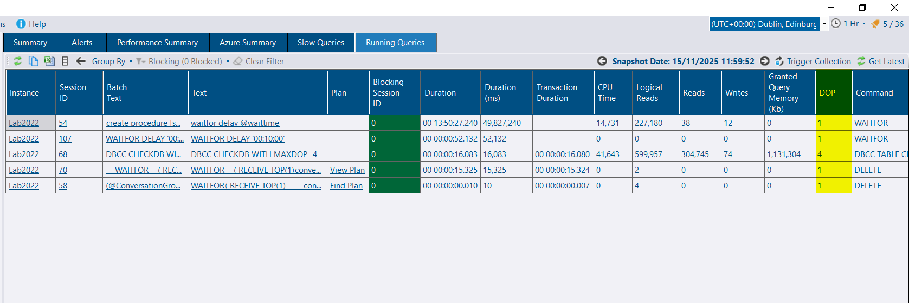
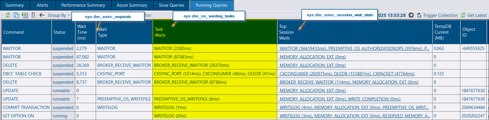
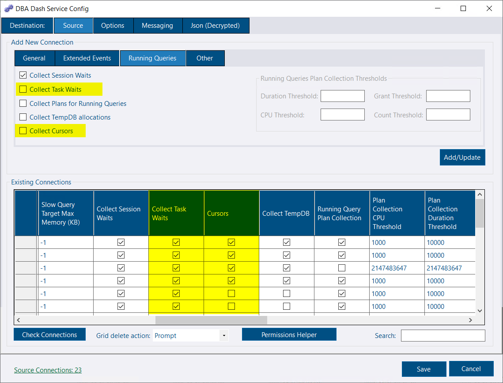
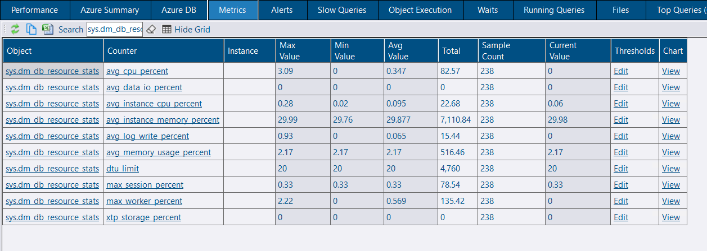

### SQL 2025 ready

DBA Dash is fully compatible with SQL Server 2025. Testing began during private preview and continued through the GA release to ensure seamless support for the latest version.

## Running Queries

### Cursor Collection

Cursor information can now be captured for running queries from [sys.dm_exec_cursors](https://learn.microsoft.com/en-us/sql/relational-databases/system-dynamic-management-views/sys-dm-exec-cursors-transact-sql). Previously, when code created a cursor and executed a fetch call in a separate batch, you would only see something like `FETCH API_CURSOR00000000000000CD` - not very useful. Now, DBA Dash captures the actual statement, batch text, and other cursor details for better visibility.

### DOP

The DOP (Degree of Parallelism) is now captured from [sys.dm_exec_requests](https://learn.microsoft.com/en-us/sql/relational-databases/system-dynamic-management-views/sys-dm-exec-requests-transact-sql).

### Task Waits

DBA Dash now captures task-level waits for running queries. Wait stats are available from three sources:

1. [sys.dm_exec_requests](https://learn.microsoft.com/en-us/sql/relational-databases/system-dynamic-management-views/sys-dm-exec-requests-transact-sql) - shows the current wait type for the request
2. [sys.dm_exec_session_wait_stats](https://learn.microsoft.com/en-us/sql/relational-databases/system-dynamic-management-views/sys-dm-exec-session-wait-stats-transact-sql) - returns historic wait stats aggregated for the session
3. [sys.dm_os_waiting_tasks](https://learn.microsoft.com/en-us/sql/relational-databases/system-dynamic-management-views/sys-dm-os-waiting-tasks-transact-sql) - captures task-level waits (top 3). While sys.dm_exec_requests shows a single wait type, parallel queries may have multiple tasks waiting on different resources. DBA Dash aggregates these and returns the top 3 task-level waits.

### Configuration

Cursor collection and task waits can be configured using the service config tool. Enable these options when adding a new connection, or update them in the grid for existing connections.

## Metrics

Metrics are now available for [sys.dm_db_resource_stats](https://learn.microsoft.com/en-us/sql/relational-databases/system-dynamic-management-views/sys-dm-db-resource-stats-azure-sql-database) and [sys.elastic_pool_resource_stats](https://learn.microsoft.com/en-us/sql/relational-databases/system-catalog-views/sys-elastic-pool-resource-stats-azure-sql-database). While previously available on the Azure DB tab, these metrics can now be used to create custom counter alerts.

## Azure Database Tagging

Tagging is now available for individual Azure databases in addition to server-level tags.

## .NET 10 Coming Soon

Microsoft recently released .NET 10, the latest LTS (Long Term Support) release. Version 3.31 remains on .NET 8, but .NET 10 support is planned for a future update. The [.NET 10 Desktop Runtime](https://dotnet.microsoft.com/en-us/download/dotnet/10.0) will be required for the upgrade.

## Additional Changes

See the [3.31.0 release notes](https://github.com/trimble-oss/dba-dash/releases/tag/3.31.0) for a complete list of fixes and improvements.

