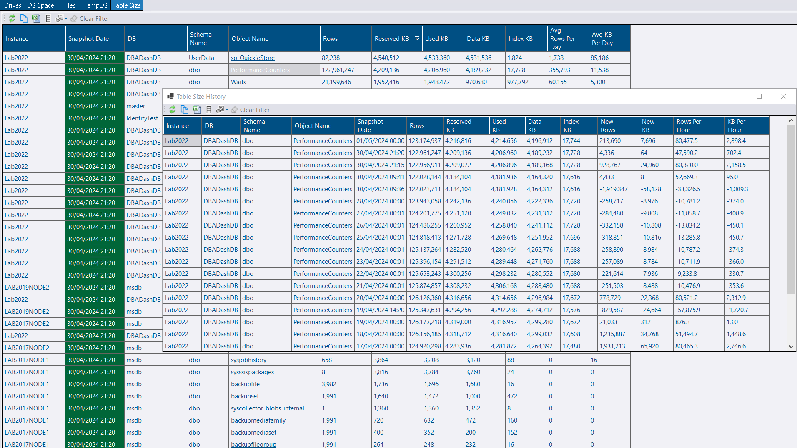
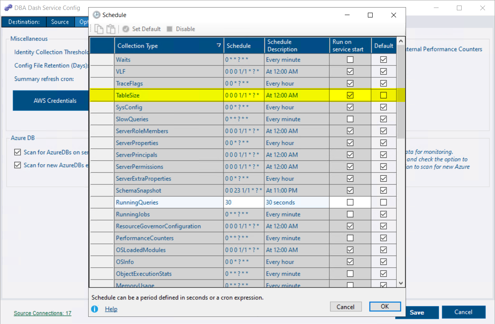
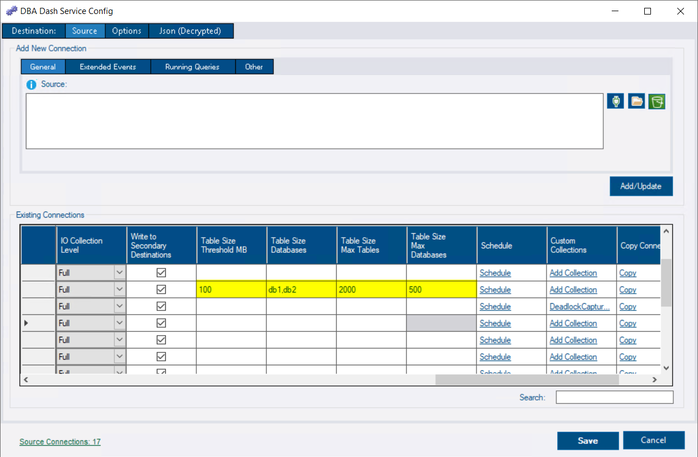

## Table Size collection & reporting

The table size collection allows you to track how fast your tables are growing.  The table size report is similar to the disk usage by top tables report in SSMS, but it provides growth rates and can show the top tables across all your instances & databases.  It also provides easy access to the growth history of each table.

[](table_size.png)

In this version, the TableSize collection is **disabled** by default.  To enable it, click the **Configure Schedule** button on the options tab in the service configuration tool.  Find the **TableSize** collection and uncheck the default schedule.  Enter a cron expression for the schedule (e.g. `0 0 0 1/1 * ? *` to run daily at midnight).  [See here](/docs/help/schedule) for more info on configuring schedules.

[](schedule.png)

### Thresholds

There are some default thresholds in place to limit the data collected to tables of an interesting size (100MB) and also to skip the collection on instances with a large number of databases (500) or databases with a large number of tables (2000).  It's also possible to specify which databases you want to collect table size information for.  You can edit this information in the connections grid on the source tab of the service configuration tool or by editing the json associated with the connection.

[](thresholds.png)

```json
      "TableSizeCollectionThresholdMB": 100,
      "TableSizeMaxDatabaseThreshold": 500,
      "TableSizeDatabases": "db1,db2",
      "TableSizeMaxTableThreshold": 2000
 ```

### More info

This collection was initially prototyped using the [custom collection](/docs/help/custom-collections/) & [custom reports](/docs/how-to/create-custom-reports/) features. You could re-create this collection and report using these features without writing a single line of C#!  The app can even generate some of the boilerplate T-SQL for you to customize as required.
