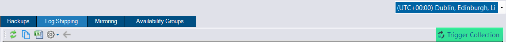

## Messaging improvements

The [messaging](/docs/help/messaging/) feature enables communication between the GUI and the DBA Dash service, allowing you to trigger collections to run on demand.  This feature was added in [3.5](../whats_new_in_3_5_0/) and has been enhanced in 3.6:

* [SQS Queue support](/docs/help/messaging/#enable-messaging-for-remote-dba-dash-services) added for instances in remote environments.

*For most users, you simply need to click the "Enable Messaging" checkbox in the service configuration tool to enable you to trigger collections to run on demand.  If you have a more advanced configuration where data is being imported via a S3 bucket, you can configure a SQS queue to extend this communication to your remote instances.*

* Trigger collections directly from tabs
Triggering a collection previously required navigating to the collection dates tab.  In many cases you can now trigger the collection directly from the tab where you want the data refreshed.

* Schema snapshots can be triggered on demand.

## Other

See [3.6.0](https://github.com/trimble-oss/dba-dash/releases/tag/3.6.0) release notes for a full list of fixes.
