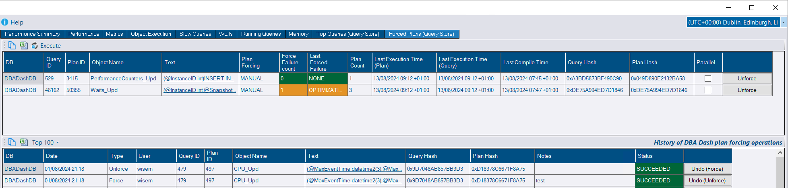

## Query Store Plan Chart

Chart to visualize performance of query plans for a query over time.

From the *Top Queries (Query Store)* tab, click the query ID for a query to drill down.  Click the chart tab at the bottom left to see a chart instead of the plan summary.

## Forced Plans

A new option is available to force query plans directly from DBA Dash.

You can also view forced plans in the *Forced Plans (Query Store)* tab.  A history of plan forcing operations is kept for plans forced using the DBA Dash GUI, providing a quick undo option.

### Security for plan forcing

🔒Plan forcing is disabled by default and needs to be enabled in the service configuration tool.

* In the Options tab, check *Enable Communication* and *Allow Plan Forcing*.
* Add users to the *AllowPlanForcing* and *Messaging* database roles to enable users to force plans in the GUI.  *db_owner* will also have access.

## Check Connections

Old source connections should be removed from the service configuration tool.  They use up resources (threads) trying to connect to an instance that no longer exists.  The new *Check Connections* button allows you to check which instances are currently accessible.  It will also show the the time of the last collection for the instance - making it easier to see how long an instance has been inaccessible.

## Wildcard support for Table Size

[Chad Baldwin](https://github.com/chadbaldwin) adds a [contribution](https://github.com/trimble-oss/dba-dash/pull/954) that improves the flexibility of the table size collection configuration.  This makes it easier to track the table size for the databases that you are interested in.

## Other

See [3.8.0](https://github.com/trimble-oss/dba-dash/releases/tag/3.8.0) release notes for a full list of fixes.
