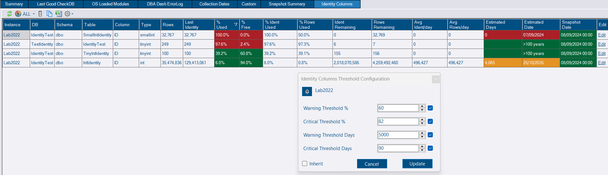
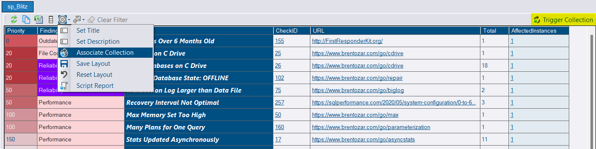
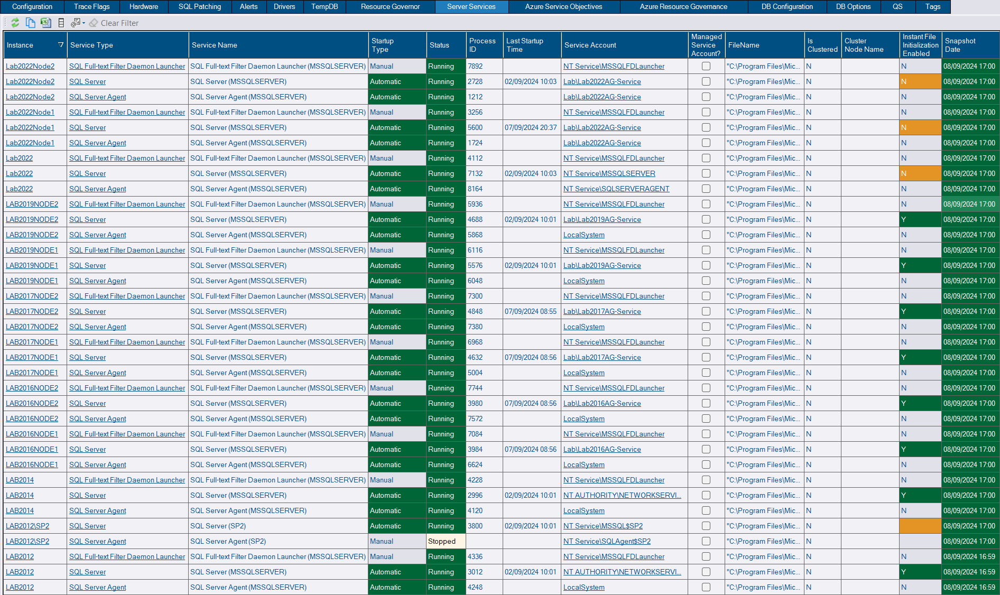
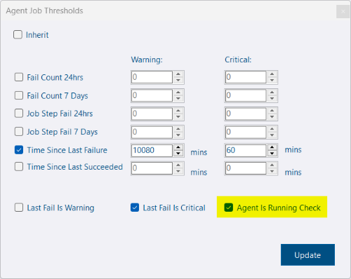
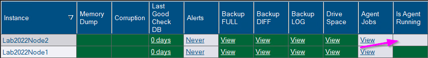

## Identity Columns - Threshold configuration on days remaining

Identity columns threshold can now be configured on calculated days remaining in addition to % used.  The summary page will now show the minimum days remaining in addition to the maximum identity % used.

## Custom Reports - trigger collection option

[Custom Reports](/content/docs/how-to/create-custom-reports/) allow you to extend the functionality of DBA Dash with your own bespoke reports.

You can now associate your own [custom collection](/content/docs/help/custom-collections/) or standard collection with the report, allowing you to trigger the collection to run on demand directly from your report.


This uses the new [messaging](/content/docs/help/messaging/) feature which can be enabled by clicking a checkbox in the config tool.



Triggering collections currently only works at the instance level


## Server Services collection (sys.dm_server_services)

A new collection has been added to capture information from the [sys.dm_server_services](https://learn.microsoft.com/en-us/sql/relational-databases/system-dynamic-management-views/sys-dm-server-services-transact-sql?view=azuresqldb-current) DMV.  This returns status information for SQL Server services (Engine, Agent, FullText).  This includes the account name that is been used for the service which can be useful if you want to identify which services are not using a gMSA account for example.

## Option to disable SQL Server Agent Running Check

In some cases the SQL Agent might be turned off intentionally on an instance because it's not being used.  There is now an option to disable the agent is running check.

## Other

See [3.9.0](https://github.com/trimble-oss/dba-dash/releases/tag/3.9.0) release notes for a full list of fixes.
