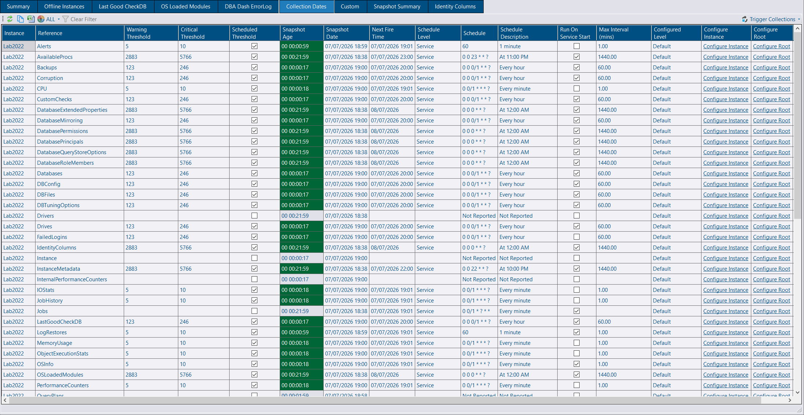
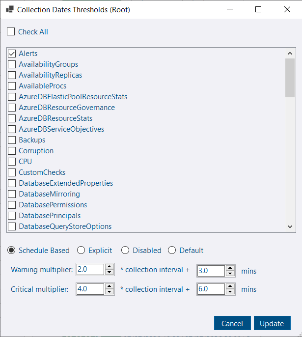

## ScheduleInfo collection

The service now records schedule configuration in the repository database via the `ScheduleInfo` collection (populated at service start). This enables a few useful improvements:

- **Collection details:** view the cron expression, schedule description, next fire date, and other metadata in the *Collection Dates* tab for each collection.

[](collection-dates.png)

- **Smarter alerting:** collection-date alerting can use the configured schedule to make thresholds more meaningful. Schedule-based thresholds are now available.

### Schedule-based thresholds

[](collection-threshold.png)

Schedule-based thresholds let you set alerts based on a multiple of the collection frequency plus a fixed buffer. In the example above there is a warning multiplier of 2.0 and a buffer of 3 minutes. Thresholds are calculated from the collection frequency. For example:

- A 1-minute collection: (1 × 2.0) + 3 = 5 minutes (warning threshold)
- A 1-hour collection: (60 × 2.0) + 3 = 123 minutes (warning threshold)

If you change the collection frequency in the service configuration tool, thresholds update automatically. Disabling a collection also disables its threshold.

### New Defaults

The table below shows the *typical* thresholds assigned to collections based on frequency and the new schedule-based defaults. The warning threshold will trigger about 3 minutes after missing two collections; the critical threshold about 6 minutes after missing four collections.

| Collection Frequency | Old Warning | New Warning | Old Critical | New Critical |
| -------------------- | ----------- | ----------- | ------------ | ------------ |
| 1min                 | 5min        | 5min        | 10min        | 10min        |
| 1hr                  | 125min      | 123min      | 180min       | 246min       |
| daily                | 1445min     | 2883min     | 2880min      | 5766min      |

#### Migration

During upgrade, old default threshold values are removed automatically as a one-time migration. If you haven't customized thresholds, you'll automatically get the new schedule-based thresholds. To restore the old defaults, run the following SQL on the repository database:

```sql
INSERT INTO dbo.CollectionDatesThresholds
(
    InstanceID,
    Reference,
    WarningThreshold,
    CriticalThreshold
)

SELECT T.InstanceID,
       T.Reference,
       T.WarningThreshold,
       T.CriticalThreshold
FROM
(VALUES
(-1,'DBFiles',125,180),
(-1,'ServerExtraProperties',125,180),
(-1,'OSLoadedModules',1445,2880),
(-1,'TraceFlags',125,180),
(-1,'ServerProperties',125,180),
(-1,'LogRestores',125,180),
(-1,'DatabasesHADR',5,10),
(-1,'LastGoodCheckDB',125,180),
(-1,'Alerts',125,180),
(-1,'DBTuningOptions',125,180),
(-1,'DBConfig',125,180),
(-1,'OSInfo',5,10),
(-1,'Drives',125,180),
(-1,'Databases',125,180),
(-1,'Instance',125,180),
(-1,'Drivers',1445,2880),
(-1,'SysConfig',125,180),
(-1,'Backups',125,180),
(-1,'AzureDBServiceObjectives',125,180),
(-1,'Corruption',125,180),
(-1,'RunningQueries',5,10),
(-1,'CPU',5,10),
(-1,'IOStats',5,10),
(-1,'ObjectExecutionStats',5,10),
(-1,'SlowQueries',5,10),
(-1,'SlowQueriesStats',5,10),
(-1,'AzureDBElasticPoolResourceStat',5,10),
(-1,'Waits',5,10),
(-1,'AzureDBResourceStats',5,10),
(-1,'DatabasePrincipals',1445,2880),
(-1,'ServerPermissions',1445,2880),
(-1,'ServerPrincipals',1445,2880),
(-1,'DatabasePermissions',1445,2880),
(-1,'ServerRoleMembers',1445,2880),
(-1,'DatabaseRoleMembers',1445,2880),
(-1,'DatabaseMirroring',125,180),
(-1,'Jobs',1445,2880),
(-1,'JobHistory',5,10),
(-1,'VLF',1445,2880),
(-1,'CustomChecks',125,180),
(-1,'PerformanceCounters',5,10),
(-1,'DatabaseQueryStoreOptions',1445,2880),
(-1,'AzureDBResourceGovernance',125,180),
(-1,'ResourceGovernorConfiguration',1445,2880),
(-1,'MemoryUsage',5,10),
(-1,'IdentityColumns',10080,20160),
(-1,'RunningJobs',5,10),
(-1,'TableSize',4320,11520),
(-1,'ServerServices',1445,2880),
(-1,'FailedLogins',1445,2880),
(-1,'ResourceGovernorWorkloadGroups',5,10)
) T(InstanceID,Reference,WarningThreshold,CriticalThreshold)
WHERE NOT EXISTS(SELECT 1 FROM dbo.CollectionDatesThresholds CDT WHERE CDT.InstanceID = T.InstanceID AND CDT.Reference = T.Reference)
```

Note: The new default values will apply to any collection type that reports a schedule.  This includes custom collections.

## System report conversions

This release adds additional custom report conversions:

- **TempDB**
- **Last Good CheckDB**
- **Identity Columns**
- **Running Jobs**

Converting these tabs to system reports simplifies the codebase and enables them to benefit from custom report features, such as triggering collections and opening in a new window.

## Minor fixes

- Added horizontal scrolling support for grids when using a compatible mouse. If you have a touchpad, use a two‑finger scroll. If you only have a vertical scroll wheel, use Ctrl+scroll to scroll horizontally (previously supported).
- Fixed a bug in the schema snapshot collection when using the new queue-based scheduling.
- Improved deployment handling to avoid failures with certain user-created object types.
- Fixed cell highlighting so it remains in place when a grid is sorted.
- Reverted the SqlClient NuGet package update due to a breaking change in Entra authentication.

## Other improvements

See the [4.14.0 release notes](https://github.com/trimble-oss/dba-dash/releases/tag/4.14.0) for a full list of fixes and improvements.
