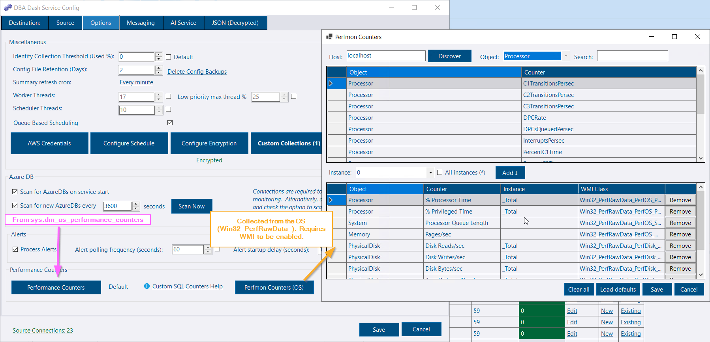
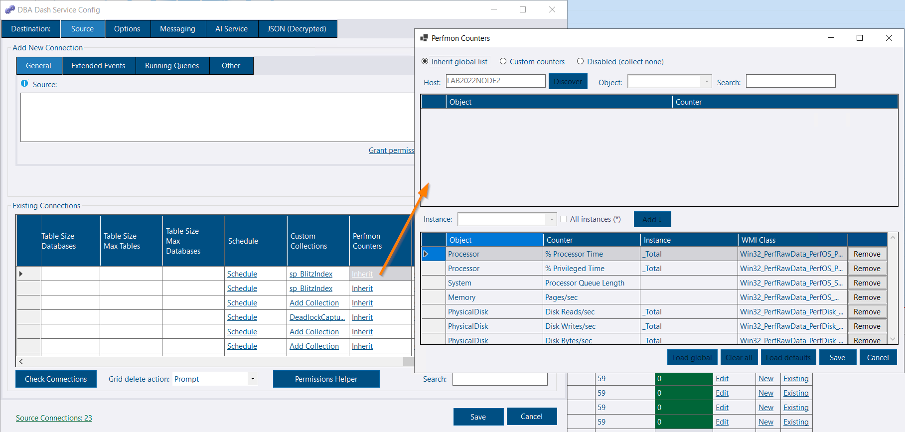
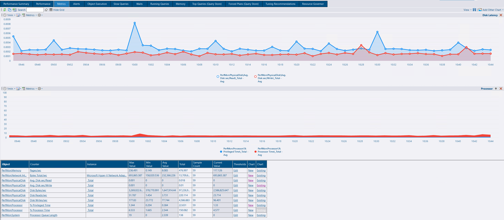
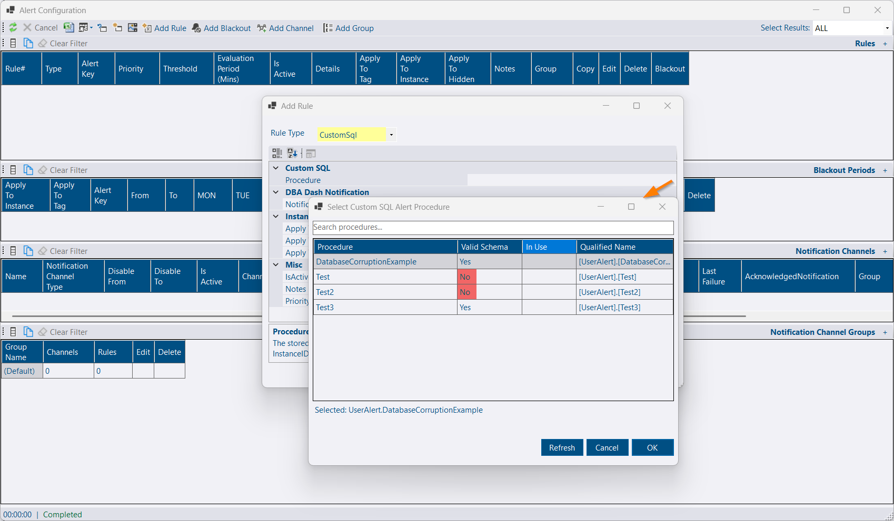
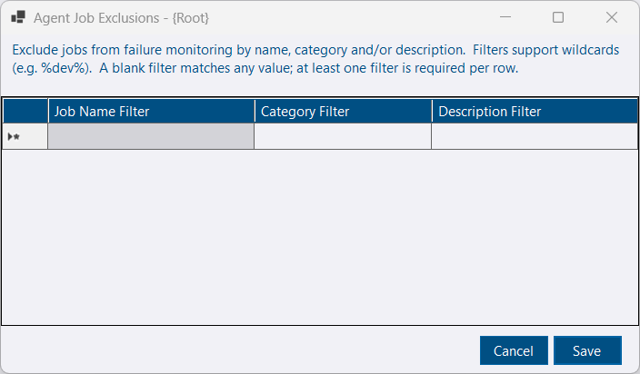

## Overview

DBA Dash 4.16.0 adds native OS Perfmon counter collection and several usability improvements to the Metrics tab, charting, and alert rules. This release expands host-level visibility, simplifies multi-metric charts, and introduces a more flexible `CustomSql` alert type. The sections below summarize the highlights and show quick configuration and upgrade notes.

## OS-level (Perfmon) counter collection

Previously DBA Dash collected a subset of Windows performance counters via the `sys.dm_os_performance_counters` DMV. Version 4.16.0 can also capture native OS Perfmon counters, exposing many additional host-level metrics.

Where to find them:

- Counters appear on the **Metrics** tab alongside DMV-collected metrics.
- Counters can be added to dashboards, included in custom reports, and used for alerts.

### Why this matters

- Gain host-level metrics (CPU queue lengths, disk/adapter counters, NIC stats, etc.) alongside DMV-derived SQL Server metrics.
- Useful for troubleshooting OS-level bottlenecks that don't appear in SQL DMVs.

### Configuration (quick)

1. Open the service configuration tool → **Options** → **Perfmon Counters (OS)**.
2. (Optional) Click **Load Defaults** for a curated starter set.
3. Enter a host name and click **Discover** to list counters.
4. Use the object filter/search, select counters, click **Add**, then **Save**.

Notes:

- Selected counters apply to all instances that have WMI enabled. You can override this per-instance if required.

To override counters per instance:

1. In the **Source** tab, open the **Perfmon Counters** configuration for the instance.
2. Choose **Inherit global list**, **Custom counters** (optionally **Load Global** to import), or **Disabled (collect none)**.
3. Modify the list and click **Save**.

## Metrics tab and charting improvements

You can now combine multiple metrics into a single chart and configure aggregation, axes, and chart types more easily:

- **New** — create a new chart for the selected metric.
- **Existing** — add the selected metric to the most recently used chart; if no chart exists, a new one will be created.

Use cases:

- Combine related metrics (for example, *Avg. Disk sec/Read* and *Avg. Disk sec/Write*) into a single *Disk Latency* chart.
- Overlay OS-level counters with DMV metrics to correlate SQL activity with host behavior.

Tip:

- Use the **Metrics** toolbar to add metrics and choose aggregation (avg, max, sum) appropriate to the metric.

## Alert Improvements

### CustomSql alert type

The `CustomSql` alert type lets you implement bespoke alerting logic using a stored procedure in the `UserAlert` schema. The proc must return three columns:

- `InstanceID` INT — the instance the alert relates to
- `AlertKey` NVARCHAR(256) — unique key per item within the instance (used for de-dupe/resolution)
- `AlertMessage` NVARCHAR(MAX) — the alert message

See the example template: [UserAlert.DatabaseCorruptionExample](https://github.com/trimble-oss/dba-dash/blob/main/DBADashDB/UserAlert/Stored%20Procedures/DatabaseCorruptionExample.sql).

If the stored procedure uses the correct schema and columns it will show as valid in the UI.

### Other new rules

- `FailedLogins` — alert on a specified threshold of failed logins over a time window.
- `DatabaseMail` — alert when Database Mail stops or is misconfigured.

## Agent Job exclusions for daily checks

Agent jobs can now be excluded from daily checks (summary/job status pages) by name, category, or description. Exclusions may be configured globally or per-instance.

## Other improvements

See the [4.16.0 release notes](https://github.com/trimble-oss/dba-dash/releases/tag/4.16.0) for a full list of fixes and improvements.

Note: There was no blog post for 4.15 (it was a maintenance release). See the fixes for 4.15 [here](https://github.com/trimble-oss/dba-dash/releases/tag/4.15.0).
