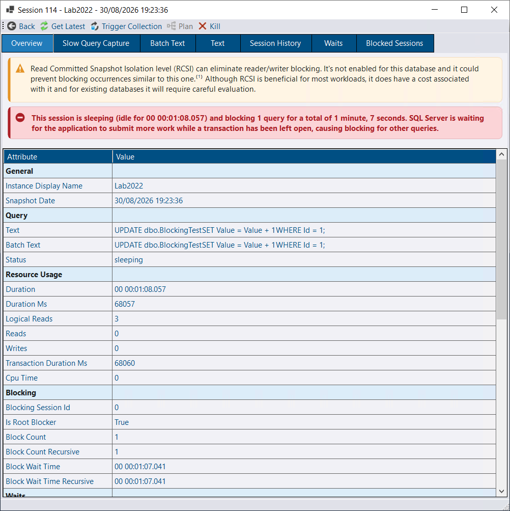
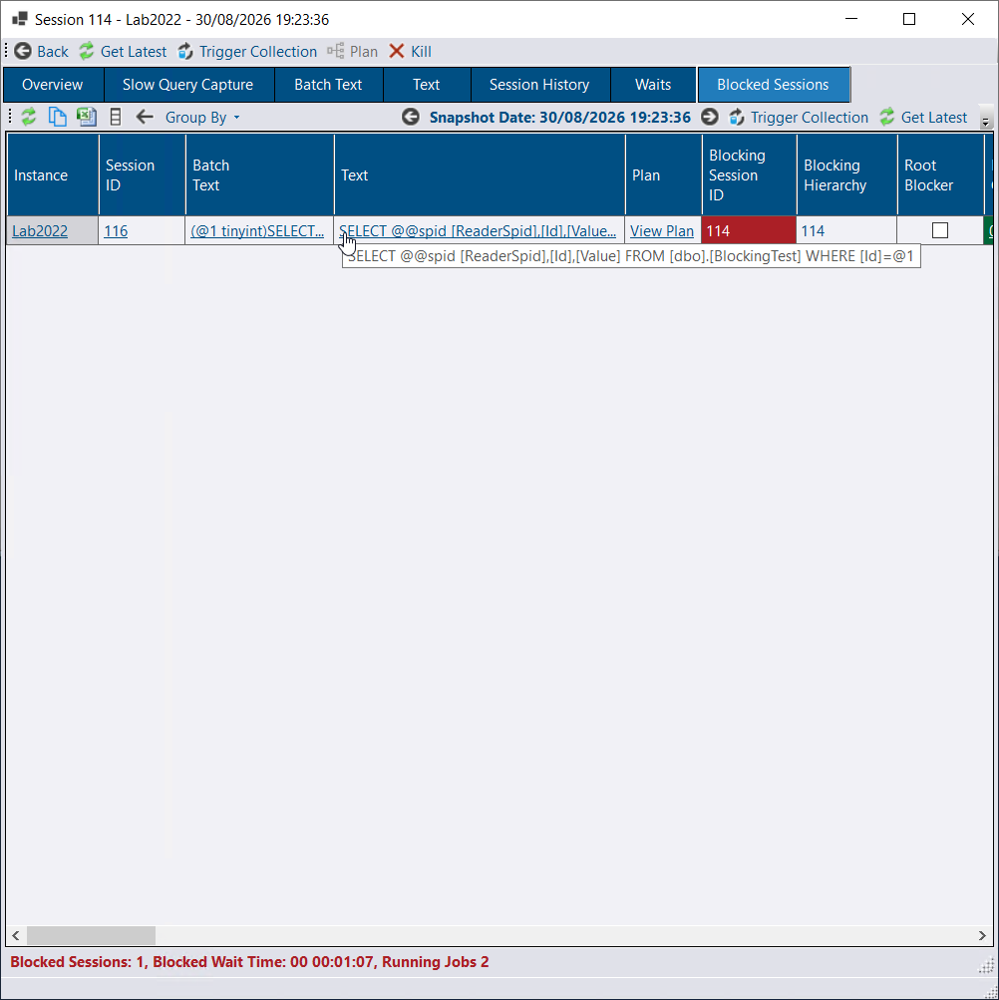
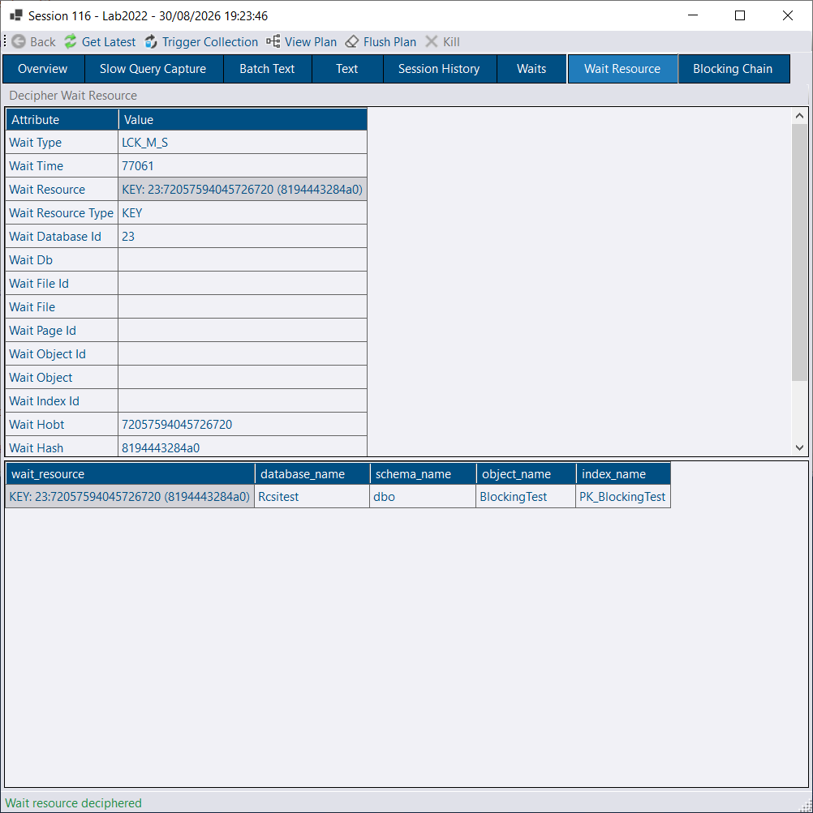
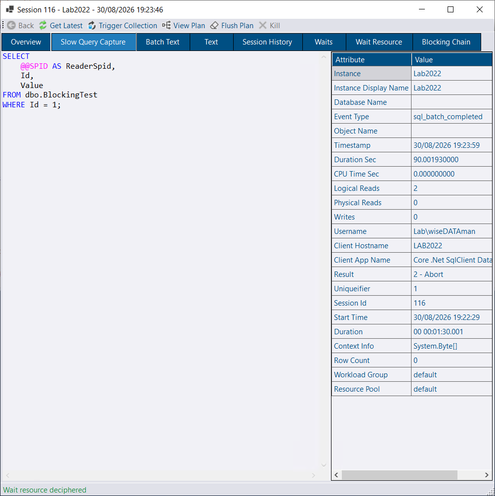

## Extended Events

### Ad-hoc XE traces

You can now create ad-hoc Extended Events (XE) sessions directly from DBA Dash. This avoids switching tools when you need a short-lived trace and adds functionality for tracing across multiple instances.

- Multi-instance tracing: trace across Availability Group nodes (primary + replicas) or multiple Azure databases and view a combined result set.

	

- Simplified configuration: a responsive UI makes it easier to pick events, fields, and filters.

	

- Save/load templates: persist trace configurations (events, fields, filters) and reload them later; templates can prompt for values (for example, application name or `session_id`).

- History and retention: trace runs are recorded in the repository database so you can reload runs, add notes, export results, or remove traces. Retention is configurable.

- Time limits: client-side durations are supported and traces stop automatically when the configured time elapses.

- Flexible results grid: group, filter, and aggregate results using the DBA Dash grid — choose multiple groupings and aggregations per column.

### Demo

### Existing XE sessions

DBA Dash also discovers and manages existing XE sessions across your estate. Features include:

- Live inventory of running sessions across all your SQL instances
- Start/stop sessions
- Watch sessions and view event data (ring_buffer or event_file targets)
- Copy the generated `CREATE EVENT SESSION` script

### Get started

Enable Extended Events in the Service Configuration tool (Messaging tab). See the Extended Events guide for configuration and repository security details: [/docs/help/extended-events]( /docs/help/extended-events).

## Running Queries — Session ID link

Previously, clicking the Session ID column on the Running Queries tab opened the associated `rpc_completed`/`sql_batch_completed` event (when available), showing the query as submitted from the client with parameters and execution metrics. That functionality remains, but the dialog now opens to an Overview tab by default — a pivoted, easier-to-read summary of Running Queries data — and surfaces helpful information cards.

The red information card above highlights a session that has been idle for more than a minute (waiting for the application to commit or send more work).  The yellow information card highlights that blocking that could be mitigated under RCSI. On the Blocked Sessions tab you can jump to the blocked request and inspect details.

The "Wait Resource" tab includes a "Decipher Wait Resource" action that translates wait strings like "KEY: 23:72057594045726720 (8194443284a0)" into a human-readable form; the data is collected and returned automatically via the messaging feature.

There are many features in this dialog: session waits, session history, Query Store, query plan, and the `sql_batch_completed`/`rpc_completed` event details remain available.

Actions available (when enabled in the *Messaging* tab and when the user has the required repository DB role membership such as `AllowKillSession` or `AllowPlanForcing`):

- **Kill Session** — e.g. terminate a query causing severe blocking. This is available only for recent snapshots and includes validation to ensure the same **request** is still running before attempting to kill it.
- **Flush plan** — remove the associated plan from cache using `DBCC FREEPROCCACHE` with the plan handle. This helps recover from parameter-sniffing problems; if Query Store is available consider forcing a plan from the Query Store tab instead.

## Alert improvements

* Added AWS DevOps notification channel
* Updated generic Webhook channel to support headers

## Other improvements

See the [4.17.0 release notes](https://github.com/trimble-oss/dba-dash/releases/tag/4.17.0) for a full list of fixes and improvements.
