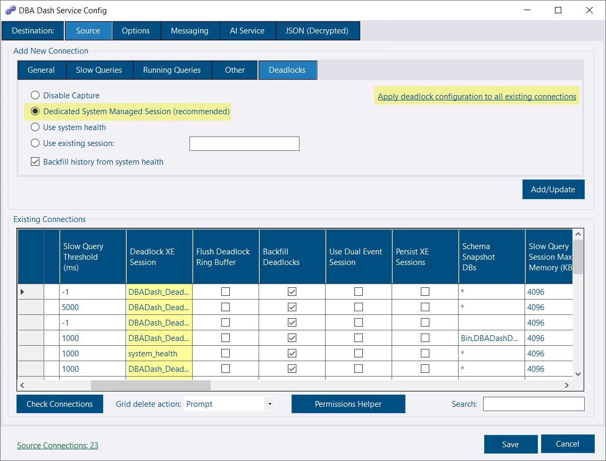
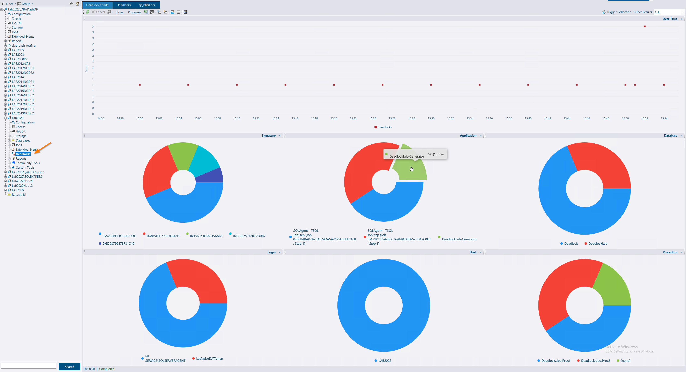
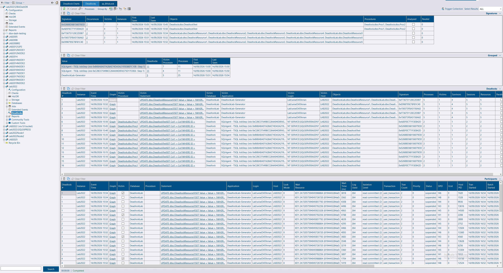
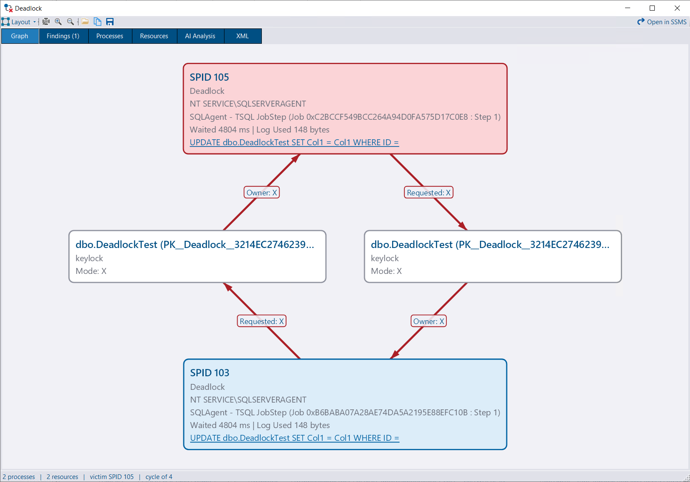
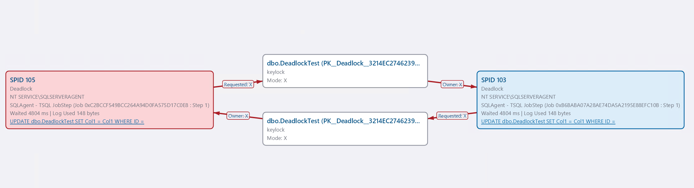
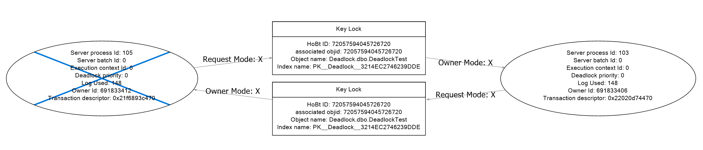
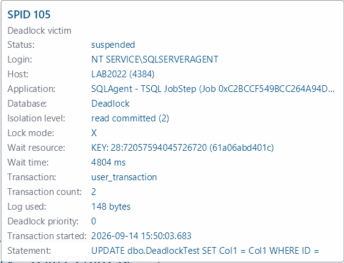
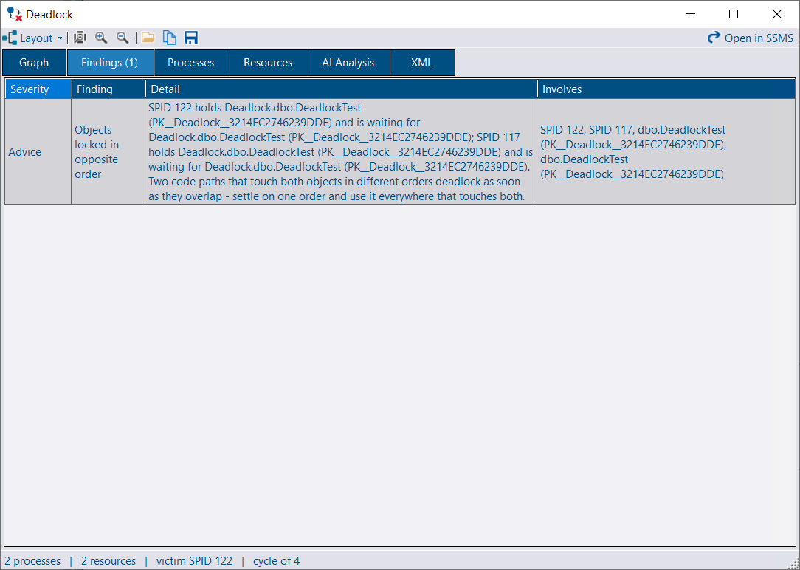
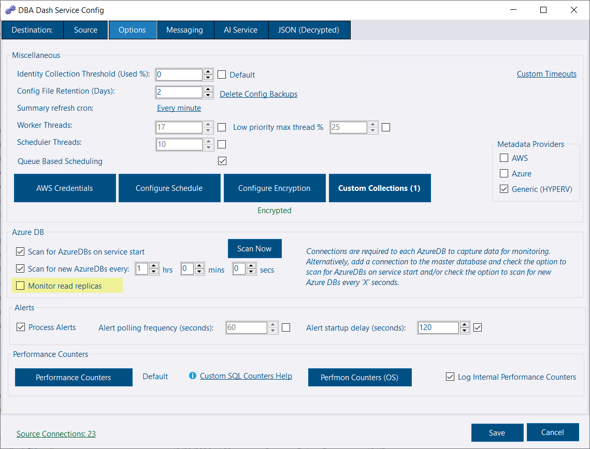

## Overview

DBA Dash 4.18.0 adds native deadlock monitoring from collection through analysis and visualization, including a dedicated deadlock viewer and optional AI analysis. This release also makes it easier to monitor Azure SQL Database read replicas.

## Deadlocks

DBA Dash previously had limited support for deadlocks. It captured the `Locks\Number of Deadlocks/sec\_Total` performance counter, which was available on the Metrics tab and used to calculate a deadlock count on the Performance tab. Clicking a deadlock square on the Performance tab ran `sp_BlitzLock` for that time period, providing information about the associated deadlocks, including a deadlock graph that could be opened in SSMS.

DBA Dash now has comprehensive support for deadlocks, including:

- New deadlock collection
- A dedicated **Deadlocks** node in the tree
- Deadlock signatures, serving a similar purpose to `query_hash` by identifying similar deadlock events
- Charts showing deadlocks over time and by application, database, login, host, procedure, or signature
- Native drill-down, so `sp_BlitzLock` is no longer required (although it remains available)
- A native Deadlock Viewer that improves on the basic visualization provided by SSMS
- Static analysis of the deadlock XML with observations and advice
- Optional AI analysis. With the AI Service configured, you can ask AI to analyze any deadlock. Analysis is cached per signature to avoid repeated requests.
- A **Tools > Open Deadlock Graph** menu option to open `.xdl` files saved from SSMS or elsewhere in the new viewer

### Deadlock Collection

Deadlock collection is scheduled to run every 5 minutes by default, but nothing is collected until a capture option is configured for each monitored instance. SQL Server, Amazon RDS, Azure SQL Managed Instance, and Azure SQL Database are all supported.

See the [Deadlocks](/docs/help/deadlocks/) documentation for the full detail - permissions, service level settings, how the collection works, and troubleshooting.

#### New connections

- Click the **Deadlocks** tab under the **Source** tab when adding a connection.
- Select an option:
  - **Disable Capture**: Deadlock capture is disabled regardless of the configured schedule. This is the default.
  - **Dedicated System Managed Session**: Recommended. Creates a new XE session on the monitored instances to capture deadlocks. This is the most efficient capture option.
  - **Use system health**: The built-in `system_health` session already captures deadlocks, but it contains other events that must be processed. This is less efficient than using a dedicated session.
  - **Use existing session**: Use a custom session that includes the `sqlserver.xml_deadlock_report` event. Ideally, the session should only include this event.

If you choose the system-managed session, a new XE session named `DBADash_Deadlocks` is created on the instance and captures deadlocks from that point forward. This requires the `ALTER ANY EVENT SESSION` permission, which slow query capture already uses. You can also backfill historical deadlocks from `system_health`. This runs once in the background after the first collection.

#### Existing connections

- Set the `Deadlock XE Session` column in the existing connections grid to `DBADash_Deadlocks` (recommended), `system_health`, or your own custom session name.
- Backfilling deadlocks from `system_health` is enabled by default. Uncheck this option if you do not want to capture historical data.

Alternatively, click the _Deadlocks_ tab, select the option you want to use, and click **Apply deadlock configuration to all existing connections**.

### Deadlock Reports

The **Deadlock Charts** report shows deadlock counts over time, with pie charts highlighting counts by signature, application, database, login, host, or procedure. This provides a high-level overview of where to focus your efforts. The charts support drill-down so you can inspect the detailed information captured for each deadlock. The **Deadlocks** report provides the same detail for the selected time period.

1. Deadlocks grouped by signature.
2. Deadlocks grouped by the grouping selected in the toolbar (Application by default).
3. Individual deadlock events.
4. A report for all participants in the deadlock, unless **Victims Only** is selected in the **Processes** toolbar menu.

Clicking the **Graph** link in items 3 and 4 loads the deadlock viewer.

> **Tip:** Want to see an instance's recent deadlocks before you configure collection? Click **Trigger Collection** on the **Deadlocks** report. For an instance that isn't configured, this reads the existing `system_health` session once without creating anything on the instance. It requires the [messaging](/docs/help/messaging) feature.

### Deadlock Viewer

The deadlock viewer lets you visualize the deadlock and inspect the relationships between its processes and resources.

There are two supported view modes: **Ring** and **Column**. The Column layout below is similar to SSMS.

SSMS view of the same deadlock:

The DBA Dash viewer provides several usability improvements over the SSMS viewer. For example, statements are displayed in the chart with a link to load the full statement text in a code viewer, and rich tooltips provide additional context.

The viewer is also interactive. You can move objects around, similar to SSMS. Clicking an object highlights the resources owned by that object and the resources it wants to access, which is especially useful for more complex graphs.

Clicking the **Findings** tab provides static analysis, with observations and advice that do not require AI.

Or click **AI Analysis** for detailed, AI-driven observations and recommendations. Nothing is sent until you click **Submit for analysis**, and the exact request is shown first so you can review it. Deadlock graphs can include parameter values. Previous analyses are kept, so you can compare answers or reuse one for another occurrence of the same deadlock.

The parsed **Processes** and **Resources** data is also available on the relevant tabs.

See the [Deadlocks](/docs/help/deadlocks/) documentation for more on the viewer, signatures, findings and AI analysis.

## Azure SQL Database read replica support

Read replica monitoring can be added with one click. Read replicas are distinguished in the GUI by a different icon and the `(read only)` suffix.

## Other improvements

See the [4.18.0 release notes](https://github.com/trimble-oss/dba-dash/releases/tag/4.18.0) for a full list of fixes and improvements.
