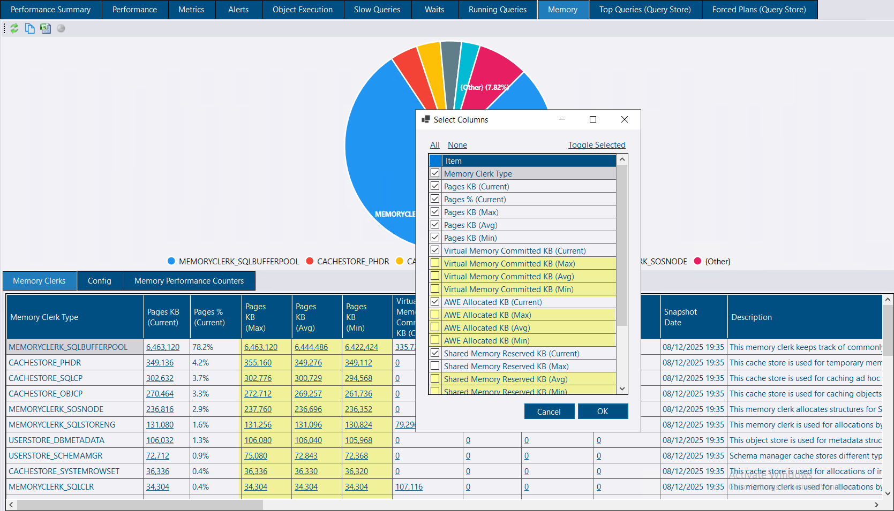
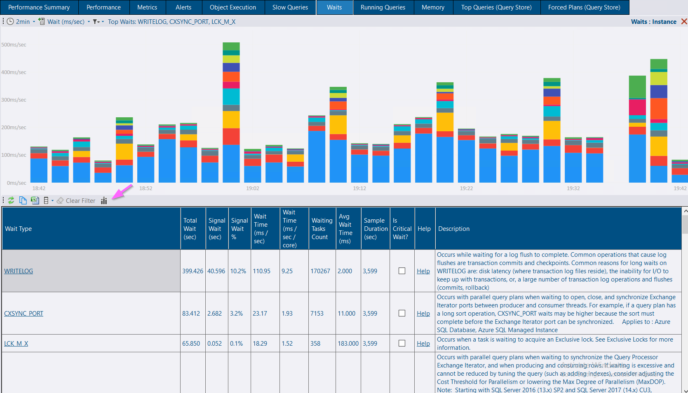
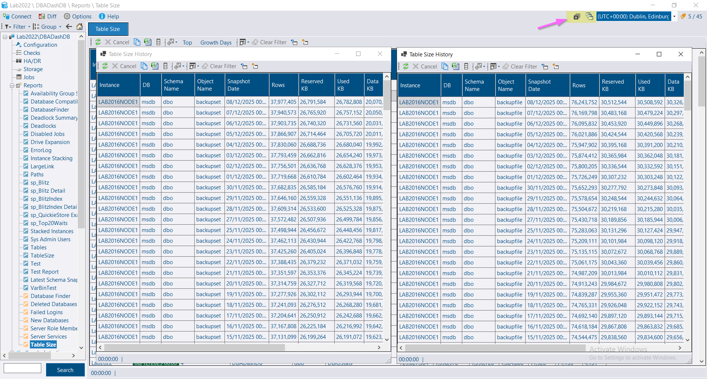

## Memory Analysis Enhancement

The Memory tab now displays **maximum**, **average**, and **minimum** values alongside current readings. This historical view makes it easy to identify memory clerk issues that occurred during your selected time range, even if they're not currently active.

## Waits Visualization

The Waits tab now includes the waits bar chart, previously only available on the Performance tab. This consolidates all wait analysis tools in one location for a streamlined troubleshooting workflow.

## Flexible Form Management

Forms can now be configured to either close existing instances when opening new ones (default) or allow multiple instances to remain open simultaneously. Quickly load new form instances without the extra step of closing the existing form.  Or keep existing forms open to refer to later or for side-by-side comparisons.

## Community Contributions

Thank you [Mark Cilia Vincenti](https://github.com/MarkCiliaVincenti) for [this PR](https://github.com/trimble-oss/dba-dash/pull/1665) to reduce code complexity.

## Other Improvements

* **Slow Queries tab**: Added clickable links on *Object Name* column
* **Forced Plans tab**: Added navigation links for *Query ID*, *Plan ID*, *Object Name*, *Query Hash*, and *Plan Hash* columns
* **Running Queries tab**: Additional grouping options added.
* Performance optimizations
* Service config tool now automatically grants "logon as a service" rights for smoother installations *(added in 4.0.1)*

See the [4.1.0 release notes](https://github.com/trimble-oss/dba-dash/releases/tag/4.1.0) for a complete list of fixes and improvements.

