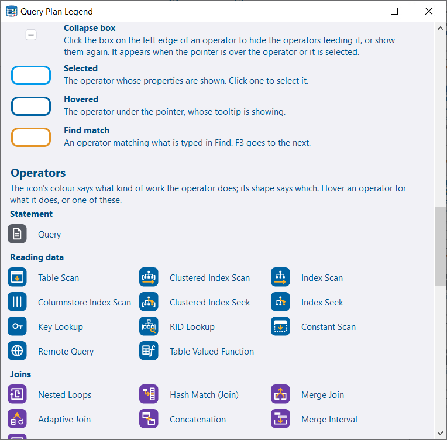
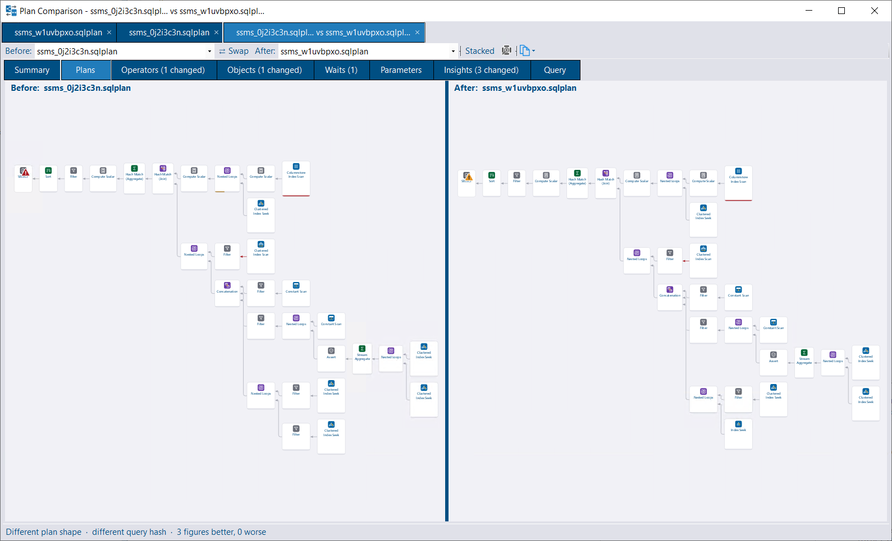
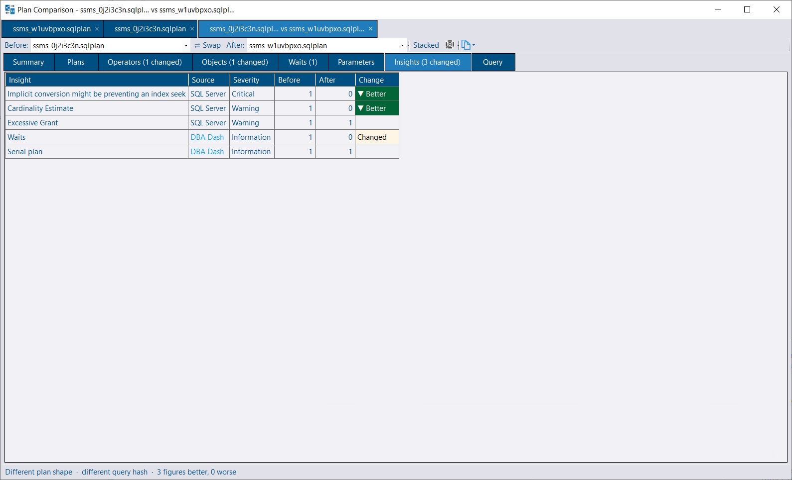
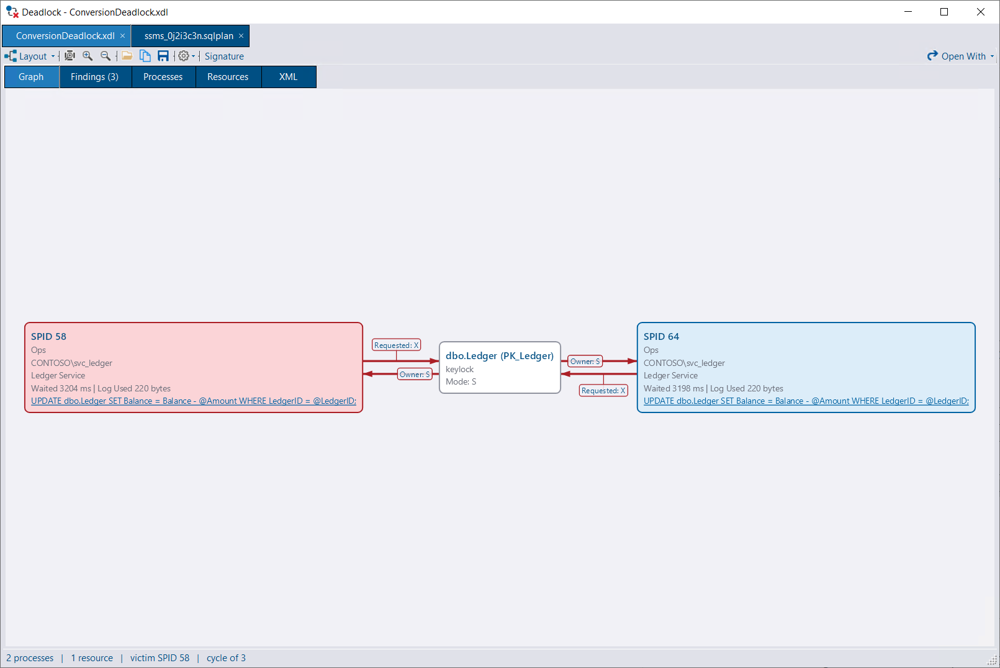
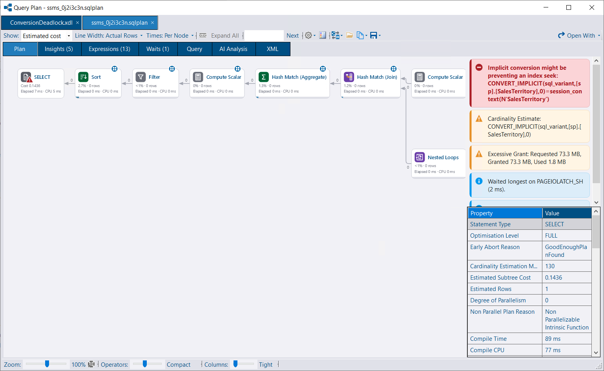
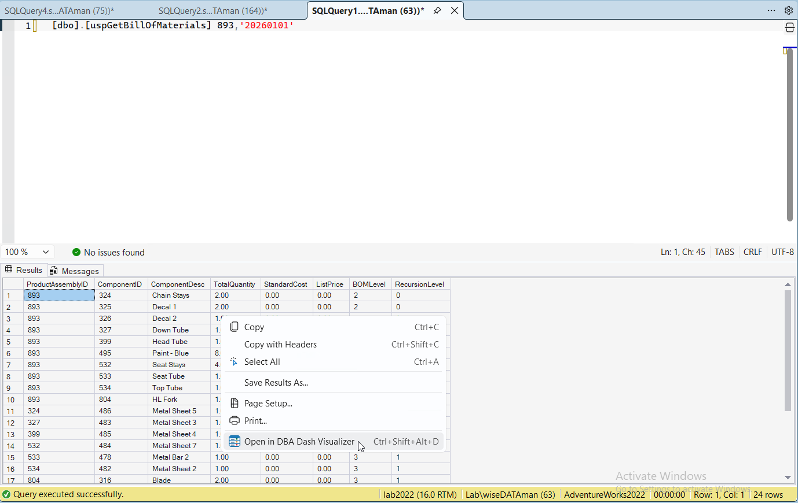

## Overview

The 4.18 release added a native deadlock viewer. The 4.19 and 4.20 releases do the same for execution plans, with a built-in query plan viewer that includes static analysis (insights), side-by-side plan comparison, and optional AI analysis.

Both viewers are now also available outside of DBA Dash. **DBA Dash Visualizer** is a small, standalone app for opening `.sqlplan` and `.xdl` files. No repository database, service, or SQL Server connection is required. A new **SSMS extension** lets you send an execution plan, deadlock graph, or results grid from SSMS straight to the viewer.

Grids across DBA Dash also get **data bars**, making it easier to spot the values that stand out.

## Query Plan Viewer

Previously, clicking a query plan in DBA Dash saved a `.sqlplan` file to a temp folder and opened it with whatever application was registered for that file type. This worked well if you had SSMS or Plan Explorer installed, but not otherwise. Plans now open in a viewer built into DBA Dash. Opening the plan in an external application is still one click away with the **Open With** button.

Highlights include:

- **Tabbed interface.** Each plan opens in its own tab, making it easy to compare a fast run with a slow one. Deadlock graphs open as tabs in the same window. Drag and drop files onto the window to open them.
- **Rank operators by what matters.** Operator bars and coloring can be based on estimated cost, rows, CPU, elapsed time, logical reads, or estimate error. The most expensive operator by estimated cost is often not the one that took the most time, and switching between them makes this easy to see.
- **Arrows sized by rows or data size**, using actual or estimated counts, and colored by how far the estimate was out.
- **Badges** on operators that are worth a closer look: warnings, row estimates that are an order of magnitude out, parallelism, batch mode, rows read and discarded, and missing indexes.
- **Two layouts.** The default SSMS-style layout keeps the main branch of the plan on a single row, producing a more compact plan. An alternative centered layout is also available from **Settings > Plan Shape**.
- **Navigation.** Zoom around the pointer, drag to pan, use the arrow keys to walk the tree, press Space to collapse an operator's inputs, and press Ctrl+F to find an operator, table, index, or predicate. Collapsed operators are shown as stacked cards with a count of hidden operators.
- **Detail panels** for the selected operator's properties, plus tabs for insights, missing indexes (with a `CREATE INDEX` statement), parameters (with compiled and runtime values as `DECLARE` statements), waits, the statement text, the `SET` options, and the raw XML. Each item links back to the operator it relates to.
- **Multi-statement plans** get a statement selector that can be ranked by cost, elapsed time, or estimate error. You can also save an individual statement as its own `.sqlplan` file.
- **Legend.** A built-in legend explains the badges, colors, and other visual cues used by the viewer.

See the [Query Plan Viewer](/docs/help/query-plan-viewer/) documentation for more detail.

### Insights

Similar to the **Findings** tab in the deadlock viewer, the plan viewer performs static analysis of the plan and highlights things worth investigating. This doesn't require AI. Examples include:

- Scalar UDFs, including where they prevent a parallel plan.
- Implicit conversions that affect the plan.
- Excessive memory grants. On actual plans, a grant of 1 GB or more where less than 15% was used. On estimated plans, a desired grant of 1 GB or more.
- Memory grant waits, with an explanation of `RESOURCE_SEMAPHORE` queuing.
- Optional parameter (catch-all) predicates such as `WHERE (col = @p OR @p IS NULL)`, `ISNULL(@p, col)` or `COALESCE(@p, col)` without `OPTION (RECOMPILE)`. The insight explains why a single cached plan can't seek on these conditions and lists the fixes, including SQL Server 2025's optional parameter plan optimization.
- Partitioned scans and seeks that read every partition, where partition elimination isn't in effect - including the common cause of a data type mismatch with the partition function.
- Warnings, missing indexes, and top waits.

The **Insights** tab lists the warnings SQL Server includes in the plan alongside DBA Dash's own findings, worst first. A **Source** column shows whether each one came from SQL Server or DBA Dash - the DBA Dash findings are ones you won't see in SSMS.

The memory grant used by each operator is also shown in the property grid and operator tooltips, making it easier to see where a large grant is going.

### Compare Plans

Use the **Compare** menu on the plan viewer toolbar to compare the current statement with another plan open in the window, another statement in the same plan, or a plan opened from a file. The comparison opens in its own tab. Either side can be switched to any statement of any open plan, or the two can be swapped.

The **Summary** tab starts with the key differences, followed by statement-level figures - run time, I/O, memory grant, estimates, parallelism, and compilation - with each change marked as better or worse. A noise threshold means small timing differences are treated as similar. Estimated figures such as cost are flagged as weaker signals, and runtime figures aren't judged against an estimated plan. The summary can be copied as text.

The **Plans** tab shows the two plans side by side (or stacked), with the selection mirrored between them.

Other tabs compare operators (grouped by type), objects (grouped by table, index, and access method), waits, parameters (including the sniffed compiled values), insights, and the query text, with a side-by-side diff.

This is useful for investigating a plan regression, or for checking that a tuning change had the effect you expected.

### AI Analysis

With the [AI Service](/docs/help/ai-assistant/) configured, you can ask AI to analyze a plan, the same way as for deadlocks. As before, nothing is sent until you click **Submit for analysis**, and the exact request is shown first so you can review it.

The analysis is scoped to the selected statement and includes the plan XML along with what the viewer already knows: insights, missing indexes, waits, parameters, and the operators ranked by their own cost. For very large plans, the XML is excluded by default. You can choose to include it, and the size is shown in tokens so you know what you are sending.

Analyses are stored against the query hash and query plan hash, so you can view previous answers for the same query - including answers about a different plan for the same query, which can be useful when investigating a plan regression.

Both the plan and deadlock viewers now also support **follow-up questions**, so you can continue the conversation rather than getting a single answer. The initial analysis is stored in the repository database and shared with other users. Your follow-up questions and answers are private to you. They are stored locally and protected with Windows DPAPI.

### Deadlock Viewer

The deadlock viewer now has a properties grid showing full process details, including the full execution stack. It also uses the same tabbed interface as the plan viewer, instead of opening a new window for each deadlock.

### Opening plans

Plans open automatically when you click a query plan link in DBA Dash. You can also use **Tools > Open Query Plan**, drag and drop `.sqlplan` files onto the viewer, or pass them on the command line. DBA Dash can optionally register itself as a handler for `.sqlplan` files, in the same way it already could for `.xdl` files. When several files are opened at once from Explorer, they open as tabs in a single window.

## DBA Dash Visualizer

DBA Dash Visualizer is a new standalone app containing the same plan and deadlock viewers as DBA Dash. It's for when you have a plan or a deadlock graph and don't have DBA Dash - no repository, service, SQL Server connection, or monitored instance is needed. Features that depend on DBA Dash, such as AI analysis and Query Store lookups, are not included.

There are two ways to install it:

- **Setup program.** Download `DBADash_Visualizer_Setup_<version>.exe` from the [latest release](https://github.com/trimble-oss/dba-dash/releases/latest). It installs in a few seconds for the current user only, so no administrator rights are required. It adds a Start menu entry, installs the .NET Desktop Runtime if it's missing, and updates itself.
- **Zip.** Download `DBADash_Visualizer_<version>.zip` and extract it to a folder of your choice (xcopy deployment).
<!-- TODO: restore once the winget package passes review
- **winget.** `winget install Trimble.DBADashVisualizer`. This runs the same setup program. The package is added to the winget repository some time after each release.
-->

The Visualizer can register itself for `.sqlplan` and `.xdl` files so it appears in Explorer's **Open with** menu. It checks for updates at most once a day. See the [DBA Dash Visualizer](/docs/help/dba-dash-visualizer/) documentation for full details.

The release page now includes a table to help you pick the right download:

| I want to... | Download |
|---|---|
| Set up monitoring (repository DB + service + GUI) | `DBADash_<version>.zip` |
| Add a monitoring client on another machine | `DBADash_GUI_Only_<version>.zip` |
| View query plans/deadlocks only - no monitoring (installer, auto-updates) | `DBADash_Visualizer_Setup_<version>.exe` |
| View query plans/deadlocks only - no monitoring (xcopy deployment) | `DBADash_Visualizer_<version>.zip` |

## SSMS Extension

A new extension for SSMS 21 and 22 adds an **Open in DBA Dash Visualizer** option to SSMS:

- **Execution plans** - from the execution plan right-click menu.
- **Deadlock graphs** - from a right-click menu added to deadlock graph tabs.
- **XML** - a plain XML tab holding a plan or deadlock graph, such as the output from `sp_BlitzLock`.
- **Results grids** - from the results grid right-click menu.

The option is also available on the **Tools** menu, with **Ctrl+Alt+Shift+D** as a keyboard shortcut. Items open in the DBA Dash Visualizer, or in DBA Dash if the Visualizer isn't installed.

Opening a results grid gives you sorting, filtering, Group By, and export options that aren't available in SSMS. XML and JSON columns are shown as links, and plans or deadlock graphs in a cell open in their viewers.

If the query window has more than one results grid, **Open All Results in DBA Dash Visualizer** sends every result set in one go. They open on a single tab with a table per result set. **Save All** saves them as a data set file that can be re-opened later, or as an Excel workbook with a sheet per result set. The Visualizer can also open results saved from SSMS with **Save Results As** XML.

You can also script the results as `INSERT` statements. Right-click the grid and select **Save Table > Script Grid** for the visible columns with their grid headers, or **Script Data Table** for all the underlying columns. The script creates a `#DBADashGrid` temp table, inserts the rows, and selects them back. Run it in SSMS to re-create the results you saw in the grid, then query the temp table to slice the data further. This is a handy way to share a result set with someone else or to keep a copy of it to compare against later. The grid can also save directly to a table in a SQL Server database, or export the data as JSON, XML, Markdown, HTML, or Excel.

The extension is included with DBA Dash and the Visualizer. Install or uninstall it from the **Options** menu in DBA Dash, or from the **Settings** menu in either viewer. You'll be offered an update if the installed extension is older than the app.

See the [SSMS Extension](/docs/help/ssms-extension/) documentation for more detail.

> **Note:** SSMS doesn't provide a supported API for reading the plan, deadlock graph, or results grid data. The extension relies on SSMS internals, so a future SSMS update could break some of these options until the extension is updated.

DBA Dash also has a new **Tools > Open Grid or Data Set** option, which can open exported grids and the DataSets written to the DBA Dash service's Failed folder without a repository connection.

## Data Bars

Grids across DBA Dash, the viewers, and the Visualizer now support data bars for numeric columns. Right-click a column or cell and select **Data Bar**. A bar is drawn in each cell, sized by the value's share of the column's range, making it easy to spot the values that stand out.

- **Style:** the bar can sit under the value or fill behind it.
- **Color:** a solid color, a traffic light (higher is worse, or higher is better), a gradient, or positive/negative. Negative values run left from a zero line, and positive values run right.
- **Options:** set the colors, a fixed minimum and maximum, and warning and critical thresholds. Thresholds can be a percentage of the scale, or actual values - for example, latency could be amber from 5ms and red from 50ms.
- **Copy to All Numeric Columns** applies the same style to the other visible numeric columns. Each column keeps its own scale.

By default, a bar is scaled to the values showing, so it rescales when you filter, group, or refresh the grid.

Data bars can be saved with a [custom report](/docs/how-to/create-custom-reports/) using **Edit Report > Data Bar**, or with **Save Data Bars** on the grid's **Data Bar** menu. For result grids opened in the Visualizer, data bars are remembered and re-applied to the next result set with the same columns.

## Service memory leak fix

Thanks [tao-exsitec](https://github.com/tao-exsitec) for a [bug fix](https://github.com/trimble-oss/dba-dash/pull/2142) contribution, and for an excellent [bug report](https://github.com/trimble-oss/dba-dash/issues/2141) backed up with heap snapshots. ♥️

The offline instance monitoring added in 3.19.0 created a linked cancellation token source roughly once a second without disposing it, causing a slow memory leak in the DBA Dash service. In the reported case, the service grew by around 20 MB per day - from 3.2 GB to 6.8 GB over 184 days. If your service runs for long periods without a restart, upgrading to 4.20.4 is recommended.

## Release Notes

See the release notes for a full list of fixes and improvements:

- [4.20.4](https://github.com/trimble-oss/dba-dash/releases/tag/4.20.4)
- [4.20.3](https://github.com/trimble-oss/dba-dash/releases/tag/4.20.3)
- [4.20.2](https://github.com/trimble-oss/dba-dash/releases/tag/4.20.2)
- [4.20.1](https://github.com/trimble-oss/dba-dash/releases/tag/4.20.1)
- [4.19.0](https://github.com/trimble-oss/dba-dash/releases/tag/4.19.0)
