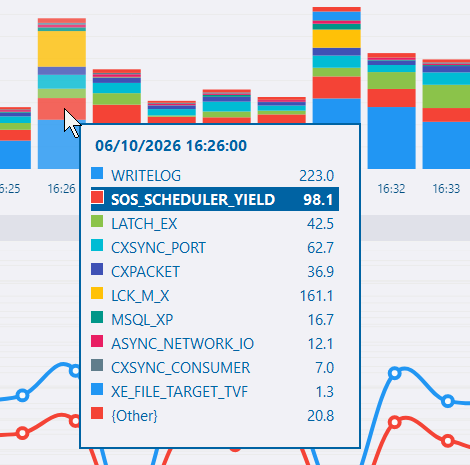
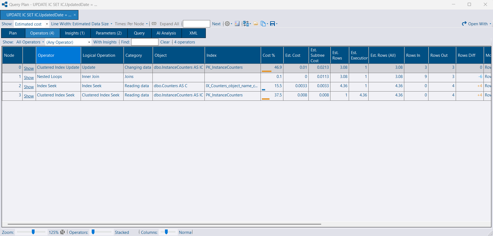
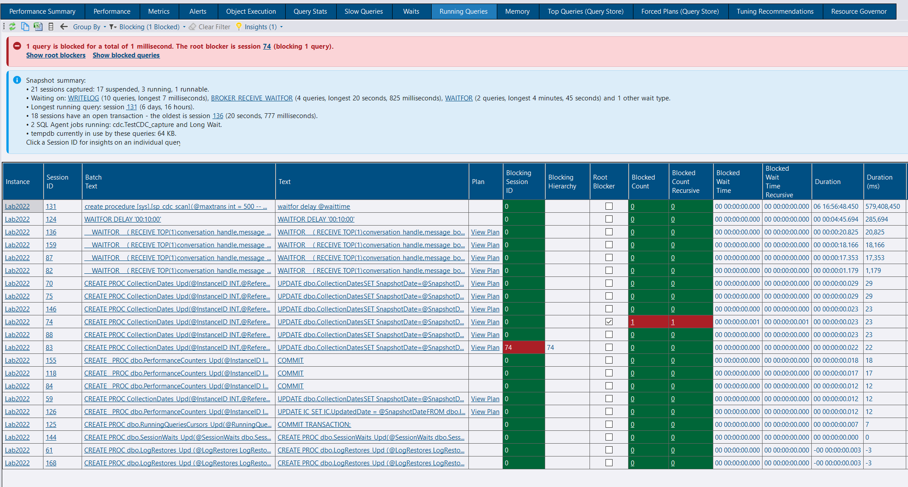
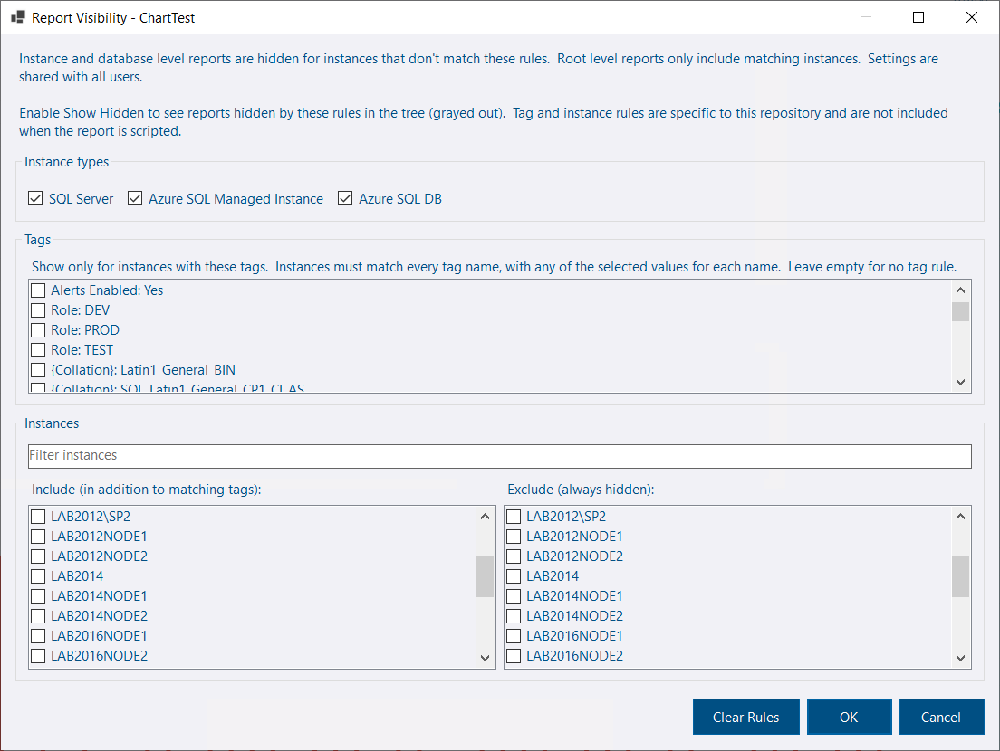
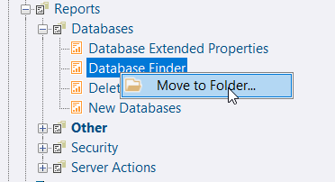

## Chart Tooltips

Chart tooltips now highlight the selected series.  This saves having to visually search the tooltip and avoids any confusion when there are similar colors used.

Pie charts now use the same tooltips as other charts for consistency.

## Plan Viewer

A new Operators tab lists every operator in the plan and its properties in a grid, with a quick link back to the chart.

The memory grant properties under Optimizer Hardware Dependent Properties are now easier to read:

* Estimated Available Memory Grant and Max Compile Memory are shown in MB/GB
* Estimated Pages Cached uses thousands separators

Where SQL Server's memory grant feedback has resized the grant, these properties now show that figure alongside the optimizer's original estimate, so a resized grant isn't mistaken for what the optimizer thought it needed.

The Query Hash and Query Plan Hash properties now link straight to Query Store when the plan was opened from DBA Dash against an instance it can message - no more copying hash values around to look them up yourself.

## AI Assistant

An Ollama provider has been added, supporting the use of local models. Set `AI:Provider` to `Ollama` and configure `Ollama:BaseUrl` and `Ollama:Model` to use it - see [AI Assistant](/docs/help/ai-assistant/).

A **Model** menu has been added to the plan and deadlock viewers' AI Analysis tabs (under Options), for providers that accept a model per request - currently Anthropic and Ollama. It lists the configured default plus whatever models the service reports as available, so you can pick a different model for a single analysis without changing the server-side configuration. The choice is shared between both viewers for the rest of the session.

## Slow Queries - EventFile capture mode

A new EventFile capture mode is available for slow queries.  It has the following advantages over RingBuffer:

* The session is never stopped and started to flush it, so no events are lost while it’s stopped. You don’t need the dual session option.
* When a lot of slow queries run in a short time they go to disk instead of overflowing the ring buffer.
* Each collection reads only new events instead of serializing the whole ring buffer.
* If the session is kept running when the service stops (see below), slow queries that run while the service is down are still captured. They are collected when the service starts again.

Ring buffer was originally chosen as it works for Azure DB and Managed instance the same as it does for regular SQL instances.  The downside is the buffer size is limited to 4MB and must be processed in full on each collection - even if there are only a small number of new events.  DBA Dash solves this by flushing the ring buffer, but there is a risk of losing some events.  EventFile target allows for storage of more events and we don't need to flush it between collections as this target provides an efficient way to read from where we left off on the previous collection.

The table below compares the cost of the two approaches on a production instance as an example.  The CPU cost of the EventFile collection is much lower than RingBuffer.

| mode       | minutes | total cpu \(ms\) | avg cpu ms/minute | max cpu ms/minute | avg logical reads/minute | avg duration ms/minute |
| ---------- | ------- | ---------------- | ----------------- | ----------------- | ------------------------ | ---------------------- |
| EventFile  | 135     | 1438.0           | 10.65             | 62.00             | 23                       | 405.9                  |
| RingBuffer | 135     | 22815.0          | 169.00            | 375.00            | 3958                     | 1401.6                 |


This only compares the cost of collection.  The cost of the extended event writing to a file target instead of a ring buffer isn't considered - it's difficult to measure and it's expected to be low.


EventFile target isn't supported for Azure DB and managed instance.  The default (for now) remains RingBuffer.

See [capture modes](/docs/help/slow-queries/#capture-modes) for details.

## Running Queries - Wait Resource link

Clicking the Wait Resource link on the Running Queries tab now opens the session details dialog on its Wait Resource tab, instead of providing a script to decipher the wait resource. If messaging is enabled, the wait resource is deciphered for you directly. The script is still available from the toolbar for when you need it.

## Running Queries - Insights

Insight cards have been added to the top of the Running Queries tab when viewing a single snapshot - the snapshot-level counterpart of the insights already shown on the session detail's Overview tab. Similar issues are summarized across all sessions in the snapshot, with links to open a session or filter the grid to the sessions involved:

* Blocking - blocked count, total wait and root blockers, including sessions blocked by an orphaned DTC or deferred recovery transaction.
* Sleeping sessions with an open transaction, past an idle threshold.
* A memory grant queue (`RESOURCE_SEMAPHORE`), or large grants if nothing is currently queued.
* Allocation contention (`PAGELATCH` on PFS/GAM/SGAM pages) per database, with tempdb vs. user database advice, plus other tempdb page latch waits that suggest metadata contention.
* Compile locks, `RESOURCE_SEMAPHORE_QUERY_COMPILE`, `ASYNC_NETWORK_IO` and implicit transactions.

The toolbar's Insights dropdown shows how many insights were found and lets you choose between **Show Insights with Summary**, **Show Insights Only** and **Hidden**. The optional summary card lists session statuses, top waits, the longest running query, open transactions, running jobs, parallelism, memory grants and tempdb usage. Since insight text can't normally be selected, right-clicking a card now offers **Copy** to put its text on the clipboard.

## Custom Reports - Visibility

When you create a custom report it might apply only to a specific instance or group of instances. Previously, visibility was determined only by the level of the tree implied by the report's parameters. Report visibility can now be controlled based on:

* Instance type - Regular instance, Managed Instance, Azure DB
* Tags
* Include/Exclude specific instances

Root level custom reports can now be created without needing to create the `@RootIDs` parameter in the stored procedure.

## Custom Reports - Folders

Folders can now be created to organize your custom reports.  System reports can also be organized alongside your own custom reports based on whatever folder categories you want to use.

## Tabbed Session Detail dialog

The session details dialog (opened by clicking a session id link on the Running Queries tab) now lets you open multiple sessions in a tabbed interface - similar to the query plan & deadlock viewer.

## Teams notification channel

Setting up Microsoft Teams notifications is much easier with a dedicated Teams notification channel, instead of configuring the generic webhook channel with a custom template.

See the [alerts documentation](/docs/help/alerts/#microsoft-teams) for more info.

## Release Notes

See the release notes for a full list of fixes and improvements:

- [4.21.0](https://github.com/trimble-oss/dba-dash/releases/tag/4.21.0)
